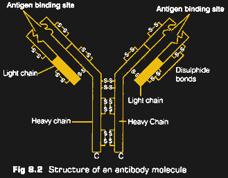

# 冠状病毒检测随访:快速免疫检测

> 原文：<https://hackaday.com/2020/03/30/coronavirus-testing-follow-up-rapid-immunologic-testing/>

当我开始写[我最近关于新冠肺炎测试的文章](https://hackaday.com/2020/03/24/coronavirus-testing-just-the-facts/)时，我以为我会写一篇比较和对比类的文章。像许多人一样，我认为“黄金标准”测试应该是我详细描述过的逆转录-聚合酶链式反应(RT-PCR)测试。的确如此，但它也存在问题，比如缺乏认证实验室，需要训练有素的技术人员来运行样本。我还假设会有另一种测试，一种简单的血清学测试，可以使用抗体来辨别是否有活性感染，甚至是以前已治愈的感染。

当我写第一篇文章时，我找不到对新冠肺炎进行免疫测试的迹象(更具体地说，是对导致新冠肺炎病毒的 SARS-Cov-2 的测试)。但是，几乎随着新冠肺炎病例数量的上升，消息也在迅速变化，简单、快速的抗体检测现在或很快就会出现。他们可能不会取代黄金标准的 RT-聚合酶链式反应测试，但他们确实会成为一线供应商和这种疾病的受害者的游戏规则改变者。因此，快速浏览一下传染病的免疫检测，并了解它们是如何工作的是有好处的。

## 先天和适应性

为了理解免疫分析是如何工作的，有必要了解一下人类免疫系统是如何识别入侵者并将其作为摧毁目标的。当然，这是一个非常复杂的系统，因为它的任务是根据最细微的线索区分自体和非自体细胞，完整的治疗将需要比获得想法所需的时间长得多的时间。所以，是的，这是一个非常精简的免疫系统之旅，但它应该足以完成这项任务。

由于免疫系统的主要工作是识别和摧毁从细菌到病毒甚至其他人类细胞的入侵者，它必须有一些关键的东西，使其具有极强的选择性和侵略性。由于由 21 种不同的氨基酸组成，蛋白质具有几乎无限的可变性，因此成为完美的目标，尤其是因为大多数入侵者的外表布满了数十种不同的蛋白质。

免疫反应始于*先天免疫系统*，这是一组快速反应的第一反应细胞。先天系统是非特异性的；除了区分自我和非自我的能力，它的细胞几乎什么都吃。当它遇到细菌或病毒粒子时，它会包裹并分解它，这个过程被称为吞噬作用。所有这些研究入侵者表面的蛋白质然后被呈现给另一组细胞，形成第二个免疫系统，即*适应性免疫系统*。

General structure of an immunoglobulin molecule. Source: [Biology Discussion](http://www.biologydiscussion.com/immunology/structure-of-antibody-molecule-with-diagram/56271)

适应性系统的细胞表面有它们自己的蛋白质，正式称为免疫球蛋白(Ig ),但通常称为抗体。这些蛋白质在图表中总是显示为 Y 形，这实际上相当准确。Y 的“臂”是高度多样化的，不同的抗体具有不同的氨基酸序列。这产生了一群对其他蛋白质具有不同亲和力的抗体，亲和力取决于氨基酸的大小、形状和静电荷。

当先天免疫细胞将入侵者的蛋白质片段呈现给适应系统时，如果幸运的话，其中一种抗体会随机匹配并结合到入侵者身上。这启动了一系列事件，导致编码匹配抗体的基因在一个称为克隆扩增的过程中大量扩增。免疫系统的细胞可能需要几天到几周的时间来建立这种防御，但一旦开始，大量的细胞就开始巡逻，并配备有针对感染的抗体。一旦入侵者被清除，这支细胞大军中的大多数都被遣散，但少数记忆细胞仍保留着这种特定的抗体，准备在同样的挑战再次出现时，通过先天免疫系统迅速发起进攻。

 [https://www.youtube.com/embed/wHCJUMBKgyo?version=3&rel=1&showsearch=0&showinfo=1&iv_load_policy=1&fs=1&hl=en-US&autohide=2&wmode=transparent](https://www.youtube.com/embed/wHCJUMBKgyo?version=3&rel=1&showsearch=0&showinfo=1&iv_load_policy=1&fs=1&hl=en-US&autohide=2&wmode=transparent)

## 随波逐流

因此，监测免疫系统的状态不仅可以告诉我们患者目前是否正在对抗感染，而且通过挖掘免疫系统的机构记忆，它还可以告诉我们某人是否曾经面临过特定的挑战。所有这些都需要我们有一个特定抗体的样本，这些抗体是身体在防御病毒时产生的。传统上，这是一个缓慢而困难的过程，其中来自受病毒攻击的动物的细胞被精心培养并通过人类细胞系扩增，产生的抗体在用于免疫测定之前被纯化。

抗体纯化通常需要几个月的时间，但在新冠肺炎的案例中，第一批抗体很快就被分离出来。台湾中央研究院的杨安秀等人培育了一种针对病毒 N 蛋白(或称核衣壳蛋白)的单克隆抗体。他们仅用了 19 天就分离和纯化了抗体，使用的过程涉及抗体和抗原相互作用的人工智能模型。根据模型的预测，他们可以创建一个编码抗体的 DNA 序列库，这些抗体应该对 N 蛋白具有特异性，这种抗体可以在无需首先在动物身上进行实验的情况下进行生产和选择。他们成功地将生产一种抗体的通常时间缩短了两个月，并继续创造其他对新型冠状病毒如此特异的抗体，以至于它们不会与任何其他人类冠状病毒结合。

将纯化的单克隆抗体用于可用的检测是另一个挑战，多家公司正在夜以继日地完善他们的测试版本。这些测试中的大多数被称为护理点(POC)测试，使用横向流动结构。妊娠试验是横向流动免疫测定的常见例子，与即将上市的新冠肺炎 POC 试验非常相似。

横向流动测试的工作原理是从患者身上提取样本，可能是用于新冠肺炎测试的血液，然后将其应用于吸收基质。基质通常是硝化纤维素，由于毛细作用，血液将快速通过它。在通过基质的过程中，样品将穿过充满干燥缓冲试剂和特殊抗体混合物的区域。这些抗体不一定对新型冠状病毒蛋白有特异性；它们会吸附样本中几乎所有的蛋白质。但它们与某种粒子结合，如胶体金微珠或染色乳胶粒子。这些将在测试的后期提供视觉信号。

穿过测试的结合区域后，样品中的蛋白质现在被微粒“修饰”。继续沿条带向上迁移，直到交叉线含有对新型冠状病毒蛋白特异的干燥单克隆抗体。根据测试形式的不同，这些测试线中可能有两到三种病毒抗体，加上至少一种几乎可以与任何东西反应的控制线。样品中任何修饰过的病毒蛋白都会与测试线结合，结合物的积累会产生一条有色的线，在基质的背景下很容易看到。

 [https://www.youtube.com/embed/z07CK-4JoFo?version=3&rel=1&showsearch=0&showinfo=1&iv_load_policy=1&fs=1&hl=en-US&autohide=2&wmode=transparent](https://www.youtube.com/embed/z07CK-4JoFo?version=3&rel=1&showsearch=0&showinfo=1&iv_load_policy=1&fs=1&hl=en-US&autohide=2&wmode=transparent)

值得注意的是，还有一种后门技术。可以使用病毒蛋白的克隆片段代替产生抗 SAR-CoV-2 蛋白的抗体。在这种情况下，蛋白质将被施加到测试条上，并将结合患者样本中的任何缀合-修饰的抗体。这里的主要优点是不需要针对病毒蛋白的单克隆抗体，缺点是不同的患者将根据他们在病毒感染周期中的位置以及他们的一般免疫反应表达更高或更低量的抗体。

运行和解释侧向流动免疫分析只需很少的培训，结果通常在 20 分钟左右即可获得。与 qPCR 检测所需的时间相比，更不用说认证实验室和将样品运送到认证实验室所需的时间，护理点免疫检测的优势是显而易见的。

目前，至少有 9 种针对各种新型冠状病毒蛋白的侧向流动免疫测定法正在开发中。其中一些正在发货，一些正在验证，一些正在寻求监管机构的批准。但所有这些都是基于免疫系统惊人的复杂性和适应性，这个系统的任务是让人类在充满挑战的世界中生存下来，是可以想象到的最小和最阴险的包。