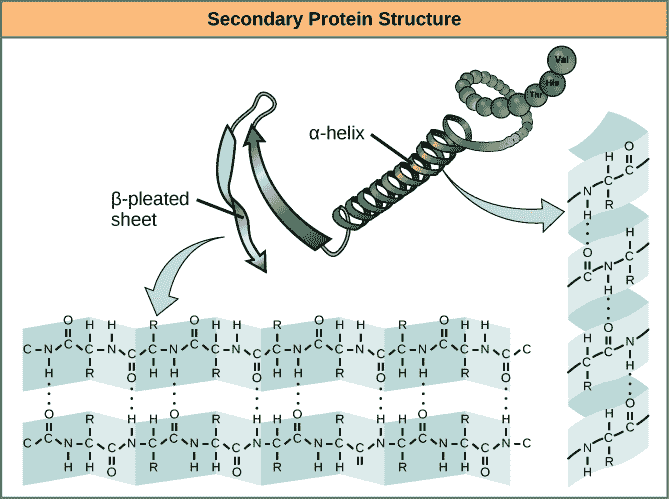
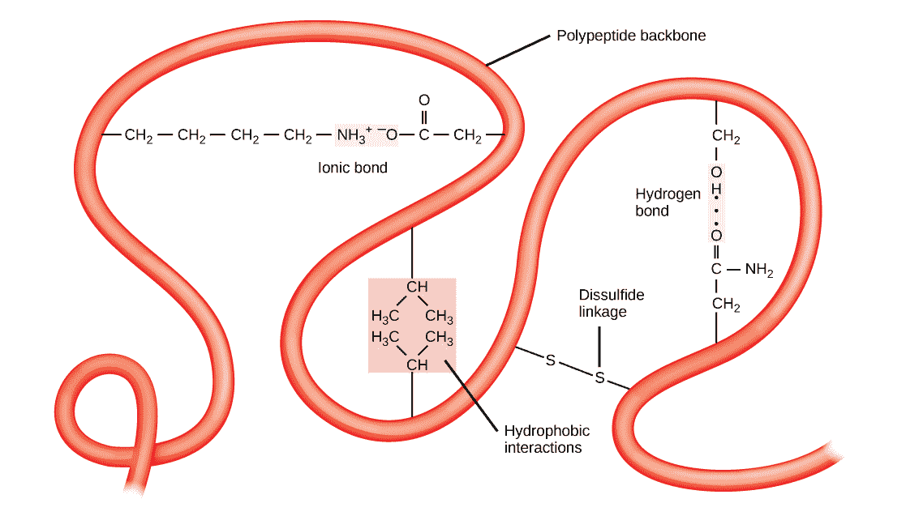

# 那么到底什么是蛋白质折叠呢？

> 原文：<https://hackaday.com/2020/04/14/so-what-is-protein-folding-anyway/>

当前的新冠肺炎疫情充斥着黑客热衷攻击的问题。从 [3D 打印面罩](https://hackaday.com/2020/03/29/nih-approved-3d-printed-face-shield-design-for-hospitals-running-out-of-ppe/)和[自制面罩](https://hackaday.com/2020/03/18/homemade-masks-in-a-time-of-shortage/)到[完全成熟的机械呼吸机的替代品](https://hackaday.com/2020/03/23/mit-ventilator-designed-with-common-manual-resuscitator-submitted-for-fda-testing/)，源源不断的想法鼓舞人心，温暖人心。与此同时，在另一个领域也有很多努力:旨在对抗病毒本身的研究。

找到问题的根源似乎最有可能结束这一疫情，并领先于未来的，这就是分布式计算努力称为 [Folding@Home](https://hackaday.com/2020/03/22/coronavirus-and-foldinghome-more-on-how-your-computer-helps-medical-research/) 旨在解决的“了解你的敌人”问题。数百万人已经签署了从备用 PC 和 GPU 中捐赠周期，并在此过程中创造了历史上最大的超级计算机。

但是这些万亿次浮点运算到底是用来做什么的呢？为什么蛋白质折叠会导致如此多的计算能力？这背后的生物化学是什么，为什么蛋白质首先需要折叠？这里简单介绍一下蛋白质折叠:它是什么，它是如何发生的，为什么它很重要。

## 首先:蛋白质是做什么的？

蛋白质对生命至关重要。它们不仅提供细胞的结构元素，还充当催化几乎所有生化反应的酶。蛋白质，无论是结构蛋白质还是酶蛋白质，都是以特定序列首尾相连的氨基酸长链。蛋白质的功能是由蛋白质上和蛋白质中不同位置的氨基酸决定的。例如，如果一种蛋白质需要与带正电的分子结合，结合位点可能充满了带负电的氨基酸。

为了理解蛋白质如何实现定义其功能的结构，快速回顾一下分子生物学的基础和细胞中的信息流是合适的。

蛋白质的产生，或者说表达开始于 T2 转录过程。在转录过程中，细胞中保存遗传信息的双链 DNA 部分解开，将 DNA 的含氮碱基暴露给一种叫做 RNA 聚合酶的酶，通常被称为 RNAPol。RNAPol 的工作是制作基因的 RNA 拷贝或转录本。这种基因拷贝被称为信使 RNA 或 mRNA，是一种单链分子，非常适合在一个称为*翻译*的过程中指导细胞的蛋白质制造机器——核糖体。

核糖体就像一个夹具，获取 mRNA 模板，并将其与其他小片段 RNA 匹配，称为转移 RNA，或 tRNA。每个 tRNA 都有两个主要的活性区域——一个有一个称为反密码子的三碱基部分，与 mRNA 上的互补密码子相匹配，另一个区域用于结合该密码子特有的氨基酸。在翻译过程中，tRNA 分子随机地试图利用它们的反密码子与核糖体中的 mRNA 结合。当匹配完成后，tRNA 分子将其氨基酸连接到前一个氨基酸上，在 mRNA 编码的氨基酸链中形成另一个环节。

这个氨基酸序列是蛋白质结构层次的第一层，被称为蛋白质的*一级结构*。蛋白质的整个三维结构，实际上是它的功能，直接来自一级结构，通过这些氨基酸中每一个的不同属性以及它们如何相互作用。如果没有这些化学性质和氨基酸之间的相互作用，多肽就只是没有三维结构的线性序列。我们在烹饪中经常看到这种情况，这是蛋白质三维结构的热诱导变性。

## 蛋白质各部分之间的长距离连接

一级结构之外的结构层次被巧妙地称为*二级结构*，包括氨基酸之间相当短程的氢键。这些稳定的相互作用形成了两个主要的图案:α-螺旋和β-折叠。α-螺旋形成紧密盘绕的多肽区域，而β-折叠是平坦、宽阔的区域。这两种基序都具有结构特性和功能特性，这取决于它们内部氨基酸的特性。例如，如果α螺旋中主要含有亲水性氨基酸，如精氨酸和赖氨酸，那么它很可能会参与水相反应。

alpha-helix and beta-sheet motifs in proteins. The hydrogen bonds form as the protein is being expressed. Source: [OpenStax Biology](https://openstax.org/details/books/biology-2e/)

蛋白质结合这两个主题，以及它们主题上的变体，形成下一级结构，即*三级结构*。与二级结构的简单基序不同，三级结构更倾向于由疏水性驱动。大多数蛋白质的核心往往含有高度疏水的氨基酸，如丙氨酸和甲硫氨酸，由于残基的“油腻”性质，水被排除在外。这些结构经常出现在跨膜蛋白中，跨膜蛋白嵌入在细胞周围的脂质双层膜中。蛋白质上的疏水区域在膜的脂肪内部是热力学稳定的，而蛋白质的亲水区域暴露在膜两侧的水环境中。

三级结构也趋向于由氨基酸之间的长距离键来稳定。这方面的经典例子是二硫键，它通常出现在两个半胱氨酸残基之间。如果你曾经去过发廊，闻到某人烫发时轻微的臭鸡蛋味，你正在目睹头发中角蛋白三级结构的部分变性，这是通过使用含硫硫醇化合物减少二硫键实现的。

Tertiary structure is stabilized by long-distance interactions, like hydrophobicity and disulfide bonds. Source: [OpenStax Biology](https://openstax.org/details/books/biology-2e/)

二硫键可以出现在同一多肽链中的半胱氨酸残基之间，或者位于完整的不同链中的半胱氨酸之间。不同多肽链之间的相互作用是蛋白质结构的第四级，即*四级结构*。你血液中的血红蛋白是四级结构的完美例子。每个血红蛋白分子由四个相同的珠蛋白亚单位组成，每个亚单位通过多肽内的二硫键以及与含铁血红素分子的结合保持特定的构象。所有四个珠蛋白亚基通过分子间二硫键结合在一起，整个分子作为一个整体同时结合多达四个氧分子，并在需要时释放它们。

## 在寻找疾病解决方案的过程中建立结构模型

随着增长的链从核糖体中挤出，多肽链在翻译过程中开始折叠成最终形状，类似于一段伸直的记忆金属丝在加热时可以迅速变成复杂的形状。但正如生物学的一贯情况一样，这个故事还有更多。

在许多细胞中，转录的基因在翻译前有广泛的编辑，与基因的原始碱基序列相比，这极大地改变了一级结构。翻译机制还经常寻求分子伴侣的帮助，分子伴侣是一种蛋白质，可以暂时与新生多肽链结合，以防止其形成中间结构，从而阻止其形成最终形状。

所有这些都是说，从一级结构预测蛋白质的最终形状并不简单。几十年来，探索蛋白质结构的唯一方法是用物理方法，如 X 射线晶体学。直到 20 世纪 60 年代末，生物物理化学家才开始建立蛋白质折叠的计算模型，主要关注蛋白质二级结构的建模。除了一级结构序列之外，这些方法及其后代还需要大量的输入数据，如氨基酸之间的键角表、疏水性列表、电荷状态，甚至进化时间范围内的结构和功能保守性，以对蛋白质的未来进行最佳猜测。

目前用于二级结构预测的计算方法，就像目前在 Folding@Home 的网络上运行的那些方法，可以达到大约 80%的准确率，考虑到任务的复杂性，这已经相当不错了。新型冠状病毒刺突蛋白等蛋白质的折叠预测模型生成的数据将与物理研究数据相结合，以得出该蛋白质的可靠结构，并可能让我们了解该病毒如何与人类血管紧张素转换酶-2 (ACE-2)受体结合，这些受体排列在呼吸道中，这是它进入身体的途径。如果我们能弄清楚它的结构，我们也许能找到阻止结合和防止感染的药物。

蛋白质折叠研究对于我们理解如此多的疾病和感染至关重要，即使我们找到了击败新冠肺炎的方法，Folding@Home 网络也不会闲置太久。过去一个月，Folding @ Home 网络出现了爆炸性增长。该网络是一种研究工具，非常适合探索与错误折叠蛋白质相关的数十种疾病的核心蛋白质模型，如阿尔茨海默氏病和变异型克罗伊茨费尔特-雅各布病，通常被错误地称为疯牛病。当下一个病毒不可避免地出现时，所有的马力，以及在管理它的过程中获得的所有经验，都将准备好再来一次。