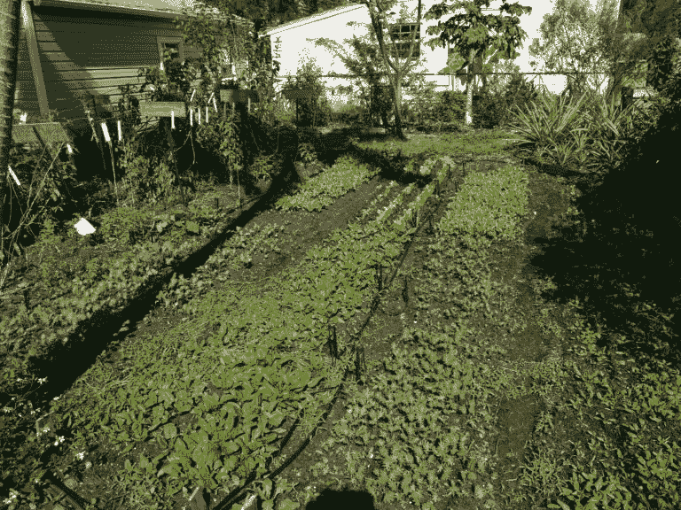
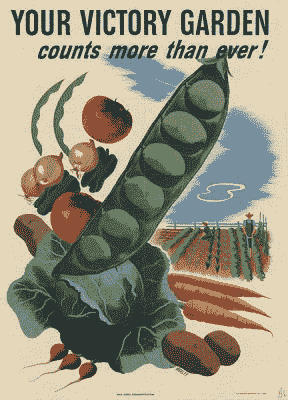
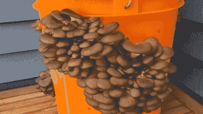

# 再次照料你的花园

> 原文：<https://hackaday.com/2020/07/16/tend-your-garden-again/>

20 世纪 40 年代初，几个国家的农业发生了令人难以置信的转变。在世界各国政府的鼓励下，各行各业的人们正在大规模种植所谓的“胜利花园”。第二次世界大战期间，数以百万计的这种小型家庭菜园涌现出来，以帮助降低农产品价格，让任何人都可以为战争做出贡献，哪怕只有一点点土壤。

据估计，仅在 1943 年，胜利菜园生产的蔬菜就占美国总产量的三分之一。然而，从那时起，这些高产的花园中的绝大多数都被放弃了，取而代之的是高度修剪、施肥、灌溉的草坪草(这种草坪草不生产食物，但维护成本更高)，但由于最近的全球疫情，人们又开始对再次种植自己的食物感到好奇，如果不是已经在积极种植花园的话。在现代，尽管自 40 年代以来许多民间知识已经失传，但种植任何规模的花园都比以往任何时候都容易，尤其是有了大量的可用技术来帮助。

作为一个不仅作为一个世界知名科技网站的作家把食物放在桌子上，而且作为一个小规模市场农民从字面上和比喻上把食物放在桌子上的人，我学到了一些东西，我希望如果你开始你的第一个花园，这些东西会有所帮助。

## 你可以在任何地方种花，但是地点很重要

作为参考，我住在南佛罗里达(10b 区，我们稍后会谈到)，我向附近的农贸市场出售各种沙拉蔬菜。我还种植了许多其他可食用但无利可图的植物，也是为了好玩。这里的土壤大多是没有价值的沙子，但这涉及到开始之前需要知道的两个最重要的事情:你自己的气候和土壤类型。

The beginning of growing season at my mini-farm in December in south Florida. This used to be an expensive lawn and is now semi-profitable salad green beds instead: lettuces, kale, arugula, and spinach, with some tomato trellises on the left and fruit trees and pineapples in the back. In the summer I rotate to sweet potatoes, black eyed peas, okra, and watermelon.

花园的基石:气候。其中最重要的是气候，因为健康花园的几乎所有其他因素都取决于气候，所以第一步是弄清楚你的植物将在什么样的气候下生长。

科彭气候分类系统可以在这方面有所帮助，因为种植适应当地气候的植物要容易得多。例如，很难([尽管并非不可能](https://www.youtube.com/watch?v=M_Hs2SUzWpU))在密西根种植芒果树，在德克萨斯种植苹果树，或者在沙漠之外种植椰枣树。另一个有助于确定你选择的植物是否会在你居住的地方生长的资源是[美国农业部植物抗寒区域图](https://planthardiness.ars.usda.gov/PHZMWeb/)。(其他国家也有类似的资源。)这是任何给定地点典型年份的最低预期温度图。例如，一种对 6 区“耐寒”的植物可以在零下 23 摄氏度的低温下存活，但一种只对 10b 区耐寒的植物(正如我之前提到的)如果温度接近冰点，就可能无法存活。值得注意的是，这一尺度不能反过来应用，即一种耐寒的植物在第六区可能存活，也可能不存活。

与气候相关，你还需要确保你的植物在正确的季节生长。例如，西红柿是温带气候下夏季种植的一种常见蔬菜，但是如果你生活在一个比平均温度高的地方(比如我生活在佛罗里达州南部)，你可能会发现几乎所有的西红柿([除了一些例外](http://blogs.ifas.ufl.edu/charlotteco/2019/06/25/tiny-but-tough-the-everglades-tomato/))都会在酷热中死去。为了解决这个问题，我附近的大多数人在 10 月种植西红柿，并在次年 4 月收获，但如果你碰巧住在佛蒙特州，你需要对这个时间表做一些明显的调整。

Köppen climate types (left) compared to USDA hardiness zones (right). There are some trends between the two maps. Also note that the section of blue at the tip of Florida isn’t the same color blue as the Northeast and Midwest. It’s the only tropical climate in the continental US!

**园林重点:土壤类型**。接下来要考虑的是土壤类型。事实上，所有的土壤都有某种喜欢在其中生长的植物，通常来说，改良小块土地的土壤以允许其他东西在其中生长并不太困难。比如红薯爱吃养分含量低的沙质土壤，但是在旁边种一棵香蕉树就不会有结果。美国所有的州都有一所农业大学，有推广办公室，土壤样本可以送到那里，这些实验室可以告诉你土壤中各种养分的含量，以及一些关于种植什么或如何向土壤中添加各种补充剂的建议。他们还可以推荐哪些植物可以在本地种植，这是一个巨大的资源。然而，种植任何植物时，土壤都是最重要的观察对象，如果你妥善照料土壤，你的花园的许多其他方面都会自然到位，例如抗病、抗虫害和提高产量。

## 从厨房的窗户到下面的院子

一旦气候和土壤类型被弄清楚了，那么园艺兔子洞(一语双关)的数量基本上是没有止境的。你那棵毫无价值的布拉德福德梨树在暴风雨中倒下了吗？种一棵苹果树或桃树！想要一块因为太热或太阳光而无法生长的草坪的免维护地被吗？可能是时候种些红薯了。我们中有些更极端的人已经开垦了整个院子来种植食物，但最好至少从小处着手。

举例来说，即使作为一个公寓居住者，你的空间有限或者没有任何土地，你仍然有一些方法可以为自己种植一些食物。用当地园艺中心的几盆表土，或者耐心地用厨余制作自己的堆肥，就有可能在敞开的窗户附近种植大量的药草和香料，尤其是大葱、罗勒、牛至和许多其他植物。有了一盏小灯，生菜和辣椒等其他东西也是可以的。

Victory Garden poster via [Wikimedia Commons](https://commons.wikimedia.org/wiki/File:Victory-garden.jpg)

这一领域的技术确实在进步。例如，如果你有一个鱼缸，可以用植物来过滤水，这些植物会从鱼产生的废物中受益。这种共生关系被称为[水培学](https://hackaday.com/2015/06/06/hacklet-50-hydroponic-projects/)，设置可以小到几株植物、一盏生长灯和一个只有几条鱼的水族馆。当然，水产养殖项目也可以很大，但是如果你空间有限，并且已经有了一个水族馆，那么这是一个很好的起点。如果你没有一个水族馆，你可以建立一个类似的系统，没有被称为溶液培养的鱼，[，我们已经在](https://hackaday.com/2020/06/16/compile-a-hydroponics-system-from-source/)之前的几个项目中见过。

## 公寓园艺:真菌

其他东西也可以在一个小空间或公寓里生长，其中一些甚至不是植物。各种蘑菇可以很容易地在稻草或用过的咖啡渣桶中培育。这些方法也几乎不需要专门的设备。种植蘑菇还消除了在公寓里种植植物的最大障碍之一:获得阳光。蘑菇不需要阳光来提供生长所需的能量，因此这是种植植物的可行替代方案。虽然平菇是最受欢迎的开始种植者，其他食用菌也可以在室内种植，如香菇，舞茸，狮鬃菇。

Growing oyster mushrooms from a five-gallon bucket isn’t too hard and requires very little space.

## 让小块土地产出更多的农产品

如果你确实有大量的土地，并准备开始使用技术来帮助种植尽可能多的适合你所在地区、气候和土壤类型的食物，那么可能没有比 Akiba 的各种项目更好的资源了。他是 Freaklabs 的成员，虽然他的项目不全是农业项目，但在他位于东京郊外的 Hacker Farm 的大本营，他的项目中有很大一部分旨在帮助农民提高产量，或者让他们的工作更容易。从改善水稻种植的传感器网络到致力于使用和教授技术的整个农场，他的工作为初露头角的园丁或农民提供了足够多的灵感。我在自己的小农场上使用了他的一些项目作为灵感，特别是在有限/昂贵的供水条件下管理灌溉时，因此肯定有丰富的知识可以利用。其他在这里拥有受欢迎的农业导向建筑的人包括 Brad aka [AtomicZombie],他在加拿大大草原种植了大量自己的食物，并且还建造了一些[独特的工具来帮助管理他的家园](https://hackaday.com/2019/08/13/electric-dump-truck-tricycle-is-no-toy/)。

## 吃你自己种的东西更令人满足，而且客观上味道更好

只要你了解气候和土壤类型的基本知识，并有合理的预期，在几乎任何情况下，至少自己种植一些食物的过程都是可能的。作为一个养蜂人(这本身是一个有益的爱好，可以大大提高你的花园的产量，还可以提供美味的蜂蜜、有用的蜡，甚至美味的成人饮料)，有一句很容易翻译成种植花园的谚语:“所有的养蜂都是本地的”。这意味着只有你能找到最适合你的特定环境的方法。

从某种意义上说，所有的园艺和农业也是本地的，尽管你在网上读到过各种种植植物的“正确”方法，但在你真正掌握当前情况之前，还会有一定数量的尝试和错误。但是，作为 Hackaday 社区的一部分，使用我们大多数人都可以广泛获得的技术应该会使创建现代胜利花园的过程更加容易。你最终会吃更多的农产品，因为你不想浪费你的辛勤劳动。在南佛罗里达冬天的任何一天，我都会把我花园里的西红柿和杂货店里的西红柿放在一起。