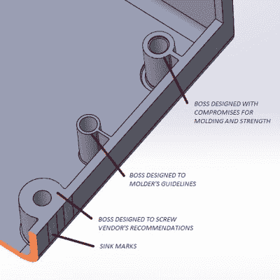

# 了解注塑成型的设计陷阱

> 原文：<https://hackaday.com/2020/04/19/gain-an-understanding-of-injection-moldings-design-gotchas/>

说到制造业，钣金和注塑让世界运转起来。作为一种制造方法，注射成型有它自己的一系列独特的设计问题和陷阱，知道总比不知道好。为了帮助提高这种意识，[studiored]发表了一系列描述注塑设计问题的博客文章，从如何避免和解决这些问题的角度进行了介绍。

Design of screw bosses demonstrating conflict between molder’s guidelines and vendor’s recommendations. Compromising between both is a science and an art.

由于注射成型涉及热量，[翘曲是一个需要注意的问题](https://studiored.com/injection-molded-part-design-part-4-warp/)，其原理可能为任何具有 3D 打印实际经验的人所熟悉。[缩痕](https://studiored.com/injection-molded-part-design-part-2-sink-marks/)也是一个问题，归结为差异冷却引起的问题，会破坏光滑和有光泽的表面。这两者在[如何最好地设计老板](https://studiored.com/injection-molded-part-design-part-3-bosses/)中都发挥了作用。

最小化和简化底切(类似于 3D 打印机术语中的突出部分)更深入一些，因为即使是一个底切也意味着模具更复杂的加工。最后，因为注射成型依赖于可靠的成型、冷却和顶出零件，[设计带拔模斜度的零件](https://studiored.com/injection-molded-part-design-part-4-draft/)(一个小角度以帮助零件移除)可能是生活中的事实。

[studiored]似乎一直在加班加点地在他们的博客上分享产品设计和制造的技巧，所以值得关注它以获得更多补充。我们之前提到，制造业的大部分都围绕着注射成型和金属板，所以为了丰富你的知识[，我们出版了一本关于弯曲金属板的艺术和科学的入门书](https://hackaday.com/2016/05/18/the-art-and-science-of-bending-sheet-metal/)。有了影响这两种常见制造方法的各种设计问题的实用知识，您就有了进军这两个领域的坚实基础。