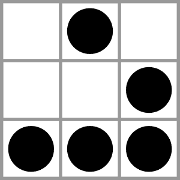

# 推出 1000 名黑客的游戏

> 原文：<https://hackaday.com/2020/04/18/the-game-that-launched-1000-hackers/>

约翰·康威于本周去世。即使你不太懂数学，你也可能知道几乎每个人都喜欢的细胞自动机规则集:康威的“生命游戏”。这是我们文化历史的一部分，最初的黑客埃里克·斯科特·雷蒙[建议用滑翔机作为黑客标志](http://www.catb.org/hacker-emblem/)。

 在我作为一名年轻的黑客的成长过程中，一套非常简单的规则，同样适用于任何地方，可以产生“生活”的想法很有影响，从对我们关于康威的文章的评论来看，我并不孤单。但我不会撒谎:我还是个孩子的时候，认为它能做的不仅仅是在屏幕上制作漂亮的图案，还能做更多的事情*。我既对又错。*

 *尽管在康威的生活中可以建造出令人惊讶的复杂机器，但为了证明这一点，请查看视频，最终还没有出现细胞自动机的统一理论。作为康威选择的数学领域的一个研究课题，细胞自动机是一潭死水。它并没有真的*去任何地方*。还是做到了？

在一台 Tandy Color 计算机上用 BASIC 语言实现康威的生活是我走上极客之路的第一件事。它与[威胁相提并论:来自 20 世纪 60 年代的基于火柴盒的机器学习算法](https://hackaday.com/2009/11/02/computer-learns-from-tic-tac-toe/)，以及在我年轻的算法生涯中以[随机文本生成器](https://mathematicaforprediction.wordpress.com/tag/martin-gardner/)的形式介绍马尔可夫链，所有这些我都在《科学美国人》的[马丁·加德纳的](http://www.martin-gardner.org/SCIAMERICAN.html)专栏中偶然读到过。康威的生活，以及一些愚蠢的赛马游戏，也让我知道了糟糕的随机数生成器:在旧的 CoCo 上，屏幕每次都会“随机”填充相同的内容。

所以也许康威不想仅仅因为他的“生活”而被人们记住，因为这有点像数学上的死胡同。但就其对世界、整整一代黑客以及我个人生活的影响而言，它所能占据的空间远远超过了满屏像素。为康威，为他的“生活”，为激励他未来的人们，干杯。你不仅仅是滑翔机，你还是滑翔机枪！

这篇文章是 Hackaday.com 时事通讯的一部分，在过去的 200 多周中，每七天发表一次。它还包括过去七天我们最喜欢的文章，您可以在[新闻简报](https://mailchi.mp/hackaday.com/hackaday-newsletter-0xd2)的网络版上看到。

想让这种类型的文章在每周五早上出现在你的收件箱里吗？[你要报名](http://eepurl.com/gTMxQf)！

【本文展示的生命的游戏例子是 *[约翰·康威的生命的游戏——1.0](https://www.pygame.org/project/2899/4734)*由尼克·贾维斯和尼克·韦恩用 Python 编写】*