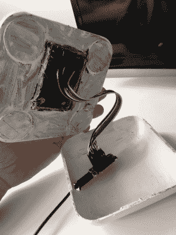

# 用放置好的六边形排列你的轨迹

> 原文：<https://hackaday.com/2020/04/24/queue-up-your-tracks-with-a-well-placed-hexagon/>

除了少数顽固坚持的人，我们大多数人已经转而听数字形式的音乐，通常是通过在线流媒体。只要没有数据限制，这是聆听您喜爱的艺术家或发现新艺术家的快捷方式。但是，将一块物理媒体加载到播放器中的行为有一种发自内心的东西，不能仅仅通过点击或敲击屏幕来复制。

 这就是为什么[【infinite video】把这个 RFID 播放列表启动器外设](https://imgur.com/a/aiS5xp7)放在一起。这里有一个重要的区别，因为这个设备实际上并不播放甚至存储音频。附近运行 Volumio 的覆盆子处理实际回放。这个设备只是一个 RFID 阅读器，带有一些聪明的令牌，听众可以使用物理令牌来选择他们最喜欢的艺术家和专辑。这当然不是一个新概念，但是我们认为这种特殊构造的细微差别值得仔细观察。

“播放器”由一个 ESP8266 和一个直接连接到 GPIO 引脚的 MFRC522 RFID 读取器组成。这对情侣被安置在一个相当大的 3D 打印外壳中，乍一看可能有点过分。但事实证明，[InfiniteVideo]实际上是在试图复制一个名为 Qleek 的众包项目，该项目基于一个类似的矮胖阅读器。

同样，六边形瓷砖也源自 Qleek 概念。但是[InfiniteVideo]并没有像原版那样用木头制成，而是打印了这些。在此过程中，印刷暂停，RFID 标签放在六边形的中间。一旦恢复，RFID 标签就永久地嵌入瓷砖中，没有可见的接缝来显示魔术是如何成功的。通过添加合适的标签，每个印刷的六边形在软件中与所需的专辑或艺术家相关联。

该项目以其便利性和视觉效果而闻名，但使用 RFID 标签进行媒体识别也是一个实用的选择。[它可以作为一种辅助技术](https://hackaday.com/2014/08/23/rfid-audio-book-reader-for-the-visually-impaired/)，或者作为一种[幼儿轻松与设备互动的方式](https://hackaday.com/2012/03/14/rfid-jukebox-for-the-kids/)。