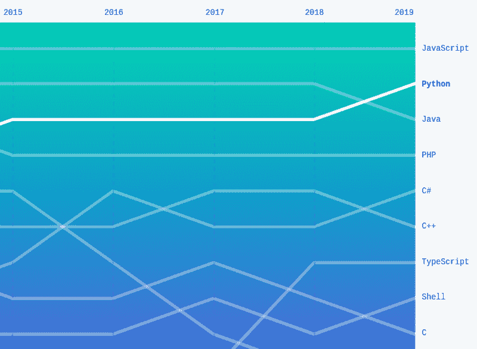

# 核心开发者对 Python 2 说了一句深情而坚定的再见

> 原文：<https://hackaday.com/2020/04/24/core-devs-say-a-fond-but-firm-farewell-to-python-2/>

核心开发人员 [Benjamin Peterson 表示，终于到了社区“深情而坚定地告别 Python 2”的时候了，他在 4 月 20 日](https://mail.python.org/archives/list/python-dev@python.org/message/OFCIETIXLX34X7FVK5B5WPZH22HXV342/)发布了 Python 2 . 7 . 18；正式结束对流行编程语言 2.x 分支的支持。这不是一个仓促的决定。Python 3.0 早在 2008 年 12 月就发布了，新的分支不仅与早期版本不兼容，而且最终会取代它成为标准，这已经不是什么秘密了。

但是将大量的 Python 代码移植到最新最好的版本上，说起来容易做起来难。从 Linux 发行版到几乎所有主要的 web 服务中使用的数百万行代码都需要审查并迁移到 Python 3。在许多情况下，变化相对较小，但是当代码被用于任务关键的应用程序时，即使最小的变化也经常被避免，除非它是绝对必要的。自愿迁移花费的时间比预期的长得多，Python 2 的寿命终止(EOL)被推迟了几年，以适应尚未做出必要更改的开发人员。

鉴于 Python 2 停产日期的不确定性，这最后一个最终版本在“官方”截止日期 2020 年 1 月之后几个月发布似乎是合适的。其目的是为了配合 2020 年的 PyCon，但正如今年上半年计划的许多活动一样，由于新冠肺炎疫情，面对面的会议不得不取消，改为虚拟会议。这可能在某种程度上阻碍了庆祝活动，但 Python 2.7.18 的发布仍将被视为每个相关人员的一个特殊时刻。

## 大到不能倒

如果一切按计划进行，这个里程碑将会在 2015 年的某个时候庆祝，因为那是最初在 2008 年宣布的日落日期。但是随着 EOL 日期的临近，很明显社区还没有准备好做出改变。Python 开发的本质使这个问题变得复杂，它通常涉及到引入许多上游库。即使个别开发人员已经准备好并能够将他们的代码转移到最新版本的 Python 上，他们的项目所依赖的库也可能不那么敏捷。在大型和受欢迎的图书馆做出改变之前，最终用户一直处于不确定状态。

Python is now the [second most popular language on GitHub](https://octoverse.github.com/)

对于爱好 Python 的用户来说，为 Python 3 准备代码通常就像确保您的`print()`函数具有正确的语法一样简单。但是迁移一个巨大的图书馆是另一回事。

需要考虑对该语言的更深奥的功能的许多改变，这意味着更新将消耗大量开发时间；许多开源图书馆一开始就没有足够的资源。由于将库迁移到 Python 3 没有明显的优势，许多开发人员干脆决定不迁移。

在一个完美的世界里，如果人们想坚持他们更舒服的旧版本，这并不重要。但是我们并没有生活在那个世界里，有那么多的网站和在线服务依赖于 Python 2，开发者不更新的事实变成了一种负担。那些负责大型 Python 项目的人经常面临一个不值得羡慕的决定:要么忍受已知的错误和安全问题，要么跳到 Python 3，这将破坏向后兼容性并需要重构大量代码。

看到这种情况的严重性，Python 开发者在 2014 年推出了[*PEP 466——Python 2.7 . x*](https://www.python.org/dev/peps/pep-0466/)的网络安全增强。这次更新专门解决了旧 Python 系列中 SSL 的老化实现，这被视为无法或不愿意升级到 3.x 分支的项目的严重安全风险。这与 Python 开发过程中通常处理特性更新的方式有所不同，但考虑到当时的环境，这是必要的。

正如 Peterson 在 Python 2.7.18 公告中指出的:“传统上，这些特性永远不会被添加到维护模式下的分支中，但为了保证 Python 2 用户的安全，会有例外。”

## Python 2 的未来

尽管已经准备了十几年，但认为每个项目都已经迁移到 Python 3 还是太天真了。最大和最著名的库已经在这一点上进行了转换，或者至少正在这样做，但是毫无疑问还有大量的 Python 2 代码在运行。[最近有人提醒我们，有多少关键系统仍在运行 COBOL](https://hackaday.com/2020/04/20/cobol-isnt-the-issue-a-misinterpreted-crisis/) ，这是一种已经有 60 多年历史的古老语言。似乎不可避免的是，Python 2 的一些代码将在未来几年甚至几十年内继续运行，仅仅是因为没有人想进去重写已经运行的东西。

今天，您的银行信息或其他关键数据会通过一些 Python 2 代码传递吗？这当然有可能，甚至有可能。可能也不会是 Python 2.7.18。现在这不一定是个问题，但是从今天起发现的任何错误和安全漏洞都不会被修复。他们甚至可能不会通过官方渠道得到报道。任何运行不受支持的 Python 版本的人都不应该期望在下一个主要漏洞被发现时得到太多的帮助。

那么在未来，我们会看到公司争先恐后地寻找知道如何修复一个几十年没有更新的软件的 Python 2 开发者吗？幸运的是，Python 的两个版本非常相似，更新代码通常只是时间问题，而不是困难。在可预见的未来，我们应该有能够完成这项工作的开发人员，但这可能不会便宜。