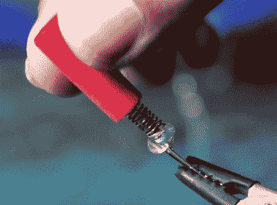

# 用 DIY 振动传感器庆祝春天

> 原文：<https://hackaday.com/2020/05/06/celebrate-spring-with-a-diy-vibration-sensor/>

当你完成旧的积压项目并提出新的项目时，你那堆积如山的电子零件是否在一天天减少？尝试一种永远不会过时的古老消遣方式:用家用物品滚动你自己的传感器。【向列！]需要一种方法来为即将到来的项目感应振动。他们在几分钟内就做好了一个弹簧振动传感器，而不是花费 1 美元外加运费并等待谁知道多久才能收到邮件。

弹簧振动传感器是一种简单的设备，可以用作穷人的加速度计，或者只是检测振动。你所需要的只是一段导线、一个 10kω电阻和一种拾取这些良好振动的方法。出于演示的目的，[向列！]在广告之后的短片中使用了 Arduino Nano。

 金属丝缠绕在螺栓的螺纹上，形成一个线圈，其大小刚好能容纳一个电阻。线圈的一端连接到 5 V，电阻的一端连接到输入引脚。它们一起构成了一个常开开关。当振动迫使两者的自由端接触时，电路接通，引脚被拉高。

如果你做了其中的一个，发现灵敏度下降了，就根据问题用更硬或更软的线缠绕一个新线圈。迭代并不比在螺栓上缠绕电线便宜多少。我们迫不及待地想看看【向列！]将使用此传感器。与此同时，我们计划用一个来检测烘干机何时停止运转并发送短信。

说到廉价的地下室传感器，你知道吗，你可以用两便士、一片阿司匹林和一个衣夹来检测漏水？这些项目展示了你的聪明才智，你可以在[我们新的家庭制造技术大赛](https://hackaday.com/2020/04/30/new-contest-making-tech-at-home/)中赢得一堆玩具，比赛将于 2020 年 7 月 28 日结束。

 [https://www.youtube.com/embed/2uKfY-7G48g?version=3&rel=1&showsearch=0&showinfo=1&iv_load_policy=1&fs=1&hl=en-US&autohide=2&wmode=transparent](https://www.youtube.com/embed/2uKfY-7G48g?version=3&rel=1&showsearch=0&showinfo=1&iv_load_policy=1&fs=1&hl=en-US&autohide=2&wmode=transparent)

