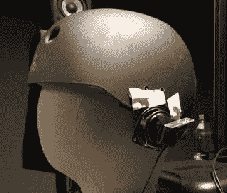
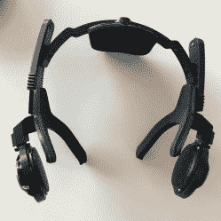

# 窥视阀的虚拟现实的耳外扬声器原型

> 原文：<https://hackaday.com/2020/05/06/peek-at-the-off-ear-speaker-prototypes-for-valves-vr/>

Valve Index VR 耳机融入了多项创新，其中一项是与众不同的离耳扬声器，而不是耳机或耳塞。Valve [的【Emily Ridgway】分享了这一不寻常系统的设计和演变，深入探讨了索引耳机的元素](https://www.valvesoftware.com/en/index/deep-dive/ear-speakers)。[Emily]准确地解释了他们想要实现的目标，他们如何确定在虚拟现实环境中提供良好声音的重要性和不重要性，以及他们能够实现的目标。

First prototype, a proof-of-concept that validated the basic idea and benefits of off-ear audio delivery.

早期研究表明，音频对于在虚拟现实环境中提供良好的沉浸感极其重要，但提供虚拟现实优化的音频体验涉及许多有趣的问题，这些问题无法通过耳机或耳塞的常用解决方案来解决。耳机和耳塞经过优化，可以传递音乐和娱乐声音，事实证明，这些并不能完全传递 Valve 确定在 VR 中很重要的一切。

人类的大脑极其善于利用细微的线索来判断声音是否“真实”，各种细节都发挥了作用。例如，一个人的耳朵形状、头部形状和面部几何形状都会给大脑预期会遇到的传入声音添加特定的音调特征。它不仅有助于定位声音，而且大脑利用声音的存在(或不存在)来决定声音有多“真实”。使用耳塞将声音直接传递到耳道中绕过了这一点，大脑更容易将这种声音视为“不真实”或甚至似乎来自于人的大脑，即使声音本身——如背后的脚步声——是高度准确的物理模拟。这个问题和其他问题是多个原型和大量测试的焦点。有趣的是，好的 VR 音频并不总是尽可能自然。例如，低频在自然界中并不常见，但良好的低音对于传递尺度感和冲击力以及拨动情感琴弦至关重要。

“Hummingbird” prototype using BMR drivers. Over twenty were made and lent to colleagues to test at home. No one wanted to give them back.

第一个原型展示了尽早测试一个概念的价值，它不是什么花哨的东西。安装在滑板头盔上的两个小扬声器验证了耳外音频传输的想法。它并不完美:扬声器太重，太大，对位置的变化太敏感，低音响应差。但是结果是积极的，足以保证更多的工作。

最终，Index 耳机的系统严重依赖平衡模式辐射器(BMR)扬声器设计。[剑桥音频对 BMR 如何工作有一个简短而甜蜜的描述；](https://www.cambridgeaudio.com/usa/en/blog/what-is-bmr)它可以被认为是传统活塞扬声器驱动器和平板扬声器的混合体，最终设计能够在房间规模的环境中提供沉浸式 VR 音频的所有真正重要的部分。

任何熟悉工程和设计的人都知道，一切都是一种权衡，这一事实可能在尖端技术中最为明显。例如，当 [Valve 在头戴式显示器](https://hackaday.com/2019/06/21/everything-you-probably-didnt-know-about-fov-in-hmds/)中深入研究视野(FOV)时，我们看到了平衡不同功能和权衡可能是多么复杂。