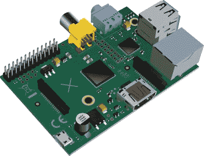
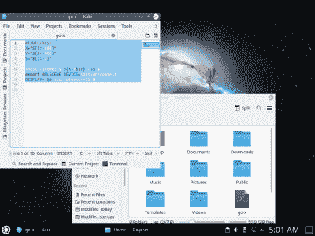
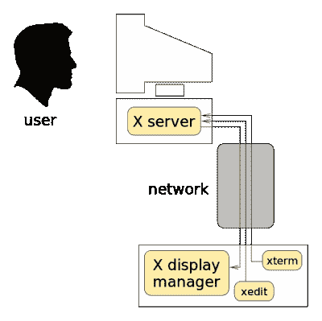

# Linux Fu:树莓 Pi 桌面无头

> 原文：<https://hackaday.com/2020/06/01/linux-fu-raspberry-pi-desktop-headless/>

在我看来，说到树莓派，有两个阵营。有些人把它们当作小电脑，甚至是连接了键盘和屏幕的笔记本电脑。但是我们中的许多人把它们当作廉价的 Linux 服务器。我属于后一种阵营。如果不算我的媒体流盒，我可能只在 Pi 上插过两三次 HDMI 插头。只要你有一根以太网电缆或者愿意在第一次启动机器之前编辑 SD 卡，你甚至可以设置它们为无头模式。

然而，对于 Raspberry Pi 4，我想在没有备用显示器的情况下使用台式机。我将向您展示两种方法，让一个完整的图形 KDE 桌面运行，只需要一个网络连接。

同样的原则也适用于大多数其他桌面环境，但是我在 Pi 上使用的是 KDE 和 Ubuntu，尽管更轻便的程序可能会运行得更好。但在这之前，我们先来说说 X11 这些年是如何出现了很大的身份危机的。

## 这个计划

远程访问 X 程序的方法有很多，很多现在已经很少用了。然而，出于这个目的，我们将使用 SSH 隧道和一些特殊的技巧来运行整个桌面。在 SSH 上运行一个 X 程序很容易，您可能经常这样做。如果是这样，您可以跳到下一部分。

[](https://hackaday.com/wp-content/uploads/2020/05/x11.png) 如果你之前没有做过 SSH 隧道，不用担心；这很容易。当您开始将`ssh`转换为 Pi 时，只需包括`-X`或`-Y`选项。您也可以在`ssh`配置文件(`ForwardX11 yes`或`ForwardX11Trusted yes`)中进行配置，这样您就不必总是键入它。SSH 程序也必须配置为允许这样做，但这通常是默认行为。

考虑这个命令。

```
ssh -X me@mypi.local konsole &
```

那会在你的 Pi 上运行`konsole`，但是屏幕出现在你的主机上。这很好，但这不是整个桌面体验。此外，一些程序确实希望得到其他服务的支持，比如 KDE 这样的桌面环境。所以窍门是如何启动桌面？

## 隧道桌面

如果你想开始一个现代版的 KDE，你可以运行`startplasma-x11`。显而易见的是，可以通过 SSH 连接尝试 X 转发。不过，这没用。你的屏幕已经被别的东西管理了——甚至可能是 KDE。

[](https://hackaday.com/wp-content/uploads/2020/05/pi-free.jpg) 诀窍是只为树莓派创建一个新的 X 服务器。虽然您可以启动一个新的服务器，但创建一个位于主服务器屏幕窗口中的假服务器更容易。有两种方法:`Xnest`和`Xephyr`。`Xnest`非常老，创建了一个功能非常少的简单服务器。它依赖于主机 X 服务器的大多数功能。`Xephyr`更现代。无论主机服务器提供什么，它都提供了许多现代功能。它基本上使用主机服务器作为帧缓冲区。

当然，这都假设您已经在 Pi 上安装了 KDE 桌面。如果你还没有做，一个简单的`kubuntu-desktop`的`apt install`将会解决这个问题。

## 使用 XNest

`XNest`的诀窍在于它创建了一个新的服务器，恰好利用了原来的服务器——它们是嵌套的。有很多选项，但通常，只要用一个新的(未使用的)显示号运行程序就足够了。

```
Xnest :11
```

注意第一个 X 是大写的。您可能需要设置大小:

```
Xnest --geometry 800x600 :11
```

您可以在您的本地机器上或者从 Pi 运行它。只要您在 SSH 连接上设置了 X 隧道，这就没有关系。但是还有一个问题。

尝试跑步:

```
DISPLAY=:11 startplasma-x11
```

最有可能的是，它将启动一些事情，并会出现工作。但是在某些时候，你会得到一个致命的错误，什么也不会发生。问题在于试图在远程 GPU 上渲染。这可能不是一些轻量级台式机的问题，但 KDE 停止。

诀窍是您需要设置一个环境变量来告诉 Qt 不要尝试进行硬件渲染:

```
QMLSCENE_DEVICE=softwarecontext startplasma-x11
```

这样做的伎俩，现在你可以有一个完整的 KDE 桌面上运行的 Pi 和显示在您的主监视器！你不会想用它来看视频或玩游戏，但除此之外，它还是非常好用的。

我把这一切都包在一个剧本里:

```

#!/bin/bash
Xnest -geometry 3840x2050 :2 &
export QMLSCENE_DEVICE=softwarecontext
DISPLAY=:2 startplasma-x11 &

```

或者更花哨一点:

```

#!/bin/bash
X="${1:-1024}"
Y="${2:-768}"
S="${3:2}"
Xnest -geometry ${X}x${Y} :$S &
export QMLSCENE_DEVICE=softwarecontext 
DISPLAY=:$S startplasma-x11 &

```

[](https://hackaday.com/wp-content/uploads/2020/05/kde.png)

## 使用 Xephyr

Xephyr 通常不会安装，您可能需要在您的操作系统上查找它是什么包。对于 Ubuntu，包是`xserver-xephyr`。出于某种原因，在 Pi 上运行它只会导致程序停止运行，什么也不做——至少在我的设置上是这样。不过，理论上你应该可以用它来代替 Xnest。

相反，我在本地机器上创建了服务器，然后请求 Pi 使用它。所以:

```

Xephyr :1 -screen 1200x720 -resizeable &
DISPLAY=:1 ssh -X ubuntu@192.168.1.39 "QMLSCENE_DEVICE=softwarecontext startplasma-x11" &

```

这是可行的，但是非常慢。`Xephyr`独立完成大量工作，因此`Xnest`解决方案更快。

## 那个 X

[](https://hackaday.com/wp-content/uploads/2020/05/x11net.png)X11 开始的时候，它有一个宏伟的计划。从您的登录屏幕，您应该能够登录到任何您有权访问的计算机。然后，你应该能够从任何一台计算机上运行你的屏幕上的程序，而不仅仅是你作为主计算机使用的那台。这在某种程度上仍然有效。然而，大多数 Linux 发行版并没有真正设置为充分利用它。

事情应该如何的诀窍是显示变量。它设置了 X 客户端(程序)连接到 X 服务器(您的屏幕)的位置。你可以把它设置成远程的。例如:

```
DISPLAY=mydesktop.local:0 konsole
```

从理论上来说，这应该具有相同的效果，但前提是您的网络在大约 9000 个端口上是开放的，并且您的 Xserver 是开放的或者设置了对等鉴定方案。

事实上，您可以使用许多欢迎程序(您向其提供用户名和密码的程序)并重新配置它们来监听网络连接并创建到其他机器的网络连接，就像 X11 设计者打算的那样。但是大多数发行版都关闭了这个功能，我甚至不确定一些新的欢迎界面是否提供了这个选项。

在现代使用中，X11 系统已经变成了你的显示器的准显示驱动程序，这很可悲。x 有如此多的功能，以至于大约 90%的 Linux 世界都没有使用。(回想一下，88.35%的统计都是现场编的。)

如果你想尝试用老方法设置它，看看`xhost`、`xauth`，并准备好改变你的 X 服务器启动，去掉阻止它监听 TCP 套接字的标志。可以做到。当然，网络安全可能不是您想要的。不过，SSH 上的隧道只用一行代码就解决了这个问题。

## 解决方案

即使完成了所有这些工作，对于大多数工作，我仍然只是从命令行登录到我的 Pi。我可能包括 X11 转发，这样我就可以在我的桌面上运行这个奇怪的程序。然而，在你真的想使用整个桌面的时候，`Xnest`解决方案已经足够好了。`Xephyr`速度很慢。我不确定如果在圆周率上运行会不会更快，但那对我来说从来都不起作用。我怀疑这是一些与 NVidia 显示驱动程序的交互，但我没有跟踪它。

同时，如果你尝试这样做，考虑把窗口做得尽可能大，并把它放在一个虚拟桌面上。这是一个巧妙的解决方案，因为您可以翻转桌面来访问 Pi 或您的常规计算机。再添加一个运行 Windows 的 VirtualBox 桌面，你就有了操作系统 trifecta。如果你使用 Wayland，这可能仍然可以使用`Xwayland`，但我没有测试出来。

如果你真的想用 Pi 替换你的桌面，你可能想考虑一下这个试用版。或者也许你更喜欢[一台笔记本电脑](https://hackaday.com/2020/05/01/old-laptop-gets-new-lease-on-life-with-raspberry-pi/)。