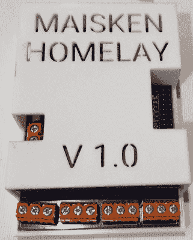

# 一把 ESP32 家庭自动化瑞士军刀

> 原文：<https://hackaday.com/2020/05/14/an-esp32-home-automation-swiss-army-knife/>

多亏了 ESP8266 和 ESP32，我们最近看到了 DIY 家庭自动化项目的爆炸式增长。当只需要 3 美元和几行代码就能把你的小工具带到网络上时，这就不足为奇了。但是将裸露的 ESP 模块植入设备只能做到这一步。最终你可能会想要组装一个稍微成熟一点的家庭自动化系统，这就是事情变得有点棘手的地方。

 这也是【阿尔弗雷多】创作 Maisken Homelay 的原因。[这款设备是满足您家庭自动化需求的一站式商店](https://upverter.com/design/maisken/19555d1b5c7ce35a/homelay-v101/)，它利用了 ESP32 的强大功能。通过将微控制器插入这个紧凑的 PCB，您将能够为您的高电流或交流负载触发四个继电器，并且仍然有 8 个 GPIOs 和 I2C 总线进行扩展。同时保持与现有开源项目(如 Home Assistant 和 ESPHome)的兼容性。

真正让这个项目与众不同的是对细节的关注。[Alfredo]在板上包括了 HLK-PM01 电源，它可以将电源电压降低到 5 VDC，用于 ESP32，因此不需要单独的电源线。他还花时间添加隔离槽，将连接到继电器的潜在高压与电路板的其他部分分开，添加电流和热保险丝进行保护，并在电路板上布满螺丝端子，这样你就可以轻松地连接所有东西。

当然，你可以从通常的嫌疑人那里花几块钱就能买到一个简单的继电器板。但它不会像 Maisken Homelay 那样提供高质量的生活和安全功能。甚至有一个 3D 打印的外壳可以帮助整理东西。

[由于一些知名的](https://hackaday.com/2020/02/24/ethics-whiplash-as-sonos-tries-every-possible-wrong-way-to-handle-iot-right/)[家庭自动化公司最近做出了一些公然反对消费者的决定](https://hackaday.com/2020/05/07/ask-hackaday-wink-hubs-extortion-as-a-service/)，现在比以往任何时候都有更多的理由使用开源硬件和软件推出你自己的智能家居。这仍然比从大型零售商那里购买一堆模块需要更多的努力，但像这样的项目肯定开始模糊消费者和 DIY 之间的界限。