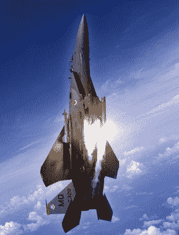
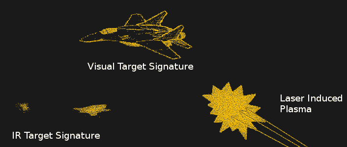
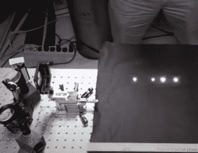

# 等离子“幽灵”可能有助于保证未来飞机的安全

> 原文：<https://hackaday.com/2020/05/18/plasma-ghosts-may-help-keep-future-aircraft-safe/>

空对空战斗或“斗狗”曾经是非常私人的事情。第一次和第二次世界大战的飞行员必须靠得非常近才能用他们的枪击中目标，因此以空中相撞结束争吵并不罕见。但是到了 20 世纪 60 年代，导弹技术已经发展到一种程度，战斗机甚至可以在目标进入可视范围之前锁定敌机并开火。飞行员的技能和经验已经不足以保证交战的结果，于是一场新的军备竞赛开始了。

An F-15 launching flare countermeasures.

很自然地，转向制导武器引发了防御性反制措施的发展，这可能会使他们感到困惑。如果导弹是由雷达引导的，目标飞机可以发射一团被称为箔条的金属条来压倒它的目标系统。热寻的导弹可以用比飞机引擎排气还热的火焰发射出去。这两种技术都简单、可靠，并且在半个多世纪的导弹发展后仍然有效。

但是它们并不完美。最大的问题是箔条和照明弹都是有限的资源:一旦飞机耗尽库存，它就失去了防御能力。它们也只能在有限的时间内工作，这使得它们的部署时间绝对关键。自动撒布器有助于确保尽可能高效地使用对抗手段，但如果有足够的时间，敌人持续的火力仍可能耗尽飞机的防御系统。

为了开发终极防御对策，美国海军一直在研究一种可以在半空中投射诱饵飞机的系统。在最近公布的专利中被称为“幽灵”，只要系统有电力，就可以产生几架这种幽灵飞机。历史告诉我们，这种技术的扩散将不可避免地导致更敏感的制导导弹的发展，但与此同时，它可以使美国飞机在任何潜在的空对空交战中获得相当大的优势。

## 寻找角色

乍一看，这个想法听起来像科幻小说里的东西。几十年来，投射到稀薄空气中的立体全息图一直是显示技术的圣杯，海军已经将这一概念发展到足以将它栓在飞机后面的地步，这一想法可能会令人震惊。但这里重要的区别是投影并不是试图愚弄人眼。也许最好将投影视为传统耀斑的固态替代品:这一想法是在空气中产生大量等离子体，以适当的波长发射足够的能量，以分散从物理飞机发射的能量。

Illustration from the Navy’s patent application

但这也不一定意味着投影会是一个无定形的斑点。该专利特别提到，该系统的 248 纳米氟化氪(KrF)激光器可以与镜子和光栅光学系统配对，以在太空中创建 2D 和 3D 立体图像。它接着将这项技术与阴极射线管电视中用扫描电子束绘制图像的方式进行了比较。

因此，虽然投影不会明显类似于实际的飞机，但它可以被赋予三维形状，以更好地近似喷气发动机或机身。这是对传统对抗措施的一个关键改进，因为 AIM-132 等更先进的制导导弹现在包括热成像技术，可以区分像耀斑这样的热“点源”和更细微的飞机形状。

## 激光灯展

碰巧的是，用激光在空中投射相对简单的几何图形的技术并不算新。一家日本公司早在 2011 年就展示了使用激光诱导等离子球作为基本显示器的“像素”，并计划将其用于广告和紧急通知。虽然这项技术提供了有限的分辨率，但它足以绘制即使在白天也可见的形状和文本。

 [https://www.youtube.com/embed/GNoOiXkXmYQ?version=3&rel=1&showsearch=0&showinfo=1&iv_load_policy=1&fs=1&hl=en-US&autohide=2&wmode=transparent](https://www.youtube.com/embed/GNoOiXkXmYQ?version=3&rel=1&showsearch=0&showinfo=1&iv_load_policy=1&fs=1&hl=en-US&autohide=2&wmode=transparent) 

这个概念也非常类似于国防部正在进行的一项关于露天等离子扬声器的研究。作为联合非致命武器计划的一部分，等离子点火产生的光和声音被设想为一种使目标眩晕或迷惑的方式。一次演示甚至展示了如何调制等离子球，使其发出声音警告信息。

## 幽灵飞行器

看看现有的激光诱导等离子体实验，海军的想法突然看起来更合理了。虽然将足够强大的激光器和相关的光学器件装入一个小到足以安装到战斗机上的包中可能还需要几年时间，但显然这个概念本身是合理的。

DoD laser-induced plasma experiment.

这种系统相对于传统火炬的优势是相当大的。如前所述，这种类型的对策是不可消耗的。箔条和照明弹需要在自动分配器的帮助下小心分配，但只要涡轮在旋转，飞机有足够的电力来操作激光，投射就可以保持活跃。

另一个关键的改进是等离子体诱饵实际上会跟随飞机飞行。有形的对抗措施很快就被抛在了后面，但是这些幽灵将能够在整个任务中与飞机保持一定的距离。

那么，当飞机能够在背后投射等离子体幽灵，使它们免受热寻的导弹攻击时，会发生什么呢？似乎下一个合乎逻辑的步骤是开发利用视觉识别进行末制导的导弹。在那种情况下，你需要一个发射器来投射一个假目标，这个假目标实际上看起来像一架真正的飞机，在这种情况下，我们可能会在不久的将来获得传说中的全息显示技术。