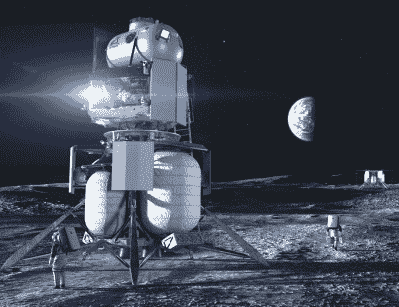
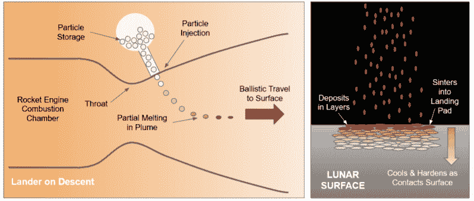

# 马斯滕月球火箭有着陆垫，将旅行

> 原文：<https://hackaday.com/2020/05/20/masten-moon-rocket-has-landing-pad-will-travel/>

由于阿波罗任务使用的建筑，在月球表面长时间停留是不可能的。斯巴达登月舱根本不够大，不足以支持超过几天的短途旅行，即使这样也是在挑战极限。但是，阿波罗计划从来没有打算成为一个概念证明，证明人类可以在月球上进行可控着陆并安全返回地球。人们总是认为，在以后的任务中，会用更先进的设备和航天器进行更详细的探索。

现在，美国宇航局希望这最终能在 21 世纪 20 年代实现，作为其 Artemis 计划的一部分。该机构表示，这些任务不仅仅是观光旅行，他们的目标是在我们最近的天体邻居上和周围建立可持续的基础设施。有了月球轨道上的空间站和月球表面的永久前哨，人员可以定期在地球和月球之间穿梭，类似于国际空间站目前处理船员轮换的方式。

Artemis lander concept

当然，在此之前，有相当多的技术挑战需要解决。一个主要的挑战是找到安全准确地将多种有效载荷运送到月球表面的方法。如果所有的主要模块彼此相距几公里远，建立一个月球前哨站将会困难得多，因此美国宇航局正在与商业公司合作开发能够高精度着陆的乘员和货运车辆。

但是准确地将它们降下来只是问题的一半。阿波罗登月舱是迄今为止人类在另一个天体上着陆的最大最重的物体，但与美国宇航局正在考虑的 Artemis 计划的一些车辆和组件相比，它绝对相形见绌。一个非常现实的担忧是，将这些巨大的飞行器优雅地降落到月球表面所需的强大火箭发动机可能会激起危险的高速尘埃和碎片云。在极端的情况下，着陆器甚至会发现自己在一个新挖的陨石坑底部着陆。

当然，合乎逻辑的解决方案是在阿耳忒弥斯基地周围建造可以支撑这些重量级车辆的加固着陆平台。但这导致了一个“先有鸡还是先有蛋”的问题:如果你不能首先将大量材料运送到地表，你如何建造一个合适的着陆垫？有几种不同的方法被考虑来解决这个问题，但其中最有趣的肯定是 Masten Space Systems 提出的想法。他们的实验技术将允许火箭发动机通过在接近月球表面时喷射熔融铝来建造自己的着陆平台。

## 熟能生巧

虽然 Masten 可能不是一个家喻户晓的名字，但当谈到着陆火箭时，他们也不是新手。事实上，这是他们的专长。该公司成立于 2004 年，一直致力于一系列日益强大的垂直起飞、垂直着陆(VTVL)车辆，累计执行了 600 多次飞行。最新版本的 XL-1[已被选为美国宇航局月球催化剂计划](https://www.nasa.gov/lunarcatalyst)的一部分，将在 2022 年前向月球南极运送多种有效载荷。

在莫哈韦沙漠开发火箭动力着陆器十多年后，马斯滕非常清楚着陆前高速喷出物带来的危险。他们发现最简单的解决方法是简单地在飞行器底部增加足够的屏蔽，土壤和岩石会反弹而不会造成任何损害。但是它不能很好地扩展，因为你给飞行器增加的每一点屏蔽都会降低它的有效载荷能力。

此外，即使你给着陆器加装装甲，使喷射出的物质不会对它造成任何损害，它仍然会在每次着陆时在地面上钻一个洞。它仍然会危及附近的车辆和建筑物；除了第一次任务，这是一个严重的问题。正因为如此，马斯滕开始研究月球表面在着陆引擎的压力下会有什么样的表现。

 [https://www.youtube.com/embed/BDxwwjNm-So?version=3&rel=1&showsearch=0&showinfo=1&iv_load_policy=1&fs=1&hl=en-US&autohide=2&wmode=transparent](https://www.youtube.com/embed/BDxwwjNm-So?version=3&rel=1&showsearch=0&showinfo=1&iv_load_policy=1&fs=1&hl=en-US&autohide=2&wmode=transparent)

在地球上完全模拟月球条件是不可能的，因为没有办法减少重力对火箭排气吹出的物质的影响。但他们的地面测试足以说服他们，他们应该开始研究不同的方法来解决这个问题。

## 即时着陆垫，只需加热

Masten 的概念被称为 FAST，或空中氧化铝喷涂技术。为了使用 FAST，着陆器将下降到距离月球表面几米以内，并进入受控悬停状态。氧化铝颗粒将被注入火箭的排气中，在那里它们被熔化并向下喷射。一旦氧化铝碰到月球风化层，它就会与松散的物质结合，然后冷却固化。

通过在着陆点上缓慢移动，引擎可以沉积足够厚的熔融氧化铝层，以创建所需尺寸的定制着陆垫。在完全硬化后，Masten 的提案称，它应该具有足够的耐热性和耐磨性，以使车辆在不扬起任何灰尘或形成弹坑的情况下完成体面。

或者至少，这是我的想法。将固体粒子注入运行中的火箭发动机的排气羽流相对来说是一个未被探索的领域，看看 Masten 的发现会很有趣。在悬停机动期间，是否需要调整以保持稳定的推力？氧化铝有可能在发动机内部堆积吗？它会不会堵塞发动机，使重新点火变得不可能？

该公司表示，在最终决定这项技术是否值得用于 Artemis 项目之前，他们将在接下来的九个月里研究这些问题，甚至可能更多。即使它没有及时为 2022-2024 年的着陆做好准备，美国宇航局称这将是迈向可持续月球探索计划的第一步，该公司相信，当该机构在 21 世纪 30 年代及以后将注意力转向火星时，这个想法仍然可以使用。