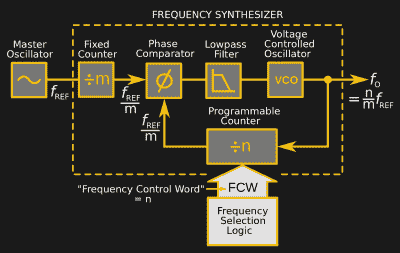

# 作为 PLL 的 Arduino

> 原文：<https://hackaday.com/2020/05/23/an-arduino-as-a-pll/>

许多业余无线电和其他项目的核心是 VFO，或可变频率振荡器。几十年前，这可能是一个自由运行的 LC 调谐电路，但随着技术的进步，它被数字锁相环频率合成器取代，最近则被 DDS 或直接数字合成芯片取代，其中的波形直接由 DAC 产生。由于 Si5351 等 IC 的存在，锁相环(PLL)仍然是一种流行的选择，但很少像以前那样由单个芯片构成。[fvfilippetti]通过用 Arduino (西班牙语，[谷歌翻译链接](https://translate.google.com/translate?client=ubuntu&client=tw-ob&channel=fs&oe=utf-8&um=1&ie=UTF-8&hl=en&sl=auto&tl=en&u=https%3A%2F%2Ffvfilippetti.blogspot.com%2F2020%2F05%2Farduino-pll-con-la-minima-cantidad-de.html))取代它的一些复杂性，重新审视了这条经典赛道[。](https://fvfilippetti.blogspot.com/2020/05/arduino-pll-con-la-minima-cantidad-de.html)

The internals of a PLL frequency synthesiser. [Image by Chetvorno](https://commons.wikimedia.org/wiki/File:PLL_frequency_synthesizer_2.svg) – CC0

PLL 是一种简单的电路，其中一个振荡器通过比较两个振荡器的相位得到的电压来控制，从而锁定另一个振荡器。将 PLL 与一组分频器相结合产生了频率合成器，其中可变频率振荡器可以锁定到单频晶体，其输出频率由分频比设定。经典的 PLL 芯片是 CMOS 4046，它将与一堆逻辑芯片结合在一起，构成一个频率合成器。Arduino 版本使用 Arduino 的内部外设来代替晶体振荡器、分频器和相位比较器，从而形成一个极其简单的物理电路，只不过是一个 Arduino 和一个用于 40 米业余波段的 VCO。如果你想亲自尝试，可以在 GitLab 上找到代码。

看看这个合成器在保持稳定的频率和最小的相位噪声方面有多好将会很有趣。人们很容易认为频率合成器之类的东西已经是板上钉钉的事情了，所以看到有人给它们带来新的东西总是受欢迎的。同时，如果您对 PLL 不熟悉，[我们正好为您介绍一下](https://hackaday.com/2016/03/23/unlock-the-phase-locked-loop/)。