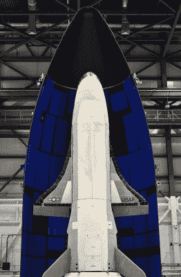
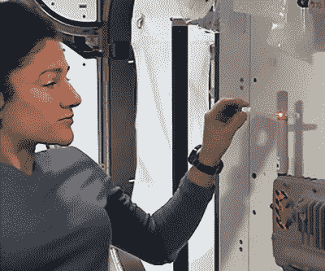
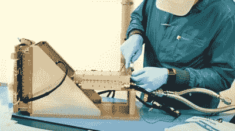

# X-37B 空天飞机将测试能量束技术

> 原文：<https://hackaday.com/2020/05/28/x-37b-spaceplane-to-test-power-beaming-technology/>

自 2010 年以来，美国军方一直在运营两架小型可重复使用的太空飞机，在近地轨道进行秘密的长期飞行。现在，X-37b 在新成立的太空部队的支持下正式运行，允许军方在外部机构有限参与的情况下，对新硬件和技术进行内部研究。太空飞机仍然需要搭乘像 Atlas V 或 Falcon 9 这样的商业火箭前往太空，但一旦它与助推器分离，X-37B 的剩余任务就是军事事务。

An X-37B being prepared for launch.

因此，很自然，关于 5 月 17 日从卡纳维拉尔角空军基地发射的 USSF 7 号任务，我们有很多不知道的。任务的持续时间和船上实验的完整清单是保密的，所以除了国防部没有人真正知道机器人飞船在做什么。但是从以前的任务中，我们知道该飞行器可能会在轨道上停留至少两年，并且有足够的[公开信息来拼凑它将进行的至少一些调查](https://www.spaceforce.mil/News/Article/2177702/next-x-37b-orbital-test-vehicle-scheduled-to-launch)。

当然，其中最有趣的是美国海军研究实验室(NRL)的一项实验，该实验将研究将太阳能转化为窄微波束；这个概念长期以来被认为是打开轨道太阳能电池阵列提供的几乎无限的能源潜力的关键。即使规模较小，一种安全可靠的空中输电方式也会有许多可能的应用。例如，它可以用来保持无人驾驶飞行器无限期地在空中飞行，或者在电动飞机起飞时为其提供额外的动力。

对这项技术进行轨道测试是一项严肃的任务，表明所有相关方必须对硬件有相当高的信心。不幸的是，目前没有太多关于 X-37B 上能量束实验的公开信息。甚至没有迹象表明它将在什么时候执行，更不用说我们什么时候应该看到任何类型的关于它如何进行的报告了。但是我们可以根据海军研究实验室在这个领域已经做的工作做出一些有根据的猜测。

## 开始(非常)小

事实证明，X-37B 实验不会是海军研究实验室第一次展示太空无线电力传输的概念。今年 4 月，宇航员杰西卡·梅尔(Jessica Meir)验证了实验室的发光整流天线(LECtenna)在国际空间站(ISS)上如预期一样工作。尽管被誉为这一概念在轨道上进行的首次实际测试，但实验的范围比你可能预期的更有限。

A LECtenna lights up on the ISS

国际空间站上展示的 LECtenna 只不过是一个标准的 LED 和一个肖特基二极管，它们的引线缠绕在一起。固定在一个透明的塑料管中，这个简单的电路能够在接近高频能量时使 LED 闪烁。在 NRL YouTube 频道的一个视频中，Meir 将简单的 LECtenna 带到了一个车站 WiFi 接入点的几毫米范围内，以证明这个概念是可行的。

实际上，这次示威与其说是为了什么，不如说是为了公关。在视频的最后，Meir 解释说，观众可以构建自己的 LECtenna，用来可视化自己家周围的能量。

在一个配套的视频中，一名 NRL 的研究人员一步一步地介绍了建造 LECtenna 的过程。他最后邀请教育工作者将视频作为互动实验室的一部分。看起来 NRL 内部的一些人想要确保人们对无线电力传输有所了解，并且考虑到公众中的某些人如何对新技术做出反应，这可能不是一个坏主意。

 [https://www.youtube.com/embed/zo7w0D6vz5g?version=3&rel=1&showsearch=0&showinfo=1&iv_load_policy=1&fs=1&hl=en-US&autohide=2&wmode=transparent](https://www.youtube.com/embed/zo7w0D6vz5g?version=3&rel=1&showsearch=0&showinfo=1&iv_load_policy=1&fs=1&hl=en-US&autohide=2&wmode=transparent)

即使它提供有限的实际应用，国际空间站上的 LECtenna 演示基本上与适当的空间太阳能装置的工作方式相同。太阳光被空间站的太阳能电池阵列转化为电能，进而以标准 WiFi 的形式产生 2.4 GHz 的电磁辐射。这种辐射能量的一小部分被 LECtenna 捕获，然后转换回点亮 LED 的 DC 电压。但是能在更大范围内做到吗？

## 现在你在玩弄权力

NRL 送上 X-37B 的硬件，被称为光电射频天线模块(PRAM)，旨在现实世界条件下找到答案。该设备使用一个 12 英寸见方的光伏板，将阳光转化为电能，驱动高频发电机。从公布的信息来看，目前还不清楚实验的接收器端是什么样的，尽管可能至少会有一些方法来检测 PRAM 辐射的微波能量。

PRAM module, with possible liquid cooling connections.

[根据 NRL 的新闻稿](https://www.nrl.navy.mil/news/releases/nrl-conducts-first-test-solar-power-satellite-hardware-orbit)，这项实验的主要焦点将是研究 PRAM 在运行时的热特性。保持温度稳定可能是一个挑战，因为冷却系统不仅要应对微波电子设备产生的任何热量，还要应对强烈的阳光。与地球表面相比，天基太阳能(SBSP)的主要优势之一是收集时间更长，因此硬件需要能够持续运行数年或数十年。

这种婴儿车不太可能真的被用来将电力送回地球。考虑到可能出现的巨大损失(SBSP 提案通常假设传输损失约为 60%)，如此小的太阳能电池板到达地球表面的能量没有实际应用价值。虽然这是一个足够灵敏的接收器，但还是有可能做出一些努力来至少检测到来自地面站的能量束。

## 命运之矛

如果可行，天基太阳能可以大大减少我们对化石燃料的依赖，同时解决当代可再生能源的缺点和核电的耻辱。除了完善核聚变能源，这可能是人类以负责任和可持续的方式满足其巨大能源需求的最佳机会。

鉴于这项研究的不可思议的重要性，有人可能会问为什么它是在一个神秘的军事航天器上进行测试，而不是在国际空间站甚至是一颗专用卫星上进行测试。虽然在这一点上还只是猜测，但有人认为军方对这项技术感兴趣，并希望尽快开发出来。

 这当然不难看出为什么。在不考虑当地基础设施的情况下，向前线的车辆和基地传送能量的能力将是对敌人不可思议的战术优势。太空部队当然也对太空战技术的武器化感兴趣。任何强大到足以克服大气损耗并向地球表面传送有用能量的微波发射器[都可以很容易地被重新用作反卫星武器](https://hackaday.com/2019/04/09/humanity-creates-a-cloud-of-space-garbage-again/)。

正如全球定位系统开始时是一个军事项目，后来演变成平民日常使用的东西一样，来自太空的太阳能也可能开始成为一种战争工具。这可能不是一个特别令人愉快的想法，但如果这意味着该技术得到更快的发展，并最终可以被用于更和平的努力，这可能是值得付出的代价。