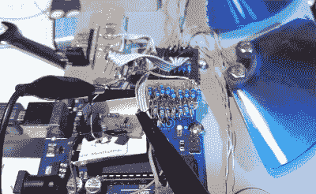

# Arduino 鼓带来噪音，不需要 MIDI

> 原文：<https://hackaday.com/2020/06/02/arduino-drums-bring-the-noise-no-midi-required/>

在浏览现有的 Arduino 架子鼓项目时，[joekutz]注意到大多数项目只是将微控制器用作现有 MIDI 设备的输入。如果你只是想构建自己的硬件接口，这很好，但他想知道是否有可能[完全放弃 MIDI 设备，实际上在内部生成音频](https://hackaday.io/project/171929-an-arduino-based-standalone-drum-kit)。

 可以肯定的是，这对于 8 位微控制器来说是一个很高的要求，这可能是为什么没有人这样做的原因。但是[joekutz]不会不战而降。最棘手的一个方面是存储样本:8 位、11.025 KHz 的 mono WAV 文件最终必须用定制的 Python 脚本转换成 C 数据数组。

不幸的是，由于样本本质上是鼓的源代码的一部分，他说分发固件是一个问题。虽然对于那些想在家玩的人来说，听起来似乎很快会有一个解决方案。

但是不要给人留下这个项目只是软件的印象。看看由冰棒棒和从汽水罐上切下的金属精心制作的定制冲击传感器，这些传感器与从旧 DVD-r 上切下的部分相匹配。实际上，从 Arduino 中获取节拍需要增加一个 R2R DAC 电路和一个 TDA2822 放大器。在休息后的视频中，你可以亲自听到结果。

【joekutz】对家酿电子乐器并不陌生。当我们最后一次听到他的消息时，他正在把一个粉红色的键盘变成他自己的个人赛车场。

 [https://www.youtube.com/embed/bmqbXa3qDog?version=3&rel=1&showsearch=0&showinfo=1&iv_load_policy=1&fs=1&hl=en-US&autohide=2&wmode=transparent](https://www.youtube.com/embed/bmqbXa3qDog?version=3&rel=1&showsearch=0&showinfo=1&iv_load_policy=1&fs=1&hl=en-US&autohide=2&wmode=transparent)

