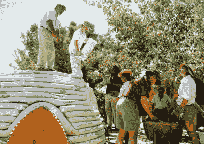
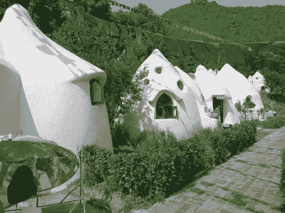
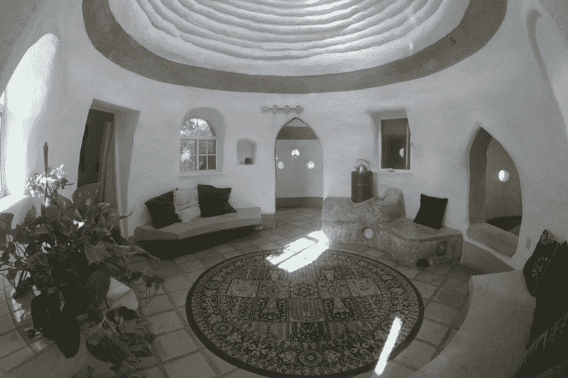
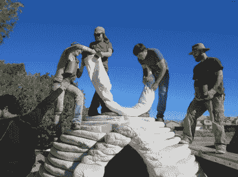

# 黑客日奖:Cal-Earth 正在深入挖掘，为有需要的人提供住所

> 原文：<https://hackaday.com/2020/06/16/hackaday-prize-cal-earth-is-digging-deep-to-shelter-those-in-need/>

对于普通人来说，政府要求原地避难或呆在家里的命令伴随着一些调整。许多变化都是理智的:我们在与家人团聚的广阔天地中航行，同时找出如何平衡工作、生活和新发现的教学角色。其他的改变是物理上的，比如给彼此足够的空间去获得成功。少数幸运者可以说，他们个人没有太大变化。不管你在这件事上的地位如何，如果你有一个容身之处，你比世界上 20%的人做得更好。

CalEarth founder Nader Khalili leads from the top of a dome in progress.

估计有 16 亿人，包括无家可归者和难民，没有足够的住所。对住所的需求是人类幸福的基石，然而为自己建造一个家似乎完全遥不可及。毕竟，如果没有一名建筑师、一两名工程师和一组携带重型设备的建筑工人，大多数人都没有资格建造一座可居住的建筑。或者他们是？

这完全取决于设计和材料。穹顶结构已经存在了几个世纪，使用压实的泥土来建造墙壁的想法是一个经过实践检验的真实概念。建筑师 Nader Khalili 利用他的 SuperAdobe 建筑系统完美地融合了这两个概念，该系统使用长沙袋填充湿润的泥土。哈利利在 1991 年开办了[加州地球建筑学院](https://www.calearth.org/) (CalEarth)，探索 SuperAdobe 的可能性，并在建筑过程中教育其他人。

> 我在穷人中长大。我是九个孩子中的一个，一直知道需要什么。我从未忘记，所以现在我在回应。纳德·哈利利

今年，[hack aday Prize](https://prize.supplyframe.com)与 CalEarth 合作，将他们广为人知的可持续生活理念推向未来。与我们的其他三个非营利组织一样，这种努力是双重的。公开征集活动邀请您为 SuperAdobe 住宅设计可持续的附加设施，以扩大其可居住性，并易于建造和使用。整个 6 月和 7 月，我们的 CalEarth 梦之队成员都在努力寻找自动化过程的方法，以便这些家园可以更快地建成，从而帮助更多的人。

## SuperAdobe 超级简单

SuperAdobe 系统非常简单，所有年龄和背景的人只要学会方法并观察它们的行动，就可以开始建造。

实际上，长沙袋是用手工从工地上弄来的湿土填实的。用石灰、水泥或任何可用的东西来稳定土壤。然后将袋子压实，螺旋成层，每层之间铺上一层铁丝网以保持稳定。

这肯定是一个艰苦的过程，但结果是一个可持续的家，即使在极端天气下也容易加热和冷却，并能抵御包括地震在内的自然灾害。SuperAdobe 结构的设计考虑了各种因素，并定位于利用自然光和防风的位置。

## 可持续人道主义援助

CalEarth 的主要重点是提供一个系统，为难民、无家可归者和其他流离失所者建造负担得起的、可持续的家园。他们在几天内就搭建了避难所，直接帮助了那些受到 2010 年海地地震和其他灾难影响的人们。

The Pegasus Children’s Project in Kathmandu, Nepal.

CalEarth 的许多学生接受了这个想法，并利用它来启动或推进他们自己的救济计划。2005 年，英国的小地球慈善机构在尼泊尔的加德满都建造了 40 多个圆顶建筑，为儿童和他们的看护者创建了一个宿舍。令人高兴的是，所有的穹顶都在 2015 年的 7.6 级地震中幸存下来。

加州 Hesperia 的 CalEarth Institute 为任何想为他人甚至为自己建造环保家园的人提供面对面和在线的工作坊和课程。虽然该研究所本身是一个资源的仙境，但其想法是能够在任何需要的地方建造 SuperAdobe 结构，使用任何可用的材料。

因此，替代和即兴表演的能力是计划的重要组成部分。CalEarth 最近开发了一个行李袋避难所系统。从本质上说，他们希望能够让一个人带着两个行李袋登上飞机，行李袋里装满了足够的工具和材料，可以在世界上任何地方建造一个 6 英尺高的紧急避难所。

## 设计可持续的附加产品

CalEarth 的目标之一是通过整合使用可持续技术的现代舒适设施，使这些紧急避难所更适合长期居住。这些将以模块化附件的形式出现，可以根据需要进行定制。

他们对这些附件的主要关注点是加热和冷却方法，如上面显示的生态穹顶中的火箭质量加热器和被动冷却系统。他们还专注于寻找地热地板解决方案、太阳能电池板的新用途以及收集水的方法。如果你能想出一种方法来收集雨水，过滤，并通过太阳能加热淋浴泵出，你肯定是在正确的道路上。

理想情况下，这些附加装置将是模块化的和高度可移动的，以补充紧急避难所行李袋系统。扁平包装设计将是完美的。它们应该易于在世界各地交付，并且一旦到达就可以安装和使用。这些问题需要新鲜的眼光和创造性的思想家，他们重视简单和尽可能利用自然资源。

##  帮助自动化流程

对于梦之队挑战，重点是自动化。建造超级建筑最昂贵的一个方面是时间投资。现在都是手工劳动，用手装袋，一次一桶或者一个咖啡罐。

CalEarth Dream 团队将致力于开发模块化解决方案，以实现过程中每一步的自动化。例如，找到一种机械打开袋子的方法，并在装满时保持打开，这样人们就可以专注于其他事情。或者有没有一种曲柄驱动的机器可以更快地装满袋子，或者有没有一种可折叠的工具可以把袋子捣成更大的脚印？也许有一种方法可以自动铺设铁丝网，这样就不用担心受伤了。

不管你想出什么，我们都想看看。观看下面加州大学地球中心主任希夫特和达斯坦·哈利利的问答视频，更好地了解建设和现代化可持续住房的挑战，并从今天开始！

 [https://www.youtube.com/embed/oF05uOYb9ag?version=3&rel=1&showsearch=0&showinfo=1&iv_load_policy=1&fs=1&hl=en-US&autohide=2&wmode=transparent](https://www.youtube.com/embed/oF05uOYb9ag?version=3&rel=1&showsearch=0&showinfo=1&iv_load_policy=1&fs=1&hl=en-US&autohide=2&wmode=transparent)

所有图片均由 CalEarth 提供。

[hack adayprize 2020](https://prize.supplyframe.com)主办单位: