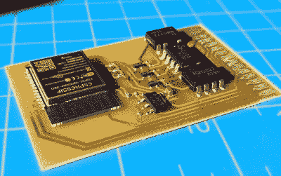

# 从头开始构建 ESP32 智能电源板

> 原文：<https://hackaday.com/2020/06/10/building-an-esp32-smart-power-strip-from-scratch/>

毫无疑问，创建智能电源板最直接的方法是采用现有的模型，加入一些继电器，你可以用支持 WiFi 的微控制器来启动它们。但是这有什么意思呢？为了他最近的项目， [[Md Raz]决定自己建造整个项目，而不是重新利用一个商业电源板。](https://www.botfactory.co/blog/what-s-new-at-botfactory-1/post/creating-a-smart-outlet-121)

 该项目从一个 3D 打印外壳开始，它可以容纳电子设备和三个面板安装插座。使用[热定形插件使其更加坚固](https://hackaday.com/2019/02/28/threading-3d-printed-parts-how-to-use-heat-set-inserts/)用于未来的升级工作，但除此之外，它是一个相当简单的矩形设计。没人说过插线板一定要漂亮，对吧？除了面板安装插座，还有一个交流 DC 转换器，用于将 ESP32 的电源电压降至 5 VDC。

除了微控制器之外，电源板中的定制 PCB 还包含三个连接到 AQH2223 固态继电器(SSR)芯片的 MOSFETs。一旦 ESP32 切换连接到每个 MOSFET 的线路，插座上方的 LED 指示灯就会亮起，相应的 SSR 就会启动以接通电源。通过在微控制器上运行简单的 web 界面，所有三个插座都可以从任何具有 web 浏览器的设备上独立控制。

如果你想限制你与电源电压的互动，那么我们已经看到一些[项目征用商业智能电源板](https://hackaday.com/2018/07/06/smart-power-strip-revived-with-raspberry-pi/)的低压侧。但是请记住，[在电源板](https://hackaday.com/2012/10/04/malicious-raspberry-pi-power-strip-looks-a-bit-scary/)里放一个树莓酱可能会让一些人觉得可疑。