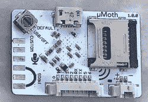

# 音频蛾:墙上的谚语蛾

> 原文：<https://hackaday.com/2020/06/25/audiomoth-the-proverbial-moth-on-the-wall/>

监控环境声音可能不是一项常见的任务，但就像野生动物相机一样，我们可以从一个永远在线的设备中了解到很多关于大自然的信息。 [AudioMoth](https://www.openacousticdevices.info/) 就是这样的设备之一。虽然它已经存在了几年，但它因是一个[开放平台](https://circuithub.com/projects/OpenAcoustics/AudioMoth/revisions/24499/parts)而闻名，拥有完整的基于 Eagle 的硬件设计文件、BOM 和固件，以及基于 NodeJS 和 electronic 的实用软件。

AudioMoth 由基于 Silicon Labs EFM32 的 MCU ( [EFM32WG980F256](https://www.silabs.com/mcu/32-bit/efm32-wonder-gecko/device.EFM32WG980F256-QFP100) )提供支持，该 MCU 具有 Cortex-M4 内核、256 kB 闪存和 32 kB SRAM。它使用板载 MEMS 麦克风记录音频和超声波频率，并以未压缩的 WAV 格式写入 SD 卡。这使得它除了能捕捉鸟类和其他野生动物的叫声外，还能捕捉到一个地区蝙蝠的声音。

AudioMoth 还有一种微型低成本版本，叫做 [μMoth](https://www.openacousticdevices.info/mmoth) ，它与 audio Moth 拥有相同的功能。该项目仍在进行中，预计今年晚些时候会有更新。

虽然 AudioMoth 设备目前显然可以从 LabMaker 等网站上以 74 美元的价格购买，但应该注意的是，该设备上使用的 MCU 被 SiLabs 列为“NRND”(不推荐用于新设计)，这可能会使若干年后构建一个 MCU 变得复杂。或者至少你得换一个不同的微控制器。

无论如何，这看起来确实是野生动物监测的一个有趣的起点，无论是简单地想要建造这样的设备，还是将其作为自己设计的灵感。