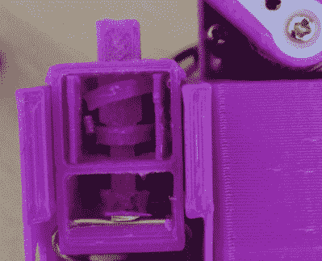

# 开关测试仪伺服冲击他们，直到他们失败

> 原文：<https://hackaday.com/2020/06/23/switch-tester-servo-slaps-them-til-they-fail/>

[James]正在设计一个开源的 3D 打印键盘开关，最终目标是用尽可能多的打印部件构建一个键盘。因为按键开关应该经常被按下，所以 DIY 开关应该像它们在工厂里的商业对应物一样被严格测试。也许更是如此。

The broken spring after 13,000+ automated boings.

[詹姆斯没有因为数百万次的操作而磨损手指，而是制造了一个机器人来测试开关，直到开关失灵。他所要做的只是插上一个开关，伺服驱动的手指慢慢向下按压滑块，直到触点闭合，从而点亮 LED。](https://incoherency.co.uk/blog/stories/keyswitch-tester.html)

在释放滑块之前，系统会等待 100 毫秒，让触点停止任何微小的振动。边上的 Arduino 跟踪接触点和释放点，并将它们发送到 PC 进行绘图。如果开关无法启动或释放，测试仪将完全停止。

我们喜欢这种自动测试器也能很好地用于商业开关——固定开关的部分是独立的，用螺丝固定，所以你可以为每一种尺寸变化都准备一个。[【James】最近对印刷开关进行了第一次测试](https://incoherency.co.uk/blog/stories/keyswitch-failure.html)，在印刷螺旋弹簧断裂之前，它经受住了令人惊讶的 13，907 次按压。

有人可能会说这是伺服测试器的两倍。如果你想要一个专用的设备，这个可以一次测试 16 个。

 [https://www.youtube.com/embed/jl0PIKjTmjM?version=3&rel=1&showsearch=0&showinfo=1&iv_load_policy=1&fs=1&hl=en-US&autohide=2&wmode=transparent](https://www.youtube.com/embed/jl0PIKjTmjM?version=3&rel=1&showsearch=0&showinfo=1&iv_load_policy=1&fs=1&hl=en-US&autohide=2&wmode=transparent)

Via [@Microchip_Makes](https://twitter.com/MicrochipMakes/status/1273691791515058177)