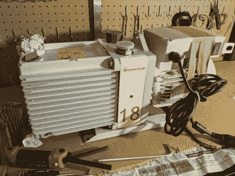

# 帮助推动开源卫星更上一层楼

> 原文：<https://hackaday.com/2020/06/21/help-thrust-open-source-satellites-to-the-next-level/>

为了令人满意地将卫星送入轨道，不仅需要搭乘火箭，还需要将卫星送入正确的轨道以完成其任务，一旦卫星到达轨道，就要保持不动。在 60 多年的工程设计中，国家航天局和商业卫星建造者投入了数十亿美元或卢布，早就解决了这些问题，但在开源微型卫星上复制这些成功仍然是一个重大的工程挑战。在这个领域工作的一个人是[Michael Bretti]，他在为最小的卫星做开源电动推进器的预算很少的工作，他需要你的帮助来众筹一件设备。

Beware suspiciously cheap eBay vacuum pumps!

作为测试的一部分，他有一个真空室，当他将推进器放入其中时，他必须创造一个太空级的真空。这不是一件容易的事，为了完成它，他有两个泵。其中的第一个，一个低真空泵，是一个显然已经寿终正寝的破旧的例子，他需要你的帮助来替换它。他的 GoFundMe 页面有一个适中的目标，只有 4200 美元，这应该在我们社区的能力范围内，通过支持它，你将帮助更广泛的小型卫星社区生产飞船，在未来几年里不断为我们提供来自太空的有趣的东西。

我们之前在 Hackaday 这里提到过他的工作，我们希望有机会更详细地了解他的推进器。同时[你可以在推特上关注](https://twitter.com/Applied_Ion)。

感谢[Bruce Perens K6BP]的提示。