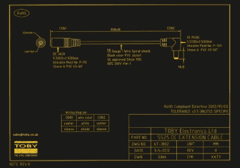

# 最简单的 TS100 升级沿着电缆测试兔洞向下

> 原文：<https://hackaday.com/2020/07/09/the-simplest-ts100-upgrade-leads-down-a-cable-testing-rabbit-hole/>

到现在为止，我的迷你工具 TS100 烙铁已经用了将近三年了。当它上市时，它重新定义了可以从预算烙铁谱的体面端期待什么，即使在那些年后，它仍然是一个要击败的。体积小，重量轻，功能强大，可黑客攻击，它甚至催生了[的直接模仿](https://hackaday.com/2020/01/27/review-saneryigo-sh72-soldering-iron/)。

如果 TS100 有故障，它不是来自熨斗本身，而是来自它的电缆。高等级的熨斗会有非常柔软的 PVC 或硅树脂电缆，但是 TS100 没有自己的电缆。相反，它依赖于电源上的任何电缆，这通常是一种便携式计算而不是焊接的笔记本电脑。因此，使用它就是不断地与它明显缺乏灵活性作斗争，这是一个小问题，但我觉得很烦人。我决心找到一个解决办法，让 DC 延长线比我的电源更灵活。

## 出乎意料地产生了一个产品

TS100 有一个标准的 DC 桶插孔，但令人惊讶的是，这是一个相当不寻常的。它需要大约 15 毫米的超长距离，一些笔记本电脑电源上的插头无法令人满意地与之匹配。对于我的电缆，我必须找到我能找到的最长的插头，结果市场上的插头出奇的少。Lumberg 做了一个，但是对于烙铁来说，它的额定电流太低了，所以我被难住了。

我联系了我的连接器供应商 Toby Components，看看他们是否有更好的选择。这就是这个传奇发生意外转折的地方。他们没有任何现成的连接器，但他们可以让他们的电缆人员使用超灵活的 PVC 电缆进行定制扩展。我付了一些现金，很快收到了一个包裹，里面装着他们的几个原型。我的电缆制造项目突然变成了产品测试。

我做的第一件事就是把它插上电源，进行焊接，这样就没问题了，而且明显比我的 PSU 上的普通电缆更灵活。但仅仅这样说并不能提供太多信息，我需要一些量化电缆柔韧性的方法。我们都可以通过感觉来判断一根电缆比另一根电缆更柔韧或更不柔韧。拿在手中，柔软度较低的电缆比柔软的电缆需要更大的力才能弯曲。研究[电缆的标准测试](https://www.elandcables.com/the-cable-lab/independent-cable-testing-and-inspection-services)揭示了一个惊喜，他们专注于安全和应力性能，而不是其静态物理属性，因此尽管有许多有趣的测试来确保它们在重复弯曲或被挤压时不会失败，但标准似乎不包括简单的灵活性测量。它值得一些思考，所以我考虑并拒绝测量一组长度的电缆在其自身重量下的下垂角，想知道是否可以建立一个测试装置，在其中一根水平电缆可以连接到它的重量，并最终达成一个简单得多的东西。

## 你如何描述电缆的柔韧性？

My rough-and-ready minimum natural bend radius test rig.

如果你拿起一根电缆，把它握在手中，它会形成一条 180 度角的线。如果你现在弯曲它，它不会形成一个点，因为它的角度更窄，相反，它会弯曲并趋向于一个圆形轮廓。你会发现，它有一个自然的最小弯曲半径，在这个半径上，它形成了圆形轮廓，并很容易恢复平直，但不会弯曲到扭结的程度。因此，测量电缆的自然最小弯曲半径是一种简单且易于重复的测试，可以比较电缆的柔韧性。

我的弯曲半径装置很简单，用一对螺丝把一块扁平的木头和另一块细长的木头固定在一起。将电缆弯曲 180 度，形成一个最小自然半径的环，然后将其夹在两块木头之间，这样就可以很容易地测量直径和计算半径。我在我的木制底座上加了一张绘图纸，这样我可以很容易地判断尺寸，但是我发现我的卡尺是最方便的测量方法。除了两根 TS100 电缆，我还测量了我工作台周围的其他几根电缆进行比较。

| 电缆 | 直径 | 半径 |
| Toby TS100 延长电缆 | 20 毫米 | 10 毫米 |
| TS100 笔记本电脑风格的 PSU 电缆 | 33 毫米 | 16.5 毫米 |
| 金 USB 电缆 | 29 毫米 | 14.5 毫米 |
| 万用表测试引线 | 16 毫米 | 8 毫米 |
| IEC 计算机电源引线 | 48 毫米 | 24 毫米 |

可以直接看出，这是一种容易再现的表征一段电缆柔性的方法。在极端情况下是万用表引线和计算机电源引线，这并不奇怪，因为前者被设计为尽可能灵活，而后者是一个厚而重的电源引线。这是一个便宜的万用表，很可能如果我不那么吝啬，买一个像样的，它会有一个明显更灵活的领导。我在 4 月 1 日逗留期间使用 GNU Radio 进行音频分析的假“Grundlagen Audio”USB lead 与此同时，对于实际上是廉价的亚马逊基础产品来说，它令人惊讶地僵硬。这可能是由于两个因素；它有一个编织的外层，以复制更昂贵的引线，我用金色油漆喷涂它，只是让它更坚硬。

测试的重点是 TS100 电缆。Toby 电缆的硬度不到笔记本电脑式电源电缆的三分之二，这确实对焊接的容易程度产生了显著影响。当我向他们询问连接器的可用性时，我并不指望会产生一种产品，但如果你想要一个[，他们在其网站](https://www.toby.co.uk/powertoboard-connectors/dc-ac-jacks-plugs/jli-5525-dc-ec-valcon-dc-plug-to-socket-extenison-cable/JLI-5525-DC-EC/)上有卖。与此同时，Hackaday 现在有了另一项测试，每当我们看到电缆时，就测量弯曲半径。