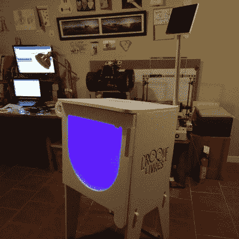

# 儿童迷你图书馆配有闪光灯和太阳能升级

> 原文：<https://hackaday.com/2020/06/28/mini-library-for-kids-gets-blinky-lights-and-solar-upgrade/>

在魁北克，阅读是很重要的，而且[pepelepoisson]的孩子们可以免费使用一个迷你图书馆角落，这个角落曾经风光一时，急需维护和翻新。在维修和重新粉刷那个小小的户外图书角的过程中，[他趁机安装了几个实验性的升级](http://www.chezpapietmamie.com/pcube/fourre-tout/croque-livres-2-0/)(链接法语，[英语翻译此处](https://translate.google.ca/translate?hl=en&tab=TT&authuser=0&sl=fr&tl=en&u=http%3A%2F%2Fwww.chezpapietmamie.com%2Fpcube%2Ffourre-tout%2Fcroque-livres-2-0%2F))。)

 这种迷你图书馆被称为 [Croque-Livres](https://croquelivres.ca/) ，是魁北克省儿童免费小书角计划的一部分(这个名字翻译成英语有点难，但可以把它想象成“小吃小屋，但为了书籍”，因为书籍是可以愉快地吞食的东西。)

经过打磨和维修以及几层新油漆后，Croque-Livres 增加了一条 WS2812B LEDs，带太阳能电池板的可充电电池，磁铁和簧片开关作为门传感器，以及一个 3.3 V Arduino 来驱动这一切。项目的 [GitHub 库包含 3D 打印件的代码和 CAD 文件。](https://github.com/pepelepoisson/CroqueLivres2.0)

WS2812B LED 灯条在技术上需要 5 V 电压，但正如【pepelepoisson】在[他的早期项目 Stecchino](https://hackaday.com/2018/03/23/stecchino-game-is-all-about-balancing-a-big-toothpick/) 中发现的那样，LED 灯条在直接由 3.7 V 锂聚合物电池驱动时工作良好。直到 3 V 左右，它才开始变得不可靠，因此一个 3.7 V 电池就能很好地为一切供电。

当门打开时，LED 灯带点亮，并发出短暂的动画，然后以条形图的形式显示电池电压。之后，门被打开的次数以二进制显示在 LED 条上。它是高度可视化的，交互式的，甚至有一个小的备忘单解释二进制是如何为任何有兴趣将光模式转换成数字的人工作的。它能支撑多久？到目前为止还不错，但这是一个完全不干扰小盒子操作的实验，所以一切都很有趣。