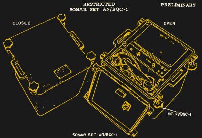
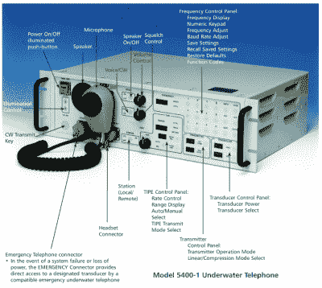
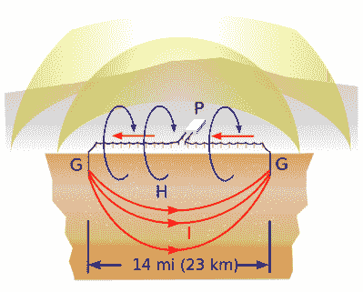
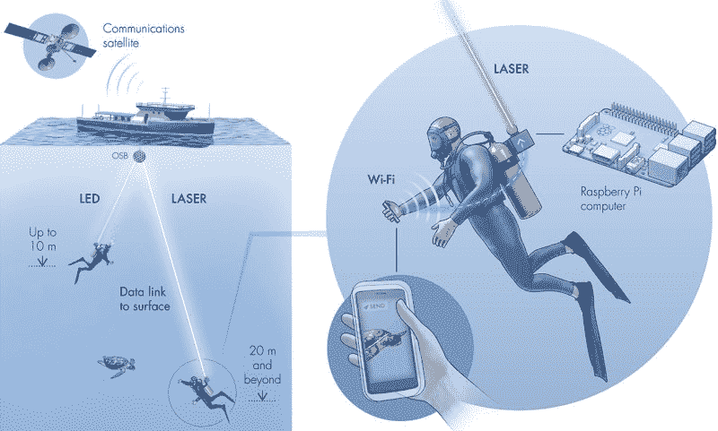

# 与潜艇通信的许多方法

> 原文：<https://hackaday.com/2020/07/15/the-many-methods-of-communicating-with-submarines/>

有时似乎很难相信，我们人类对我们拥有如此之多的海洋却探索得如此之少。海洋覆盖了地球表面的 70 %,但是我们只绘制了海底的 20%。我们所知道的 228，000 种海洋生物大约占全部水生生物的 10%。几乎所有我们所知的生命，以及我们已经彻底探索过的区域，都局限在离地表最初的几百米。

我们深水调查努力的缺乏与海洋对那些没有进化到在其中生存的人的敌意有很大关系。即使在几米深的水下生活和工作也需要极端的工程技术和极其昂贵的机器，即使这样，潜艇人员一旦到达水下，也会很快与外界完全隔绝。水下通信尤其具有挑战性，因为海水的特性使得将其用作通信介质的努力变得困难。

尽管这可能具有挑战性，但水下通信是可能的，在本文中，我们将了解一些使水下操作成为可能的模式，以及一种可能将互联网扩展到水下的新技术。

## 你好，格特鲁德？

在无声服务早期的大部分时间里，一旦潜艇被淹没，它就只能靠自己了。对于第一次世界大战中的潜艇和 U 艇来说，这一事实没有什么实际意义，因为这些艇主要是作为水面舰艇运行的，只有在攻击或躲避追击时才下潜。在他们被淹没的那一小段时间里，指挥当局几乎不需要与他们联系，因为他们大多是单独行动，由船长主动发起攻击。

20 世纪后期，随着潜艇战术演变成“狼群”攻击，船只之间需要水下通信来协调攻击变得很明显。u 型潜艇和潜艇的舰长依靠他们的高频(HF)无线电在编队中的船只之间进行通信，并协调他们对护航舰队的攻击，但这可能会使他们暴露在使用无线电测向设备的敌对部队的探测之下，而且因为他们需要浮出水面使用他们的无线电，所以他们很容易被水面船只和飞机发现。

AN/BQC-1 Underwater Telephone, aka “Gertrude”. Source: [San Francisco Maritime National Park Association](https://maritime.org/doc/ecat/cat-0087.htm)

美国海军部署的最早的水下通信模式之一是 AN/BQC-1 水下电话。这是一种电池供电的完全便携式设备，用于水面舰艇与水下潜艇通信，以及潜艇之间的相互通信。通常被称为“格特鲁德”，该设备是独立的，除了船体安装的传感器。基本单元具有电话听筒，用于单元之间的语音通信；此外,“格特鲁德”号还可以发出 24.26 千赫的音频信号，以此频率呼叫其他使用声纳设备的船只。

为了传输声音，格特鲁德号使用了业余无线电操作员熟悉的调制方法:单边带。就像无线电波一样，声音载波可以被调幅。在 Gertrude 的例子中，载波在 8.3375 千赫到 11.0875 千赫之间，就像无线电一样，接收器和发射器必须调到相同的载波频率。在发射器端，对 AM 信号进行滤波，去除载波和一个边带，留下一个单边带信号施加于传感器。接收机使用标准乘积检波器和拍频振荡器装置解调单边带信号，与单边带无线电信号中使用的非常相似，但频率不同。

A more modern acoustic underwater telephone, backwards compatible with the Gertrude. Source: [ITT Corp](http://www.123seminarsonly.com/Seminar-Reports/029/47313886-Underwater-Communications.pdf)

安/BQC-1 格特鲁德一直服役到第二次世界大战结束和冷战时期。一种更强大的装置，安/WQC-2，于 1945 年投入使用，直到今天，几乎每艘美国海军舰艇上都保留了该技术的一些版本。现代水下电话仍然使用单边带调制方案，仍然支持海军为最初的 Gertrude 建立的频率，即使它背后的电子设备在几十年间发生了巨大的变化。

## 低而长

尽管水声电话很有用，但它们的能力有限。声学电话的范围是有限的；AN/BQC-1 最适合用于不到 500 码(365 米)的语音通信，尽管其 24.26 kHz 的 ping 可以达到 10 倍的距离。声波和无线电波一样会受到传播变化的影响，固体表面的反射和不同水温或盐度层的衍射会导致多路径干扰，甚至信号完全丢失。

冷战时期，随着核动力潜艇的出现，潜艇也在扮演一个完全不同的角色。能够在海上航行数月，这些船成为弹道导弹的完美平台，这将需要与指挥当局联系到一定程度，这是二战潜艇的船长永远不会想到可能的。但是无线电波通常不能穿透海水，这就提出了一个问题，即潜艇不得不定期浮出水面检查新的订单，并失去了它的一个战术优势:隐身。

为了让潜艇安全地呆在水下，海军司令部开始探索无线电频谱的最低端。由于电离层折射，高频(HF: 3 MHz 至 30 MHz)和低频(LF: 30 kHz 至 300 kHz)波段完全能够到达全球各地，但海水的高电导率会迅速衰减这些波段的信号。

将频谱调低一点，甚低频(VLF: 3 千赫至 30 千赫)波段开始显示出对海水的良好渗透，深度可能为 20 米。这个深度不足以确保大多数潜艇的隐身，因为它们巡航时离水面太近，不舒服，所以需要展开一根长天线来尾随它们。甚低频通信也受到带宽限制，使得语音通信不切实际。因此，甚低频通信的比特率被限制在 300 bps 左右。另一个缺点是甚低频所需的巨大天线阵列和高功率发射机使得双向通信成为不可能。

更进一步，极低频(ELF: 3 Hz 到 30 Hz)波段的信号能够穿透 120 米的海水，这对于任何潜艇来说都足以保持其隐身状态。美国海军在 1968 年开始调查 ELF 乐队和血红计划。由于波长从 10，000 到 100，000 公里，ELF 发射机需要巨大的天线；事实上，在威斯康辛州建造 ELF 站的最初提议是将天线电缆埋在该州 40%的土地之下。这些电缆在传输时会产生 800 兆瓦的电力。

Project ELF antenna. Source: [Chetvorno](https://commons.wikimedia.org/wiki/File:Ground_dipole_ELF_antenna.svg "via Wikimedia Commons") / CC0

被反战积极分子和预算鹰派击败的桑吉内项目从未建成。直到 1989 年 ELF 项目终于上线，海军提出的一系列按比例缩小的 ELF 项目也没有建成。有两个发射机，一个在威斯康星州，一个在密歇根州的上半岛。天线馈线有 14 到 28 英里(22 到 44 公里)长，像公用电线一样串在木杆上，并连接到深入基岩的巨大接地棒。通电后，电流在接地棒之间流动，并穿过花岗岩基岩，产生了巨大的磁场，从而产生了 ELF 波。它基本上是一个巨大的岩石环形天线。

这个完整的系统能够以 76 兆赫的频率向佛罗里达海岸外 400 英尺(122 米)深的水下潜艇发送编码信息。不幸的是，信号的带宽太低，以至于发送一个三字符的代码组需要 15 分钟。ELF 计划只能作为一个“敲钟人”信号，通知潜艇浮出水面，并使用其他方式接收完整的信息。该系统在 2004 年被关闭，当时甚低频技术已经足够先进，潜艇可以使用它而不用担心被发现。

## 海浪下的 WiFi

有限带宽的海底通信当然有其一席之地，但如果新的研究取得成功，在水下以高比特率安全通信是可能的。在最近的一篇论文中，来自阿卜杜拉国王科技大学的巴塞姆·希哈达等人展示了一个他们称之为“Aqua-Fi”的系统，该系统将互联网扩展到了水下领域。他们主要使用现成的组件，包括 Raspberry Pi 3b，能够构建一个符合 IEEE 802.11 的无线网络，覆盖范围可达 20 米。发光二极管和激光都用于发射器，激光提供了更大的范围，但以方向性为代价。在使用防水智能手机和蓝绿激光的测试中，他们能够实现 2.11 Mbps 的速度，并通过 Aqua-Fi 链接进行 Skype 通话。

The Aqua-Fi system. Source: Shihada, B., Amin, O., Bainbridge, C., Jardak, S., Alkhazragi, O., Ng, T. K., … Alouini, M.-S. (2020). “Aqua-Fi: Delivering Internet Underwater Using Wireless Optical Networks.” *IEEE Communications Magazine*, 58(5), 84–89\. [doi:10.1109/mcom.001.2000009](http://dx.doi.org/10.1109/MCOM.001.2000009)

Aqua-Fi 作为潜艇网络不太可能有太多的未来，但海底战争远不是这种系统可以支持的唯一活动。海底研究可以受益于在水下使用互联网；人们可以想象一个太阳能浮标，在水面上有一个卫星链接，一串 Aqua-Fi 接入点拖到下面的深处。潜水员、遥控潜水器或无人驾驶飞机可以利用与互联网的全时连接，推动海洋生物学、地质学、保护，甚至只是运动潜水等娱乐的进步。我们可以接受！