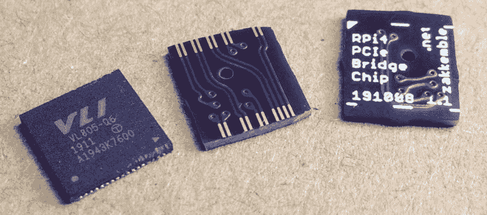
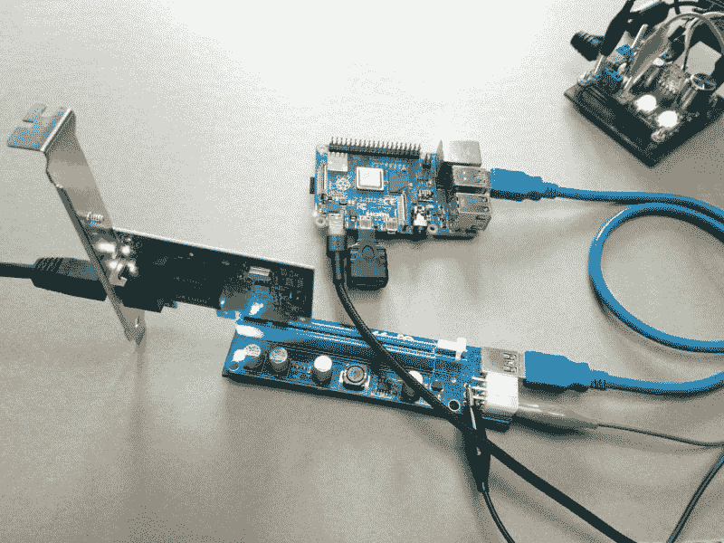

# 将 PCIe 添加到您的覆盆子 Pi 4 中，更简单的方法

> 原文：<https://hackaday.com/2020/07/01/adding-pcie-to-your-raspberry-pi-4-the-easier-way/>

自从人们发现 Raspberry Pi 4 有一个 PCIe 总线，就开始了第一个将常规 PCIe 扩展卡连接到 Raspberry Pi 4 SBC 的比赛。现在【扎克·肯布尔】已经[创造了一种新的方法](https://blog.zakkemble.net/rpi4-pci-express-bridge-chip/)，使用一个桥接 PCB 来代替 [VL805](https://www.viagallery.com/via-labs-vl805/) USB 3 控制器 IC。这也是[Tomasz Mloduchowski]最初修改的工作方式，只是现在它采用了方便的(OSHPark) PCB 格式。

在移除 VL805 QFN 封装并焊接在桥 PCB 中后，[Zak]确认一切都已正确连接，并尝试使用带有 PCIe 扩展器的 Raspberry Pi 4。这表明 Raspberry Pi 可以与基于 VL805 的 USB 3.0 PCIe 扩展卡以及基于 Realtek RTL8111 的以太网卡愉快地交谈，但不能与许多其他 PCIe 卡交谈。目前还不清楚这到底是为什么。

作为奖励，[Zak]还发现，尽管从 Raspberry Pi 中移除了 VL805 IC，使其 USB 3 端口变得无用，但人们仍然可以使用 SBC [上的 USB-C“电源输入”作为主机控制器](https://www.raspberrypi.org/forums/viewtopic.php?f=29&t=246348&p=1678554)。通过这种方式，人们可以在树莓 Pi 4 上同时拥有 PCIe x1 和 USB。

这是我们看到的将 PCIe 与圆周率结合使用的第三次迭代。如果你是在[托马斯·姆洛杜乔夫斯基]的工作基础上构建的，他[启发[科林·赖利]添加了扩展器](https://hackaday.com/2019/09/05/pcie-multiplier-expands-raspberry-pi-4-possibilities/)，现在是[扎克]，[的这个出色的黑客，我们想听听它](https://hackaday.com/submit-a-tip/)！

(感谢 Itay 的提示)