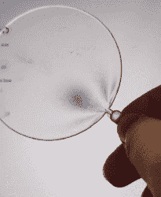

# 铣削模具和注射成型一些丙烯酸透镜

> 原文：<https://hackaday.com/2020/07/07/milling-dies-and-injection-moulding-some-acrylic-lenses/>

[Zach]在他的频道突破 Taps 上已经建立了一个关于制造一些自制丙烯酸透镜的特别账户。最后，他不仅制作了一些漂亮的凹透镜，还涵盖了整个制造过程，从铣削用于注射成型的铝模具到调整与注射实际丙烯酸树脂相关的参数，他甚至超越了以这种方式生产的光学产品的局限性。

特别吸引我们眼球的是[Zach]如何使用成品来实际演示光弹性，这种光弹性源自成型过程中产生的应力。你可能熟悉用一个数字来描述一种材料的光学特性，即它的介电常数。但是，如果除了改变速度之外，这种材料还根据材料内部的应力分布改变光的偏振和方向，会发生什么呢？虽然一个定量的答案变得有点复杂，但你可以查看[Zach 的] [额外的视频，以一种漂亮而丰富多彩的方式来可视化答案](https://i.imgur.com/Vnwoakl)，而不必求助于花哨的计算机模拟！然而，如果你真的想坚持模拟路线，看看我们的文章，在[完全不同的环境中使用有限元分析](https://hackaday.com/2019/02/06/finite-element-analysis-results-in-smart-infill/)进行应力分析。

 [https://www.youtube.com/embed/JNXgHbBIRYQ?version=3&rel=1&showsearch=0&showinfo=1&iv_load_policy=1&fs=1&hl=en-US&autohide=2&wmode=transparent](https://www.youtube.com/embed/JNXgHbBIRYQ?version=3&rel=1&showsearch=0&showinfo=1&iv_load_policy=1&fs=1&hl=en-US&autohide=2&wmode=transparent)

