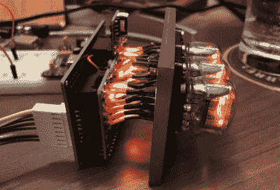

# 蒸汽朋克盖革计数器是艺术和科学的混合体

> 原文：<https://hackaday.com/2020/07/10/steampunk-geiger-counter-is-a-mix-of-art-and-science/>

[克里斯·克罗克-怀特]花了将近一年的时间来组装这个华丽的桃花心木和黄铜盖革计数器，但是我们认为你会同意我们的看法，这是值得的。从伺服驱动计数器到谢妮电子管和 LED 人造电子管，这个项目绝对是对陈旧的信息显示方法的一封情书。虽然为了更好地衡量，内部的 Raspberry Pi 也将所有收集的辐射数据推送到云中。

【Chris】说这个辐射监测器的设计受到了他对蒸汽朋克的兴趣和在实际蒸汽机上工作的个人经历的影响，但更具体地说，他还从【Richard Mudhar】建造的计数器中汲取了灵感。

[基于 1987 年 *Maplin* 发表的一项设计](https://www.richardmudhar.com/blog/2019/09/maplin-geiger-counter/),【Richard】包括一个实体柜台和 LED“deka tron”显示屏，以此向他在学生时代使用的 20 世纪 60 年代柜台致敬。[Chris]在电子设备上添加了现代元素，并添加了实时每分钟计数(CPM)的发光显示器作为额外的奖励；因为谁不喜欢蒸汽朋克里的一些日本人呢？

在内部，由通用盖革计数器板产生的脉冲被一些定制的电子设备拾取，以驱动伺服系统和 led。由这些相同的脉冲触发，Raspberry Pi 3A+更新谢妮显示并将数据推送到云端进行分析和绘图。请注意，检测器上的 J305β盖革管已被移至机器外部，两个铜弯管用作连接器。这提高了仪器的灵敏度，但也许更重要的是，看起来棒极了。

这些年来，我们已经看到了一些非常高科技的 DIY 辐射检测设备，[，但是这些聪明的机器给](https://hackaday.com/2020/01/20/random-numbers-from-outer-space/)[增加了一点奇思妙想](https://hackaday.com/2020/01/02/roll-the-bones-chernobyl-style/)，否则轻度恐怖的电离辐射过程总是我们的最爱。

 [https://www.youtube.com/embed/lEL_XkN69n8?version=3&rel=1&showsearch=0&showinfo=1&iv_load_policy=1&fs=1&hl=en-US&autohide=2&wmode=transparent](https://www.youtube.com/embed/lEL_XkN69n8?version=3&rel=1&showsearch=0&showinfo=1&iv_load_policy=1&fs=1&hl=en-US&autohide=2&wmode=transparent)

