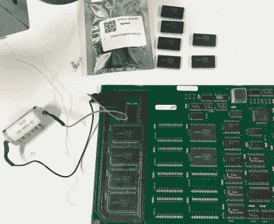

# 升级 25 年前的示波器中的 RAM

> 原文：<https://hackaday.com/2020/07/19/upgrading-the-ram-in-a-25-year-old-oscilloscope/>

通过阅读他关于这个主题的大量文章，有一件事我们可以肯定:[Tom Verbeure]喜欢他的 Tektronix TDS 420A 示波器。虽然它可能比阅读这篇文章的一些人更老，但它仍然是一个令人印象深刻的硬件，有足够多的铃铛和哨子让普通黑客有事可做。尤其是如果你[愿意执行一些硬件修改](https://tomverbeure.github.io/2020/07/11/Option-Hacking-the-Tektronix-TDS-420A.html)。

Note the battery to retain calibration data.

[Tom]已经知道如何将瞄准镜转化为解锁软件功能，这个过程与我们在更现代的瞄准镜上看到的没有什么不同。但是通过切换软件标志，你只能做到这一步。

固件中关闭的一些更高级的功能实际上需要额外的硬件来运行。仅仅在软件中将采样点增加到 120，000 是不够的，示波器实际上需要内存来容纳它们。

现在，从逻辑上讲，如果有一个软件选项来增加样本数量，就必须有一个硬件升级与之相伴。果然，[Tom]发现在示波器现有的 M5M51008 静态 RAM ICs 旁边有 6 个空位。

幸运的是，这些芯片仍然可以买到，尽管来自不同的制造商，而且比原来的零件要快一点。Digikey 不会少于 100 台，但 UTSource 很乐意卖给他 10 台。在这种情况下，零件比运费便宜。安装非常简单，尽管[Tom]提到他必须在操作过程中保持电路板通电，否则示波器会丢失校准数据。

从像 Rigol DS2072A [这样的现代示波器中挤出更多功能只需要一根 USB 线和一些软件](https://hackaday.com/2015/10/22/upgrading-rigols-more-expensive-oscilloscopes/)。有时候[只是敲入一个密码](https://hackaday.com/2014/11/12/how-to-get-50-more-zed-from-your-rigol-ds1054z/)的问题。但我们当然感谢[汤姆]付出一点额外的努力来充分利用这款经典硬件。