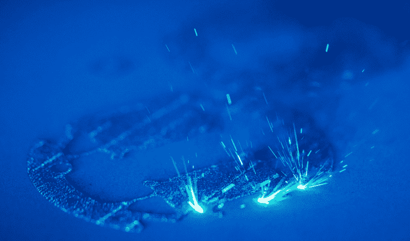
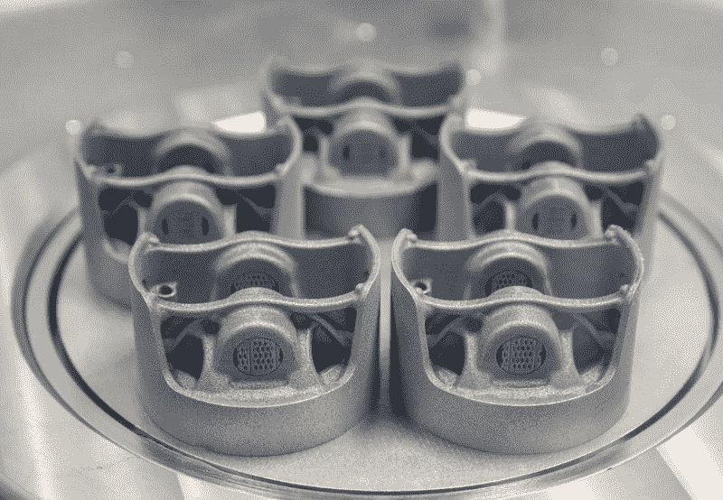
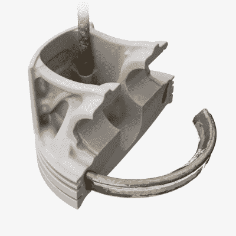
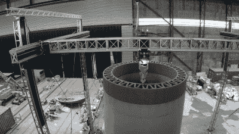

# 保时捷的印花活塞强劲而精准

> 原文：<https://hackaday.com/2020/07/28/porsches-printed-pistons-are-powerful-and-precise/>

700 马力的保时捷 911 GT2 RS 已经非常快了——比现在路上的普通汽车快三倍多。对于跑车爱好者来说，对速度和性能的需求可能没有上限。因此，[保时捷通过打印一组超轻活塞，从他们的限量版超级跑车中又获得了 30 马力。](https://www.thedrive.com/tech/34775/porsche-found-a-way-to-3d-print-lightweight-pistons-that-add-even-more-horsepower)

Pistons being lasered into existence. Image via [The Drive](https://www.thedrive.com/tech/34775/porsche-found-a-way-to-3d-print-lightweight-pistons-that-add-even-more-horsepower)

这些活塞由德国汽车零部件制造商马勒开发的高纯度铝合金粉末打印而成。保时捷让马勒与工业机械制造商通快合作，使用激光金属熔合(LMF)工艺生产这些产品。这很像选择性激光烧结( [SLS](https://en.wikipedia.org/wiki/Selective_laser_sintering) )，只是用金属粉末代替了塑料。

该机器在打印床上撒上一层粉末，然后激光根据 CAD 文件熔化粉末，使其硬化成型。这一过程一次重复一层，在需要的地方将支架扎在一起。打印工作完成后，活塞被加工成闪亮的最终形状，并经过彻底的测试，就像几十年来它们的铸造金属表兄弟一样。

A fresh plate of pistons. Image via [The Drive](https://www.thedrive.com/tech/34775/porsche-found-a-way-to-3d-print-lightweight-pistons-that-add-even-more-horsepower)

## 越来越瘦

一般来说，用打印机制作汽车零件原型比传统方法要快得多。不需要制作模具，节省了时间和费用。这些活塞不仅仅有一个很酷的起源故事——它们比铸造活塞更有优势，客观上使它们更好。

Oil shoots up the inside port and swirls through the inside. Image via [Mahle](https://www.youtube.com/watch?v=ztWsivHGL54)

首先，增材制造允许铸造不可能实现的设计。在这种设计中，所有的脂肪都从活塞上去除了——只有力会作用在活塞上的材料，所以它最终比普通活塞轻 10%。

这种精益设计为内置的冷却系统留下了足够的空间，油从活塞头的底部喷出，并在最热的区域循环。当你有更轻、更冷的活塞时，发动机可以更努力地工作，运转得更快。

这不是保时捷第一次涉足打印零件。定制桶形座椅是目前两款车型的一个选项，它们还为不再生产的车型提供某些印刷的售后更换零件。

保时捷还没有在量产车上使用这些强大的活塞。激光金属融合工艺更适合小规模生产、有限运行部件和原型制作，至少目前如此。根据这段关于打印过程的视频，打印五个活塞的床需要 12 个小时。

 [https://www.youtube.com/embed/ztWsivHGL54?version=3&rel=1&showsearch=0&showinfo=1&iv_load_policy=1&fs=1&hl=en-US&autohide=2&wmode=transparent](https://www.youtube.com/embed/ztWsivHGL54?version=3&rel=1&showsearch=0&showinfo=1&iv_load_policy=1&fs=1&hl=en-US&autohide=2&wmode=transparent)

## 高压力的打印工作

一个被设计成在压力下快速移动的东西的印刷版本会出什么问题呢？大概没什么，虽然还没来得及长期观察。马勒说，印刷活塞非常坚固，而且它们和锻造活塞一样经过严格的测试。这包括脉动测试，以确保它不会在压力下破裂，以及活塞杆连接区域的撕裂测试。然后，他们在 911 GT2 RS 测试发动机上对活塞进行了 200 小时的压力测试。

A concrete printer makes a wind turbine base on-site. Image via [GE](https://www.youtube.com/watch?v=_bpOLSWtE1U)

3D 打印也已经在其他行业突破了极限。你肯定听说过几天之内就能打印出整栋房子。混凝土打印机还通过允许现场打印巨大的基座来帮助风力涡轮机达到新的高度。风力涡轮机越高越好，但是增加的高度需要更厚的底座。在美国，基础规模首先受到高速公路立交桥高度的限制。

至于针对特定替换零件的添加制造，它不会比核反应堆承受更高的压力。即便如此，[橡树岭国家实验室正在进行一个项目，制造尽可能多的打印部件的反应堆](https://hackaday.com/2020/06/08/3d-printing-nuclear-reactors-for-fun-and-profit/)。为停产的反应堆打印替换零件已经开始了。几年前，西门子用印刷版本替换了一个有问题的叶轮，西屋电气印刷了一个用于固定活性燃料棒的顶针。

你会开印有活塞的车吗？你可能不会很快在家自己打印这些，但你可能已经在为你的项目车制作替代徽章，或者给你足够的时间，拼凑一个全尺寸的塑料兰博基尼。