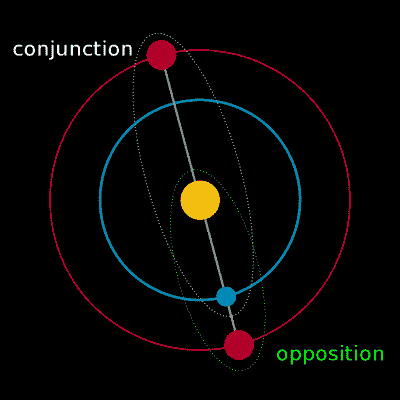
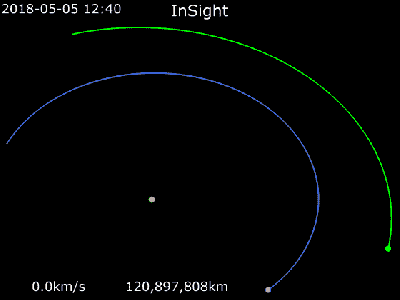
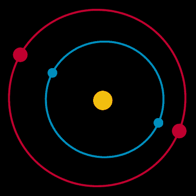
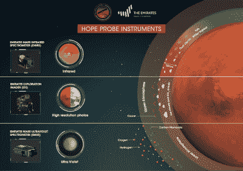
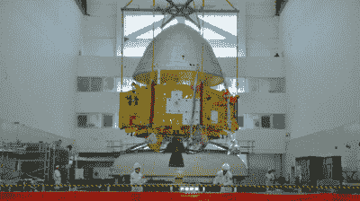

# 天空之窗:为什么这个月每个人都要去火星

> 原文：<https://hackaday.com/2020/07/21/window-in-the-skies-why-everyone-is-going-to-mars-this-month/>

火星可能不是养育孩子的好地方，但有可能有一天[埃尔顿·约翰]的著名歌词将是错误的，没有人在那里养育他们。然而，现在我们有探测器、轨道飞行器和着陆器。今年火星任务进展顺利，有三个国家即将向这颗红色星球发射火箭:美国发射了他们的[*号火星车*](https://hackaday.com/2020/02/13/mars-2020-rover-curiositys-hi-tech-twin-is-strapped-for-science-includes-a-flying-drone/)*，中国的*号田文一号*任务，阿联酋发射了他们的*号【希望】号*轨道飞行器。*

 *由于所有这一切都计划在 7 月内发生，这几乎给人一种新的太空竞赛时代的印象，每个人都试图成为第一。当然，一些自我肯定会在这里得到提升，但在如此短的时间内增加运行的原因有一个简单的解释:火星将在今年晚些时候出现——相对而言——提供了一个现在去那里旅行的理想机会。

事实上，今年是相当长一段时间以来最好的一年。下一次情况会(几乎)像今年一样有利是在 2033 年，所以可以理解太空机构渴望不要错过这个机会。并不是说火星任务不能在未来 13 年内完成——毕竟，2022 年的几项努力已经准备就绪，包括[推迟的*罗莎琳德·富兰克林*漫游者发射](https://hackaday.com/2020/04/06/getting-to-space-is-even-harder-during-a-pandemic/)。只是环境不会那么理想。

但是这到底意味着什么，为什么呢？是什么让 2020 年 7 月如此特别？每个人都在上面做什么？好吧，让我们来看看！

## 通往火星的窗口

即使是我们太阳系最简单的模型也会显示地球和火星围绕太阳旋转的不同方式，其中距离和速度是最明显的。[地球](https://en.wikipedia.org/wiki/Earth%27s_orbit)以 29.78 公里/秒的平均速度在距离太阳~~大约 149，597，870.7 公里~~ 1 天文单位(AU)的地方旋转，而[火星](https://en.wikipedia.org/wiki/Orbit_of_Mars)以大约 1.523 倍的距离和 24 公里/秒的平均速度旋转。地球大约需要 365 天才能再次到达同一地点，火星大约需要 668 天的时间来定义一天，即

 *抛出所有这些数字主要表明了一件事:地球和火星在这里没有太多的共同点，因此，它们不会在彼此附近逗留太久。尽管如此，它们确实围绕着同一个太阳旋转，因此必然会偶尔相遇。好吧，“相遇”是一个强烈的词，如果在这里过于字面上理解的话，会有致命的结果，而是彼此有近距离接触。准确的术语应该是，它们有时是 [*与*](https://en.wikipedia.org/wiki/Opposition_(astronomy)) 的对立。

## 反对

Mars in conjunction (white) and opposition (green)

每当太阳、地球和另一个天体排成一条直线，你就可以通过它们画一条直线，它们要么被称为*合*，要么被称为*反*，这取决于第三个天体在太阳的哪一边。如果这种排列是合相的，那么被讨论的天体离地球的距离可能是最远的，通常它们之间有太阳，而在相反的情况下，它是在特定的接近时刻最接近的。火星平均每 780 天与地球相对:2 年零 50 天。这意味着理论上，每 780 天就有一次去火星旅行的绝佳机会。

然而，作为发射窗口参考的反对意见不仅仅是出于资源原因以最短的可能方式旅行，而是要在一个完美的时间框架内这样做，以匹配每个人的速度和轨迹，并确保我们的火箭有实际的机会满足我们的愿望——在这种情况下是火星。别忘了我们面对的是以难以想象的速度穿越空间的巨大物体。它们可能在相对意义上彼此靠近，但我们仍然在谈论它们之间几百万公里的距离。

Typical flight path of a Mars mission, demonstrated by the *InSight* mission in 2018\. Source: [Wikipedia](https://en.wikipedia.org/wiki/InSight)

问题是，我们不能在反对的时刻沿着那条假想的线发射火箭。不仅要花几个月的时间到达那里，火箭还必须在地球和火星之间的椭圆形轨道上运行。在尽可能短的距离上这样做有最大的成功机会。如果发射得太早，火箭可能需要等待不必要的长时间才能赶上火星，这不仅浪费燃料，还可能耗尽燃料。发射太晚，结果会像野狼绝望地追逐公路赛跑者一样——除了岩石和悬崖。

作为所有这些的结果，火星任务实际上大约每 2.x 年发生一次，通常在对手之前几个月发射，然后在对手之后几个月着陆/进入轨道。

看看最近几次反对的历史和当时任务的发射日期，这一切都说明了:

*   2020 年 10 月中旬–我们的 3 项任务将于 7 月下旬完成
*   2018 年 7 月底–5 月初的两次任务
*   2016 年 5 月下旬–3 月中旬的两次任务
*   2014 年 4 月初–2013 年 11 月初和中旬的两次任务
*   2012 年 3 月初–2011 年 11 月初和 11 月底的 3 次任务

我们可以追溯到 1960 年 10 月，当时苏联在当年 12 月底尝试了第一次发射(失败),当然还有 1965 年美国宇航局的水手 4 号成功飞越火星。虽然这显示了多年来稳定的发射窗口数量，但它也显示了错过机会将导致下一个窗口打开之前的明确延迟——正如 2016 年的[洞察号任务](https://hackaday.com/2018/05/18/insight-brings-new-tech-to-mars/)，以及之前提到的欧空局和 Roscosmos 今年的[联合任务](https://hackaday.com/2020/04/06/getting-to-space-is-even-harder-during-a-pandemic/)所发生的那样。

在上面的任务历史摘录中还有另外两件值得注意的事情:我对日期很模糊，任务发射和反对之间的时间间隔各不相同。让我们先来看看实际的发射窗口，了解一下日期的模糊性。

## 窗户

虽然有一个明确的时间，我们可以连接到反对派和最近的接近，我们不必在一个非常具体的时间在一个具体的点，但有一点宽容——因此启动*窗口*。该窗口的确切宽度和位置因不同因素而异，如火箭及其轨道，并根据每次任务单独确定。

例如，如上所示，2013 年 11 月，2014 年 4 月反对派在不同时期进行了两次发射。印度的[火星轨道任务(MOM)](https://en.wikipedia.org/wiki/Mars_Orbiter_Mission) 在 10 月 28 日至 11 月 19 日有一个窗口，并于 11 月 5 日发射，而美国的 [MAVEN](https://en.wikipedia.org/wiki/MAVEN) 在 11 月 18 日至 12 月 7 日有一个窗口，并于 11 月 18 日首次可能的发射日期直接发射。

发射窗口内的每一天通常都有自己的几个小时的发射时间，火箭发射的目的是希望与另一个物体会合。请记住，一切都在太空中向各个方向旋转，所以根据你从地球上的哪个地方发射，你也必须考虑到这一点。

考虑到发射也取决于天气条件，每次任务通常有大约 3 周的时间，这是一件好事，这解释了我之前对任务时间的含糊不清。但是发射时间和反对时间之间的转换呢？在太空中没有什么是完美的。

## 古怪

Exaggerated eccentricity of Mars and Earth shown at different times of opposition

在一个理想的世界里，行星会绕着太阳做一个完美的圆周运动，在任何给定的时间里，它们到太阳的距离都是一样的。在现实世界中，这一切都有点偏离中心，而 [*偏心*](https://en.wikipedia.org/wiki/Orbital_eccentricity) 会导致一年(当地对 a 的定义)中距离的变化。例如，地球的*，即离太阳最近和最远的点，在一年内相差大约 500 万公里——或 50 亿米(Gm)——这听起来可能很多，但在大约 150 Gm 的平均距离上，其偏心率是 0.0167。春夏比秋冬多几天还是够的，作为一个生活在北极圈附近的人，我当然能体会到这一点。*

 *除了水星，火星是太阳系中最不平衡的行星，偏心率为 0.0934，其椭圆面分别为 206.6 克和 249.2 克。由于相对发生的时间并不等于行星的轨道周期，它们的接近时刻总是发生在它们轨道内的不同地方。因此，每个对立物的实际距离是不同的，旅行所需的时间也是不同的。然而，每隔 15 到 17 年，它会落在一个相似的范围内。

目前，我们处于一个很好的位置，火星和地球在 62.07 Gm 时，它们的距离在下端。然而，它也不如 2018 年窗口期的 57.29 克，或 2003 年的历史最低纪录 55.76 克——还不算公元前 57，617 年的那次遭遇。然而，看到距离再次增加，它是最接近的，直到 2033 年和 2035 年分别为 63.28 克和 56.91 克——[如果你想了解更多，这里有一个列表](https://spider.seds.org/spider/Mars/marsopps.html)。看看那些年，“每 15 到 17 年”的部分真的加起来。

该列表还显示，苏联在 1971 年的一系列任务导致了第一个火星着陆器，以及美国作为第一个轨道飞行器的水手 9 号，都发生在一个好时机，对立距离为 56.20 Gm。与 1965 年的前一次*水手 4* 任务不同，它的距离几乎是 100.00 Gm 的两倍——这使得它的成功在另一方面更加令人印象深刻。将它与[所有的火星任务](https://en.wikipedia.org/wiki/List_of_missions_to_Mars)进行比较，这也可以解释为什么在 1975 年的两个*维京人*和 1996 年的*探路者*之间几乎没有任何发射，而苏联再次利用了 1988 年的最佳时机。

这也表明，即使是最糟糕的情况也不会阻止火星任务，所以即使条件在 2033 年之前不会像 2018 年或今年那样理想——顺便说一下，这与每个人目前将人类送上火星的时间框架相匹配——我们肯定不会需要等待那么久才能看到更多的火箭向它发射。

但是让我们不要急着奔向未来，毕竟我们现在有一系列的发布等着我们去做。那这是怎么回事？

## 2020 年火星任务

正如开头提到的，三个不同的国家将在今年 7 月各自启动自己的独立任务。在火星任务的宏伟计划中，这是我们第一次看到这种情况发生——2011 年参与的国家数量相同，但俄罗斯和中国当时只有一次合作发射。这一次，实际上是三个独立的任务。

一些关于今年火星之旅的有趣事实。假设这三次任务都成功了，这将是阿拉伯国家第一次踏上星际之旅。进一步假设*好奇号*保持活跃，它将打破活跃的火星车漫游火星表面的记录，并且非美国火星车首次成为其中之一。我们还可以期待看到第一个来自火星的无人机镜头！

虽然这一切都很好，但这并不是全部。那么我们还能从这些任务中期待什么呢？

### 阿拉伯联合酋长国

首先是阿拉伯联合酋长国(UAE ),由于日本发射场的恶劣天气条件，他们不得不将原定于 7 月 16 日的发射推迟三天。好消息是，他们的发布窗口刚刚在 7 月 15 日开放，并将一直开放到 8 月 12 日，所以还没有太大的时间压力。但是没有必要再拖延了，天气状况有所改善，在当地时间 7 月 19 日星期一清晨，21:58:14 UTC，他们的 HII-A 火箭从种子岛航天中心成功发射。

UAE instruments used on their mission. Source: [Emirates Mars Mission](https://www.emiratesmarsmission.ae/gallery/infographics)

任务将把他们的*希望*探测器送入火星轨道，在那里它将记录关于大气层的一切，主要目的是创造“第一张完整的火星大气层照片”。他们的目标是研究火星上的气候动力学——本质上是创建第一张完整的火星天气图——以及逃逸的氢气和氧气是如何发挥作用的，以及为什么它会首先逃逸。探测器本身配备了三个成像仪器:[一个红外光谱仪，一个紫外光谱仪，以及一个高分辨率成像仪](https://www.emiratesmarsmission.ae/hope-probe/instruments)。

虽然任务的主要焦点自然是研究本身，但阿联酋也将此视为展示他们在太空探索方面新取得的地位的机会，特别是作为一个相当小的国家。为了激励未来的阿拉伯人追求空间科学领域，他们希望将自己树立为“该地区进步的灯塔”，并表明没有什么是不可能的。考虑到伊斯兰世界曾经在其黄金时代为人类做出的贡献，阿联酋的 T2 希望也是为了纪念该地区在天文学中的重要性，如果不是复兴的话。

### 中国

Tianwen-1 undergoing tests in 2019\. Source: [Wikipedia](https://en.wikipedia.org/wiki/Tianwen-1)

第二次任务是中国的 [*【田文-1】*](https://en.wikipedia.org/wiki/Tianwen-1)，计划于 23 日发射。七月。在 2011 年与俄罗斯的[联合探险](https://en.wikipedia.org/wiki/Fobos-Grunt)后，不幸的是，由于火箭未能离开低地球轨道而以失败告终，中国进行了他们有史以来第二次独自前往火星的尝试——并且似乎不太愿意分享关于任务本身或所涉及仪器的更多细节。

从已知和推测来看，[田文-1](https://www.space.com/china-mars-mission-tianwen-1-rolls-out.html) 是一个成熟的、全面的任务，包括轨道飞行器、着陆器和漫游车，不像以前的任务只是一个轨道飞行器。虽然它的部分目标也将研究火星的大气层，但它的主要焦点是在火星表面及其下方。主要目标似乎包括绘制地质图，探索土壤特性，寻找水冰袋——也希望找到火星上过去和可能现在存在生命的证据。

### 美国

Perseverance undergoing final testing.

最后，第三次任务，美国的 [*火星 2020*](https://en.wikipedia.org/wiki/Mars_2020) 任务，预计将于 7 月 30 日发射 [*毅力*火星车](https://en.wikipedia.org/wiki/Perseverance_(rover))及其 [*独创性*无人机](https://en.wikipedia.org/wiki/Mars_Helicopter_Ingenuity)——它的发射窗口于 8 月 15 日关闭。尽管美国之前已经多次登上火星，但像这样的努力很难成为常规操作，而且与其他两个国家一样面临着巨大的风险。

继续[火星探索计划](https://mars.nasa.gov/)，*坚持*的工作，将通过收集土壤和岩石样本寻找火星上过去的生命，特别是微生物生命。这个想法是，未来的任务要么将更多的设备带到火星上分析这些样本，要么将它们带回地球，无论哪个在那个时候看起来更可行。[丹·马洛尼]今年早些时候写了一些细节，所以如果你感兴趣，[去看看](https://hackaday.com/2020/02/13/mars-2020-rover-curiositys-hi-tech-twin-is-strapped-for-science-includes-a-flying-drone/)。

## 最后的话

我们面前肯定有一些令人兴奋的日子，接下来是几周和几个月的忍受，直到我们看到所有发射的实际结果，因为所有三次任务预计将于 2021 年 2 月到达火星。会有什么结果呢？我们只能等到明年春天才能找到答案。

至于把人类送上火星，他们已经错过了这个窗口，所以现在这仍然是我们未来至少十年的事情。没有什么能改变这种情况的轨道动力学。***