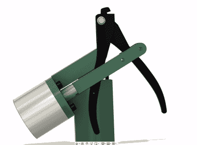

# 手动脱粒机获得气动升级

> 原文：<https://hackaday.com/2020/07/21/hand-depanelizer-gets-pneumatic-upgrade/>

在大批量生产中，较小的 PCB 通常被“面板化”,以便多个副本可以作为一个单件通过组装被混洗。每块板都用一些有策略地放置的标签连接到面板上，就像塑料模型套件中的浇口一样。如果你只需要分离几块木板，你可以用手钳简单地切割它们，但是当你要切割成百上千块木板时，这很快就变得不切实际了。

 这就是[Clough42]最近发现自己的地方。为了在不倾家荡产的情况下改善这种状况，[他决定自动化他值得信赖的手持去模板工具](https://www.thingiverse.com/thing:4546135)。基本想法是建立一个驱动器，可以代替他自己的手操作工具。他已经有了一个气压缸，可以给这个装置提供动力，他只需要设计它。

在下面的视频中，他向观众展示了这个项目的 CAD 设计过程。他的第一步，也是经常被新玩家忽略的一步，是创建他正在使用的硬件的数字表示。这使他能够快速设计 3D 打印零件，这些零件具有适当的尺寸和间隙，可以与他的现实世界组件相结合。记住:让你的 3D 模型适应你手头的组件要比反过来容易得多。

有了合适的阀门、软管和附在气压缸上的脚踏板，他可以完全不用手来操作切割机。他仍然需要手动移动面板，但至少可以避免重复挤压动作。

有了这样的工具和定制的测试夹具，你很快就能像专业人士一样在 T2 生产印刷电路板。

 [https://www.youtube.com/embed/kjaT2MmEZpg?version=3&rel=1&showsearch=0&showinfo=1&iv_load_policy=1&fs=1&hl=en-US&autohide=2&wmode=transparent](https://www.youtube.com/embed/kjaT2MmEZpg?version=3&rel=1&showsearch=0&showinfo=1&iv_load_policy=1&fs=1&hl=en-US&autohide=2&wmode=transparent)

【感谢 Anathae 的提示。]