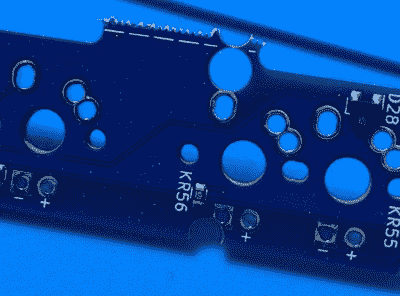

# 分离式键盘 PCB 让定制变得轻而易举

> 原文：<https://hackaday.com/2020/07/29/breakaway-keyboard-pcb-makes-customization-a-snap/>

曾几何时，键盘是你可以从一台电脑带到另一台电脑的东西，因为大多数键盘都制作得相当精美。在薄膜键盘成为标准的黑暗几十年后，机械键盘社区的崛起照亮了开源设计的可能性。任何人都可以加入，因为质量 clackers 现在存在于每个层面，无论你是想设计一个完美的分裂正交与 OLEDs，旋转编码器和后视镜，还是只想叉一些钱，得到打孔开关。

Break me off a piece of that candy bar keeb.

构建自己的键盘并不一定是令人生畏的。你想怎么简单就怎么复杂。仍然有相当数量的焊接，因为它是一个键盘。但是，如果你不想做焊接开关(或热插拔插座)以外的事情，还有很多选择！)和放一个案例在一起。

[以[Jared]刚刚完成的 JNAO(只需要一个矫形)建筑为例](https://jrdsgl.com/jnao-build-log/)。它从 PCB 和板上控制器开始，想法是从那里定制它。你可以通过 3D 打印、激光切割或其他方式雕刻自己的外壳和盘子来固定按键开关，然后开始决定开关和键帽。

JNAO 有趣的地方在于底部分离的一排按键。标准网格是 12×5，但是如果你不需要像[Jared]那样沿着顶部的专用数字行，你就不会被它卡住。您也不会被默认的布局所束缚。闪转到标准普朗克布局并不像[Jared]可能喜欢的那样容易，但我们认为他在打开烙铁之前把固件准备好是明智的。

不知道这么小的键盘怎么办？对于 cyberdeck 构建来说，它们非常完美。