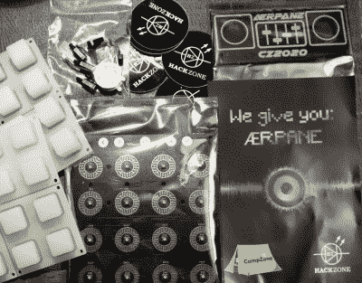
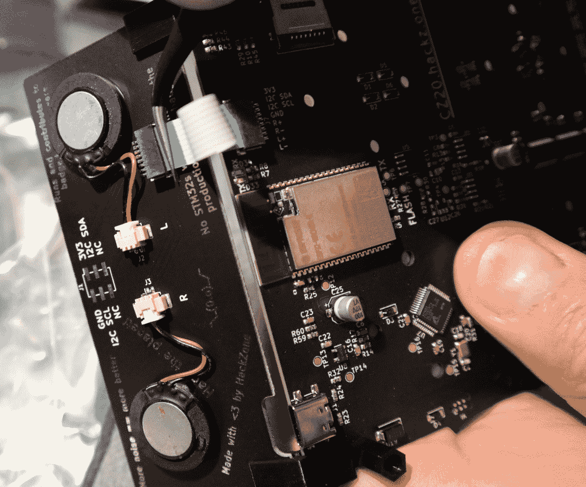
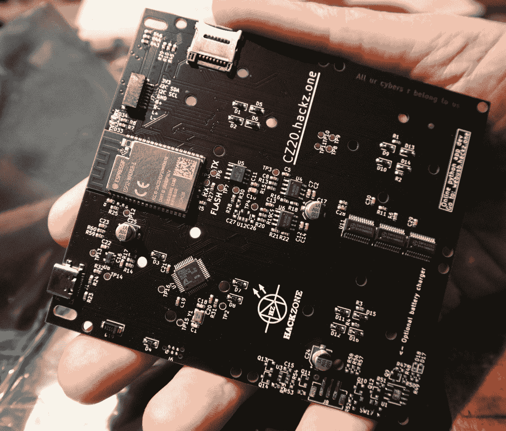
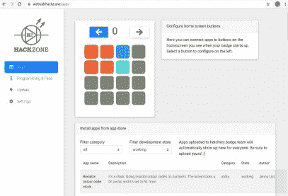
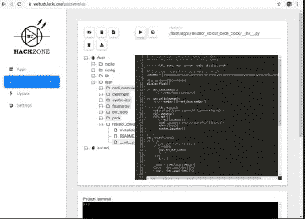

# CampZone 2020 徽章向我们表明了这一点

> 原文：<https://hackaday.com/2020/07/31/campzone-2020-badge-literally-speaks-to-us/>

今年，疫情把我平常的日程表弄得乱七八糟。我本以为我会在这个夏天的很大一部分时间里与我们世界各地精彩多样的社区交往，但我却坐在家里打开一个孤独的俱乐部伙伴，听着低沉的电子音乐，同时试图想象自己在某个领域与数千名黑客在一起。

作为活动取消的连锁反应，今年夏天又少了一样东西，电子会议徽章世界的创造力爆发已经停滞。今年徽章很少，所以少数成功制作的徽章将被珍藏起来，以提醒人们生活还在继续，未来将会有另一个黑客营的黄金夏天。今年，CampZone 2020 徽章被赋予了自己的声音，并执行巧妙的技巧，如通过 WebUSB 呈现编程界面！

## 徽章，那不完全是徽章

All the parts laid out

[CampZone](https://campzone.nl/?lang=en) 是一项主要面向游戏社区的欧洲活动，但也包含了 HackZone 活动。今年的面对面会议已被取消，并像其他许多会议一样在网上举行，但这并没有阻止其徽章创作者 Tom Clement 和团队推出 CampZone 2020 徽章。

其结果是 [AerPane](https://wiki.hackz.one/CZ20) ，发音为“耳朵痛”，参考了 [2019 i-Pane](https://hackaday.com/2019/07/25/campzone-2019-badge-is-begging-to-become-a-huge-billboard/) ，以及一个延续 CampZone 徽章主题的设计，通过板载扬声器和非常明亮的 LED 照明 16 键硅胶键盘为音乐实验者提供面对面的多媒体体验。它在皮肤下运行成熟的[徽章。团队](https://badge.team/)固件，所以当我订购我的徽章时，我很有兴趣看看他们是如何设法将丰富的界面融入到这样一个最小的 UI 硬件中的。

Inserting the flat ribbon cable is a little fiddly

我从荷兰寄来的包裹里是徽章套件，里面有两块印刷电路板、一袋硬件和硅胶键盘外壳。徽章可以订购两种键盘版本中的任何一种，一种是 12 毫米高的按键，另一种是我安装的大约 8 毫米的较短按键。主 PCB 约为 111 毫米乘 100 毫米，有一排触摸按钮、键盘按钮触点和顶部的 led，其余组件在底部。同时，较小的 PCB 约为 40 毫米乘 100 毫米，容纳扬声器，并通过短扁平电缆连接。[组装](https://wiki.hackz.one/CZ20/Assembly)相当简单，硅胶由塑料支架固定，塑料支架兼作徽章支架，扬声器板由一对夹式 45 度塑料角支架固定。扬声器本身用自粘环固定，并配有小型 PCB 连接器。组装中最棘手的部分是安装带状电缆，在这方面，我发现一把好的镊子非常有用。

The components on the rear of the PCB

查看电路板底部的硬件，有一个 ESP32-WROVER-2 模块负责繁重的工作，还有一个 Apex micro electronics APM 32 f 103 c 8 绝对不是一个处理 USB 接口的 STM32 微控制器。ESP 有一个 microSD 卡座，这是一种翻盖型卡座，而不是滑入式卡座。再往下是一对 LED 驱动芯片和一个深圳泰坦 TM8211 i2s DAC，带有一对音频驱动芯片。最后，还有一个无人居住的电池充电器和脂肪电路。连接通过主板后部的 USB-C 端口实现。提到无人居住的电池电路区域将我们带到了关于徽章的重要一点，严格来说，如果你将徽章作为一种可穿戴设备，它根本不是真正的徽章。相反，它是一个独立的单元，最好放在平面上。

 [https://www.youtube.com/embed/mi__UDd15D8?version=3&rel=1&showsearch=0&showinfo=1&iv_load_policy=1&fs=1&hl=en-US&autohide=2&wmode=transparent](https://www.youtube.com/embed/mi__UDd15D8?version=3&rel=1&showsearch=0&showinfo=1&iv_load_policy=1&fs=1&hl=en-US&autohide=2&wmode=transparent)

第一次将徽章连接到 USB-C 电源时，它会进入一次性启动序列，带有闪烁的 led 和令人印象深刻的声音，然后我们获得了徽章界面的第一次体验，因为合成语音告诉我们，长按亮起的按钮会显示它启动的应用程序，短按会启动该应用程序。它预装了五个应用程序:一个简单的和弦正弦波合成器，一个四行游戏，一个 MIDI 控制器应用程序，一个荷兰广播应用程序，以及一个用作 USB-HID 键盘并向主机输入“Cyber”的应用程序。最后一个指的是欧洲黑客空间中的一个“网络”迷因，当然，它在前面一句中的出现是用我徽章上的应用程序输入的。

## WebUSB 为徽章带来了新的便利

    The code editor and Python shell

徽章的物理特征已经描述完毕，是时候将它插入计算机并研究它的其他特征了。正是在这里，这个徽章真正推动了易用性方面的发展，因为它不需要工具链或终端，而是可以通过 WebUSB 直接访问进行开发。只需将支持 WebUSB 的浏览器指向 [webusb.hackz.one](https://webusb.hackz.one/) ，就会立即出现可用应用列表。就像所有其他 badge.team 徽章一样，这些徽章存放在他们称为孵化中心的应用程序商店中，使用 MicroPython，它们很容易编写，无需硬件本身的低级知识。更好的是，AerPane 通过 WebUSB 将开发引入浏览器，带有代码编辑器和 MicroPython 提示，允许即时代码黑客。我一头扎进去，从一个现有的时钟应用程序中借来一些代码，与我几年前写的一个项目结合起来，不到半小时，我就在孵化室里安装了[我的电阻颜色代码时钟](https://badge.team/projects/resistor_colour_code_clock)。

这个徽章是为玩家活动设计的，在这个活动中，许多参与者不是程序员，他们更有可能拥有一台 Windows 机器，而不是运行 Linux 或其他操作系统的机器。因此，WebUSB 方法作为一种吸引他们为其编码的途径非常有意义，但是我们可以看到它在一些圈子里可能不太受欢迎，因为 WebUSB 并不被所有浏览器支持。尤其是 Firefox 用户必须找到一个基于 Chrome 的浏览器，我必须按照[几个指令](https://wiki.hackz.one/CZ20/Linux)才能让它在我的 Ubuntu box 上与 Chrome 兼容。虽然它的设计是新鲜和新的，但它是一个有趣和迷人的外设，你会想玩它，它的编码简易性通过 WebUSB 接口达到了新的高度。[这都是开源的，](https://github.com/hackzone/cz20-badge)我们真的很期待看到它的一些想法影响全球#BadgeLife 社区的下一批徽章。