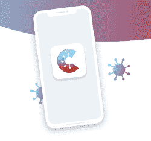
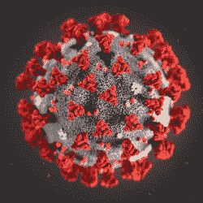

# COVID 追踪应用程序:欧洲做对了什么，做错了什么

> 原文：<https://hackaday.com/2020/08/03/covid-tracing-apps-what-europe-has-done-right-and-wrong/>

与前三个月的严重封锁相比，欧洲上个月一直处于 COVID-containment 模式。孩子们轮流回到学校，人们去感染率同样低的国家度假。乐高乐园和动物园重新开放，容量限制在 1/3。当你“正常”排队时，一旦你适应了强制戴口罩和 1.5 米的间隔，五金店和邮局就“正常”运行了。为了弥补一半的桌子必须空着的事实，大多数餐馆都把桌子伸开到了露台上。这不是真的正常，但也不再可怕。

但是，即使像我居住的德国这样做得很好的国家，每天也有几百到一千个新病例。如果像以前一样任其蔓延，第二次浪潮的可能性是非常真实的，因此采取了掩盖和距离的做法。各种欧洲 COVID 追踪应用程序是在疫情局势岌岌可危的背景下推出的。虽然没有人指望这些应用程序会取代公共距离，但如果它们能够在新的无症状病例被传播之前发现它们，它们也会有所帮助。

当谷歌和苹果推出他们的应用追踪框架时，我对它们进行了技术分析。我的结论是，基础设施是健全的，但实现细节将是所有龙都在等待的地方。不出所料，我是对的！

以下是欧洲使用 COVID 追踪应用的第一个月的最新进展。好消息是，这些应用程序似乎写得很好，并基于上述坚实的基础。很多很多人已经安装了至少一个应用程序，尽管有一些非常严重的成长烦恼，但它们似乎基本上正常运行。坏消息是，由于其隐私保护的性质，没有人知道有多少人收到了警告，或者该应用对感染率有什么影响(如果有的话)。在新的每日案件率中，你肯定看不到“应用程序效应”。经过一个月的艰苦编码工作和极度的公众善意，手机应用可能并不是一些人所希望的灵丹妙药。

## 欧洲是一个大杂烩

关于欧洲的 COVID 应用程序，你需要知道的第一件事是，它们数量众多，而且各不相同。就像我们南边的邻居会做美味的披萨，西边的邻居会做美味的法式面包和奶酪，东边的邻居会做美味的比尔森啤酒一样，全国认可的追踪应用程序不仅仅在语言上有所不同。

这里有三个框架，但其中两个基本相同。谷歌/苹果“[暴露通知系统](https://en.wikipedia.org/wiki/Exposure_Notification)”(ENS)的灵感来自欧洲“[分散式隐私保护邻近追踪](https://en.wikipedia.org/wiki/Decentralized_Privacy-Preserving_Proximity_Tracing)”(DP-3T)框架的原始草案，两者都使用蓝牙 le 上广播的日期-时间-ID 哈希来允许个人手机确定他们是否接触过受感染的个人。[我们之前广泛报道过 ENS。](https://hackaday.com/2020/04/16/google-and-apple-reveal-their-corona-tracing-plans-we-kick-the-tires/)由于哈希值经常变化，并且您的秘密 ID 从不在手机外传递，这两种方法提供了非常强的隐私保证。由于 DP-3T 和 EN 框架本质上是相同的，使用这两个系统的应用程序最终应该可以融合；ENS 基本上将 DP-3T 的概念融入了 Android 和 iOS 的 OS 级 API 调用中。因此，虽然欧洲的 DP-3T 和 ENS 各占一半，但从根本上来说都是一样的。

[“Croissants”](https://www.flickr.com/photos/15411972@N00/15011453655) by Jo@net, CC BY 2.0

与众不同的国家是法国，它使用的是相同的蓝牙 LE beacons 方法的集中版本。他们的 StopCovid 应用程序中使用的 [ROBERT 系统收集你的随机 id 和你的手机听到的日期-时间-ID 散列，在中央数据库中进行比较，然后通知你是否匹配。ROBERT 本质上是 DP-3T 的前身的副产品，DP-3T 是“](https://techcrunch.com/2020/05/26/frances-data-protection-watchdog-reviews-contact-tracing-app-stopcovid/)[泛欧隐私保护邻近追踪](https://en.wikipedia.org/wiki/Pan-European_Privacy-Preserving_Proximity_Tracing)框架(PEPP-PT)。

PEPP-PT 中的“隐私”是由于 ID 号是像分散式解决方案一样每个电话随机生成的，所以它们是假名。另一方面，如果中央服务器能够以某种方式将数字与人联系起来，那么他们就会有一个非常详细的日志，记录谁在什么时候接近了谁。数据的潜在去匿名化导致大多数参与 PEPP-PT 开发的大学转向 DP-3T，也导致了可能是有史以来最被动-激进的白皮书标题:“邻近追踪应用:关于集中与分散方法的误导性辩论”来自法国阵营。

你也不必担心政府不希望你的数据集中存储。[韩国应用的加密刚刚被破解](https://www.nytimes.com/2020/07/21/technology/korea-coronavirus-app-security.html)，由于它不仅向中央服务器报告你的 COVID 状态，还报告你的位置和购买历史，这是一个巨大的隐私漏洞。(用来加密一切的密码？"1234567890123456".至少很长。)在法国代码中似乎没有任何类似的吼叫信，但每个人的活动和联系人的数据库将成为不良黑客的诱人目标。

但即使抛开法国不谈，使用相同框架的应用程序也无法协同工作。尽管这些应用程序使用类似的框架，但政府机构需要每天广播权威的传染性哈希列表，供您的手机进行比较。德国的应用程序应该从意大利和西班牙获取数据吗？人们的共识似乎是应该这样做，而且在不久的将来会有很多工作要做。但目前，欧洲的 COVID 应用程序仍然是由国界划定的拼凑物，尽管欧洲内部的旅行限制已经部分解除。

仍然有一些国家还没有建立和运行系统。西班牙值得注意，尽管它还在发展中。

## 欧洲是开放的

在欧洲 COVID 应用程序开发过程中，最令人放心的一幕是，公众对该开发进行了多么彻底的讨论。在德国，媒体广泛报道了从仅使用假名的 PEPP-PT 到 DP-3T 的转变，这可能在很大程度上要归功于混沌计算机俱乐部和其他具有安全专业知识的公共利益团体的努力，当然还有议会中听取他们意见的人。

 由于透明度被认为是应用推广的关键，几乎所有国家赞助的应用都是开源的。以德国为例，这款应用是由 SAP 和德国电信秘密开发的，这两家公司很少因其开源资质而出名。但是在发布的前几周，他们把它 [*全部*放在了 GitHub](https://github.com/corona-warn-app) 上:服务器、应用程序、验证门户和大量文档。截至今天，在提出的 356 个问题中，有 293 个问题已经解决，所有问题似乎都得到了迅速审理和认真对待。你多久会听到一个脾气暴躁的安全程序员说代码库“[非常干净，乍看之下，没有明显的后门或安全漏洞](https://www.heise.de/hintergrund/Corona-Warn-App-Quellcode-Analyse-eines-beispiellosen-Open-Source-Projektes-4774655.html)”？好评！([此处由机器人翻译。没有任何代码是 100%安全的，但是开放的安全过程似乎正在起作用。](https://translate.google.com/translate?sl=auto&tl=en&js=y&prev=_t&hl=en&ie=UTF-8&u=https://www.heise.de/hintergrund/Corona-Warn-App-Quellcode-Analyse-eines-beispiellosen-Open-Source-Projektes-4774655.html&edit-text=&act=url)

虽然我一直在密切关注德国的进展，但许多其他国家都没有代码。这里有[爱尔兰的](https://github.com/HSEIreland/covid-tracker-app)，[意大利的](https://github.com/immuni-app)，[奥地利的](https://github.com/austrianredcross)，[法国的](https://gitlab.inria.fr/stopcovid19)，[波兰的](https://github.com/ProteGO-safe)，[荷兰的](https://gitlab.com/PrivateTracer)。值得注意的是，丹麦和芬兰没有专有应用，尽管它们分别基于 ENS 和 DP-3T 框架。欢迎在评论中给我们更新任何其他国家的节目！

如果你不相信开放、可审计的代码很重要，看看上面韩国的失败。在开放的环境中，每个人的应用程序中的硬编码密码一天都经受不住，更不用说几个月了。这并不是说在任何开放的代码库中都没有*深度*的 bugs 它们毕竟是巨大而复杂的——但是像 1234567890123456 这样容易摘到的果子会立刻被发现。

## 现在坏消息是

任何 COVID 应用程序有用的最重要因素之一是它被广泛使用。例如，如果只有 5%的人安装了该应用程序，假设您安装了该应用程序，那么您有 5%的最大可能会正确地向您报告实际暴露情况。虽然早期追踪的积极效果随着安装基础的增长而增加，但英国科学家估计，要消灭疾病，你需要大约 60%的覆盖率。

我找不到所有国家的最新统计数据，但我敢打赌德国的安装量最大，下载量超过 1600 万次。但在 8300 万人口中，这只是总人口的 19%。根据安格拉·默克尔办公厅主任的说法(他完全没有偏见)，德国拥有“最好的”应用程序，然而在调查中被问及时[只有 42%的人说他们会安装应用程序](https://www.dw.com/en/germany-launches-best-coronavirus-tracing-app/a-53825213)。

爱尔兰拥有 130 万用户，占其 490 万居民的 27%，可能是安装率最高的国家。法国的应用程序在最初几周仅被下载了 230 万次，在 6500 万次上。3.5%.哎哟。

You might need this. ([“charging-battery”](https://www.flickr.com/photos/99713555@N00/27026214875) by Wolfgang Lonien, CC BY-SA 2.0)

这是假设每个人都有应用程序，并且一直在运行。德国的这款应用本应在 ENS 提供的 Android 操作系统上运行，但由于在第一个月的大部分时间里，它都在三星和小米手机上后台运行 ( [翻译为](https://translate.google.com/translate?sl=auto&tl=en&js=y&prev=_t&hl=en&ie=UTF-8&u=https://www.faz.net/aktuell/wirtschaft/digitec/corona-app-samsung-und-huawei-nutzer-verpassten-warnmeldungen-16874805.html&edit-text=&act=url))，因此服务出现了漏洞，未被发现。操作系统的节能模式过于热情。它现在运行在“优先背景”模式下，但将两家最大的手机制造商从你的数据集中删除几周不会有所帮助。据报道，这款法国应用程序不能使用 ENS，必须在前台运行，它像吃 Nutella crepes 一样吃电池。有多少人会保持电池猪运行？

也不全是安卓。用户升级到 iOS 13.6 时出现了一个问题，根本无法运行该应用程序。我不知道这个问题是否已经解决了。有人吗？

德国体制中的其他问题更多的是政策而不是软件。如果您的 COVID 测试呈阳性，您的医生会通过邮件通知您，然后您必须通过专门的热线电话验证密码，以便将传染性输入系统。这可能导致进入系统的两天延迟，在此期间，人们不会知道他们与具有传染性的人有过接触。由于追踪联系人的速度是游戏的名字，这是一个耻辱。这是假设你注册了——罗伯特·科赫研究所的一些初步证据表明，4%到 6%的测试呈阳性的人最终在应用程序上注册了。([译](https://translate.google.com/translate?sl=auto&tl=en&js=y&prev=_t&hl=en&ie=UTF-8&u=https://www.heise.de/news/Ein-Monat-Corona-Warn-App-Bisher-bleibt-der-Effekt-aus-4846827.html&edit-text=&act=url)。)

可能会更糟。虽然从技术上讲，英格兰不再是欧盟的一部分，但它仍未能推出一款 COVID 应用。在支持了几个月的中央服务器模式，以及让他们的应用程序在 iOS 设备上运行的严重问题之后，NHS [最终决定转向分散的 ENS](https://www.bbc.com/news/technology-53114251)，这对隐私和接受来说可能是一件好事，但会导致进一步的延迟。同时[苏格兰](https://www.bbc.com/news/technology-53608111)和[北爱尔兰](https://www.bbc.com/news/uk-northern-ireland-53599514)，表面上是英国的一部分，已经将事情掌握在自己手中。

最重要的是，人们仍然在争论蓝牙 LE range 首先是否是近距离的、传播病毒的接近的良好代理。各种应用程序需要多次暴露才能触发警告，所以“公共汽车经过”的场景不是这样一个问题，但住在测试呈阳性的人楼下的人无疑会得到假阳性。

## 一个大实验？彩排吗？

欧洲 COVID 追踪应用程序上个月的教训是什么？从积极的一面来看，邀请公众参与需求过程并提供开放和可审计的代码可以极大地鼓励应用程序的采用。比较法国、德国和爱尔兰，看起来用户也足够关心他们的隐私，以至于在接受程度上也有显著差异，即使它像匿名和假名之间的差异一样微妙。

 尽管如此，还很难看到 COVID 应用程序的任何效果。无论这是因为技术故障、安装基数太低，还是没有自我报告为传染性，这些系统并没有对每日病例数产生真正的影响。也许以后会有一些可见的效果，也许没有。可悲的是，只有时间能证明一切。这些应用程序甚至会让事情变得更糟；我们还可以想象一个世界，人们基于低暴露的虚假信心放松他们的行为，仅仅因为他们周围没有人使用该应用程序。

有点令人沮丧的是，没有一种简单的技术解决方案来防止一种潜伏一周左右的高传染性疾病的传播，即使面对聪明的加密框架和开源开发。面具、距离、早期检测和通知似乎真的是前进的道路:科学和医学，而不是手机和软件。

也就是说，许多欧洲应用程序的好处是它们是开放的，尊重你的隐私，并且至少有非零的机会帮助遏制疾病的传播。使用它们不会有任何损失，开发过程有望成为未来的模型。鉴于反模式的充足供应，这本身就是一个成功。