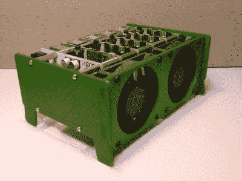

# Rack 'em Stack 'em Raspberry Pi 控制板

> 原文：<https://hackaday.com/2020/08/12/rack-em-stack-em-raspberry-pi-controller-board/>

组装一系列 Raspberry Pi 板并不难，有几个原因可能会让你想这么做。真正的诀窍是给所有的电池供电，冷却所有的电池，而不要有乱七八糟的电线，也不要把它们分开。 [ClusterCTRL 堆栈允许您将最多五块 Raspberry Pi 板](https://clusterctrl.com)堆叠在一起。PCB 沿 Pis 堆叠的侧面垂直对齐，每个引脚头都有插座。使用单个 12 至 24V 电源，它为每个板、一个 USB 电源连接和两个风扇供电。还有一个 USB 端口来控制风扇和电源。

还有一个软件组件可以提供更精细的控制。在不使用软件的情况下，PI 可以在一秒钟内上电，并监控一个 GPIO 引脚来控制风扇。通过该软件，您可以打开或关闭单个节点，将两个风扇组合在一起打开，甚至可以添加更多的堆栈。

有一种情况是[你可以从 STL 文件](https://pinshape.com/items/98243-3d-printed-clusterctrl-stack-frame-case)中打印出来，尽管你可以在[的 Tindie 列表](https://www.tindie.com/products/20770/)上买到它们，在那里可以找到关于 ClusterCTRL 的大部分信息。如果你愿意，你也可以让 3D 打印供应商给你打印一份。

电源是 10A 5.1V 直流-DC 转换器。这相当于 2A 每圆周率和 51W 的总和。因此，输入端的电源需要足以覆盖 51W 的功率、风扇的功率以及调节器低效的一些开销和其他小开销。

这些年来，我们已经看到了很多 Pi 集群，包括一个很好的集群管理学习工具。当然，总会有带有[1060 块板](https://hackaday.com/2019/11/27/your-raspberry-pi-cluster-is-not-like-this-one/)的 Oracle 集群，它需要更大的电源。