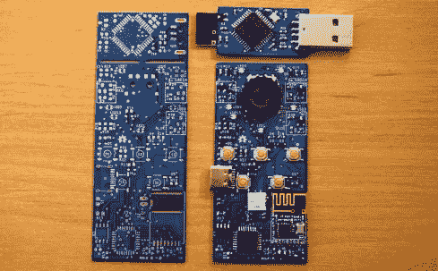
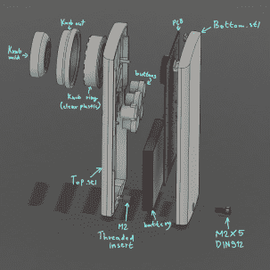

# 打造值得 2020 年使用的 YouTube 遥控器

> 原文：<https://hackaday.com/2020/08/11/building-a-youtube-remote-control-worthy-of-2020/>

回到 2018 年，【Gryo】专门为在自己的电脑上观看 YouTube 视频打造了一个遥控器。它工作得很好，但它不太符合人们对现代媒体遥控器的期望——它有点笨重，按钮反应不太灵敏，感觉不如消费流媒体设备附带的遥控器好。为了改善现状，他最近推出了[一款更加轻薄的 scratch 内置流媒体遥控器](https://www.instructables.com/id/The-Ultimate-Wireless-Keyboard-Mark-2/)，包括滚轮、颜色反馈和自定义操作的用户界面。

    

它可能看起来不像，但从技术上来说[Gyro]将他的发明归类为无线键盘，因为这是操作系统所认为的。这使得它可以很容易地与计算机上运行的任何媒体播放软件或服务一起使用，因为遥控器上的按钮按下会作为标准键盘事件被拾取。并且该软件很容易设置遥控器上的每个按钮将与哪个键相关联。

在 3D 打印的外壳内，有一个定制的 PCB，将 ATmega328P、NRF24L01 收音机和 TP4056 充电器连接在一起，通过 USB-C 为 500 mAh 的锂电池充电。接收器也是定制的，使用第二个 NRF24L01 芯片，但用 ATmega32U4 替换了微控制器。

[Gyro]在记录这个版本方面做得非常好，并且提供了你想要的一切。尽管我们很喜欢遥控器第一版中使用的独特方法，但我们不得不承认，这种迭代更有可能最终出现在我们的客厅桌子上。

 [https://www.youtube.com/embed/WGHyagQvXlI?version=3&rel=1&showsearch=0&showinfo=1&iv_load_policy=1&fs=1&hl=en-US&autohide=2&wmode=transparent](https://www.youtube.com/embed/WGHyagQvXlI?version=3&rel=1&showsearch=0&showinfo=1&iv_load_policy=1&fs=1&hl=en-US&autohide=2&wmode=transparent)

