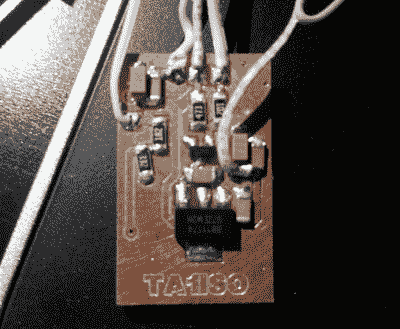

# 移动发射器内置 GPS 和蓝牙

> 原文：<https://hackaday.com/2020/08/23/mobile-transmitter-gets-internal-gps-and-bluetooth/>

虽然[Selim Olcer]对他的 Kenwood TM-D710a 无线电相对满意，但他不喜欢它需要一个笨重的外部 GPS“背包”来存储 APRS 的位置数据。于是他决定[撬开头部单元，看看能否集成自己的 GPS 硬件](https://selimolcer.blogspot.com/2013/05/kenwood-tm-d710-gps-bluetooth-android.html) ( [机器翻译](https://translate.google.com/translate?sl=auto&tl=en&u=https%3A%2F%2Fselimolcer.blogspot.com%2F2013%2F05%2Fkenwood-tm-d710-gps-bluetooth-android.html))。他不仅成功了，而且还额外增加了蓝牙兼容性。

 手里拿着维修手册电路图，找到连接到外部连接器的 GPS RX 和 TX 线路没有问题。不幸的是，无线电的电子设备都是 5 伏，而 GPS 模块[Selim]想要使用的只有 3.3 伏。所以他想出了一个小 PCB，不仅包括为 GPS 模块供电的电压调节器，还包括一些分压器来对这些信号进行电平转换。

由于 Kenwood TM-D710a 已经设计为接受 GPS 升级模块，他只需要更改无线电菜单中的一些配置选项，就可以看到新的硬件。从技术上来说，这个项目已经完成了，但因为箱子里还有空间，而且他有一个 GPS 模块可以输出 NMEA 句子，[Selim]加上了一个通用的蓝牙串行模块，这样他就可以在智能手机上看到位置信息。有了 APRSdroid 这样的应用程序，他现在有了一个很好的移动地图显示，使用的是从收音机的 GPS 获取的位置。

随着这一修改的完成，看起来头单元已经准备好了，但这只是移动钻机的开始。现在我们想看看他[如何将整个东西整合到汽车](https://hackaday.com/2020/02/05/the-50-ham-going-mobile/)中。