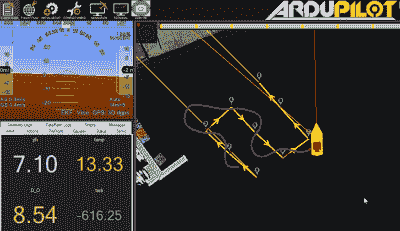

# 用一对机器人分析水质

> 原文：<https://hackaday.com/2020/08/14/analyzing-water-quality-with-a-pair-of-robots/>

为了充分研究诸如湖泊之类的水体，需要从一系列深度和位置获取读数和样本。传统上，这是由几个研究人员在一艘小船上使用各种工具完成的，这些工具可以被降低到所需的深度，这自然是一个非常缓慢和昂贵的过程。随着越来越多的颗粒水质分析需求的增长，已经提出了各种机器人方法来帮助自动化过程。

 一群来自波士顿东北大学的学生一直在从事[项目信天翁，这是一种半自动车辆](https://hackaday.io/project/165920-project-albatross)的独特组合，它们协同工作，提供来自水面以上和以下的几乎即时的数据。通过利用开源软件和现成的组件，他们的系统有望负担得起，甚至对于从事自己的环境研究的公民科学家来说也是如此。

这种由五加仑水桶和铝挤压件组装而成的水面飞行器，使用 Pixhawk 自动驾驶模块来控制一套改装的舱底泵，作为推进器。有了 ArduPilot，团队就能够指挥车辆按照预先规划的路线行驶，或者根据需要保持在一个位置。拖在这艘船后面的是一艘装载传感器的潜水器，其灵感来自于获得 2017 年黑客奖的[的](https://hackaday.com/2017/11/11/open-source-underwater-glider-wins-2017-hackaday-prize/)[开源水下滑翔机(OSUG)](https://hackaday.io/project/20458-osug-open-source-underwater-glider) 。

使用由 NEMA 23 步进电机操作的注射器阵列，滑翔机能够通过调整浮力来控制其在水中的深度。PVC 管体侧面的铝制“翅膀”可以防止车辆在水中滚动。与水面飞行器一样，滑翔机的许多部件都是从五金店购买的，以降低制造和维护的总成本。

水面航行器的系绳为潜水器提供动力，与内部电池相比，大大增加了潜水器在水下的时间。它还允许将滑翔机尾部传感器的读数实时传输给研究人员，而不是等待它浮出水面。虽然该团队表示，PID 调整仍有工作要做，这将使滑翔机对其深度进行更精细的控制，但最近的测试结果看起来非常有希望。

The [HackadayPrize2020](https://prize.supplyframe.com) is Sponsored by: