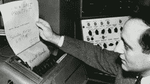
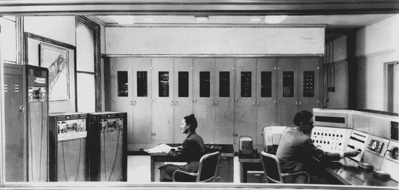
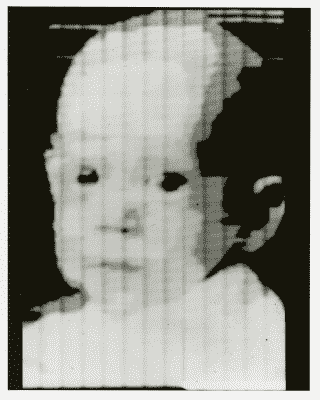
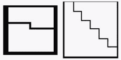

# Russell Kirsch:像素先锋和数字成像之父

> 原文：<https://hackaday.com/2020/08/20/russell-kirsch-pixel-pioneer-and-the-father-of-digital-imaging/>

他们说的是真的——除非你尝试，否则你永远不知道你能做什么。Russell Kirsch 开发了第一台数字图像扫描仪，并随后发明了像素，他是这一公理的坚定信徒。如果罗素在 1957 年从未试图将他三个月大的儿子的照片输入电脑，你现在可能正在阅读《黑客日报》的印刷版。Russell 的工作为使数字成像成为今天的算法和存储方法奠定了基础。

Russell reads SEAC’s last printout. Image via [TechSpot](https://www.techspot.com/news/86391-russell-kirsch-computer-scientist-who-invented-pixel-has.html)

拉塞尔·a·基尔希 1929 年 6 月 20 日出生于纽约市，是俄罗斯和匈牙利移民的儿子。他从布朗克斯科学高中开始就接受了良好的教育。然后，他在 NYU 大学获得了电气工程学士学位，在哈佛大学获得了理学硕士学位，并在美利坚大学和麻省理工学院就读。

1951 年，Russell 去了国家标准局工作，也就是现在的国家科学技术研究院(NIST)。他在 NIST 工作了近 50 年，并开始使用美国最早的可编程计算机之一，即 SEAC(标准东方自动计算机)。这台房间大小的计算机建于 1950 年[，是作为人口普查局做研究的临时解决方案而开发的](https://nvlpubs.nist.gov/nistpubs/sp958-lide/086-089.pdf)。

Standards Eastern Automatic Computer (SEAC) was the first programmable computer in the United States. Credit: NIST via [Wikimedia](https://commons.wikimedia.org/wiki/File:Fifitieth_Anniversary_of_First_Digital_Image_Marked_(5941021342).jpg)

像同时代的其他计算机一样，SEAC 使用穿孔卡片、水银存储器和电线存储器。Russell Kirsch 和他的团队的任务是找到一种无需任何预先处理就能将图像数据输入机器的方法。因为这台电脑应该是临时的，所以它的使用不像其他电脑那样受到严格控制。尽管它 24/7 全天候运行，并得到了大量的使用，但 SEAC 比其他计算机更容易访问，这为前沿实验留出了时间。在接下来的 13 年里，NIST 最终将 SEAC 留在了身边，直到 1963 年。

## 原始像素推进器

This photo of Russell’s son Walden is the first digitized image. Public Domain via [Wikimedia](https://commons.wikimedia.org/wiki/File:NBSFirstScanImage.jpg)

术语“像素”是*图像元素的简称。*从技术上讲，像素是数字成像的长度单位。像素是任何可以在计算机屏幕上显示的东西的组成部分，所以它们是第一批可寻址的闪光灯。

1957 年，拉塞尔带来了他儿子瓦尔登的照片，这将成为第一张数码照片。他将照片安装在一个转鼓扫描仪上，扫描仪的一端有一个马达，另一端有一个频闪盘。这个鼓被连接到一个光电倍增管上，该管在一个丝杠上旋转。光电倍增管用于探测非常微弱的光线。

随着鼓慢慢旋转，一个光电倍增器来回移动，通过盒子壁上的一个方形观察孔扫描图像。显像管将图像数字化，向 SEAC 传输 1 和 0，描述它通过方形观察孔看到的东西——1 代表白色，0 代表黑色。瓦尔登湖的数字图像是 76 x 76 像素，这是 SEAC 允许的最大值。

## 可变形状像素

如果 Russell Kirsch 有什么遗憾的话，那就是他把像素设计成了方形。十年前，81 岁的他开始研究一种形状可变的像素，希望能改善数码成像的未来。他编写了一个 LISP 程序来探索这个想法，并使用 6×6 的正方形像素阵列来模拟三角形和矩形像素。

Alternative pixel geometries. Image via [Cloudseed Films](https://vimeo.com/22179638)

在下面的视频中，Russell 讨论了这个想法，并证明了可变像素比方形像素能提供更多信息，并且整体像素明显更少。这需要一些技巧，因为三角形和矩形的像素对必须仔细选择，旋转，混合在一起才能最好地表现图像，但图像质量绝对值得努力。接下来是 Russell 讨论 SEAC 硬件的视频。

Russell 于 2001 年从 NIST 退休，搬到俄勒冈州波特兰市。截至 2012 年，他偶尔会出现在咖啡馆里，与任何他能接触到的人讨论技术。不幸的是，拉塞尔患上了老年痴呆症，于 2020 年 8 月 11 日因并发症去世。他已经 91 岁了。

[https://player.vimeo.com/video/22179638](https://player.vimeo.com/video/22179638)

 [https://www.youtube.com/embed/lF0TA9O3Dc8?version=3&rel=1&showsearch=0&showinfo=1&iv_load_policy=1&fs=1&hl=en-US&autohide=2&wmode=transparent](https://www.youtube.com/embed/lF0TA9O3Dc8?version=3&rel=1&showsearch=0&showinfo=1&iv_load_policy=1&fs=1&hl=en-US&autohide=2&wmode=transparent)

