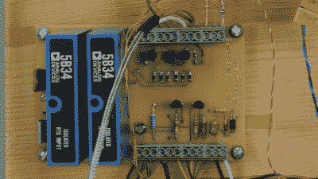
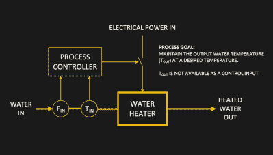

# 作为可编程逻辑控制器评估 Raspberry Pi

> 原文：<https://hackaday.com/2020/08/24/evaluating-raspberry-pi-as-a-programmable-logic-controller/>

对于许多人来说，可以使用 Raspbery Pi SBC 作为工业控制器并不奇怪，但它有什么好的吗？这就是[Dough Reneker]和[William Shaffer] [建造测试平台来观察树莓派在面对面测试中的表现](https://www.controlglobal.com/articles/2020/raspberry-pi-vs-plc-for-model-based-control/)的问题。他们使用一个简单的水加热例子，将树莓派 3B 上基于 Python 的控制回路与 [C0-12DD1E-2-D 自动直接点击](https://www.automationdirect.com/adc/shopping/catalog/programmable_controllers/click_series_plcs_(stackable_micro_brick)/plc_units/c0-12dd1e-d)可编程逻辑控制器( [PLC](https://en.wikipedia.org/wiki/Programmable_logic_controller) )进行了比较。

 使用树莓 Pi 作为 PLC 的一个主要障碍是缺乏工业 I/O 能力。这需要额外的硬件，在这种情况下，需要增加一个四通道 ADC 板和一个定制板来调理信号。Raspberry Pi 寻找 0-3 V 输入，工业控制应用通常在-10 至 10 V 范围内，并且经常使用[4-20mA 电流环路](https://en.wikipedia.org/wiki/Current_loop)。

使用 PLC 利用所谓的梯形逻辑，其中每个动作取决于条件。通过每次更新扫描，PLC 确保所有输入条件实时转换为适当的输出条件。它唯一的工作是监控手头的过程，它做得很好。

 这里运行 Linux 的 Raspberry Pi 的灵活性和通用性是一个缺点。与 PLC 不同，缺乏硬实时操作系统意味着您不能保证 Pi 会对变化的输入做出响应。

这两个系统的行为表明，虽然两个系统都完成了它们被编程的任务，但树莓派显然更加不稳定。虽然人们可以围绕这些问题进行编程(假设在精简的软实时配置中使用 Linux 和中断驱动的本机代码)，但制作适合工业环境的 Raspberry Pi 系统所需的努力表明了为什么单板计算机没有被采用来替代 PLC。

 [https://www.youtube.com/embed/0eZdNMJDlJU?version=3&rel=1&showsearch=0&showinfo=1&iv_load_policy=1&fs=1&hl=en-US&autohide=2&wmode=transparent](https://www.youtube.com/embed/0eZdNMJDlJU?version=3&rel=1&showsearch=0&showinfo=1&iv_load_policy=1&fs=1&hl=en-US&autohide=2&wmode=transparent)

