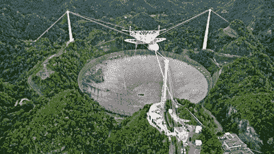
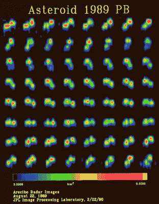
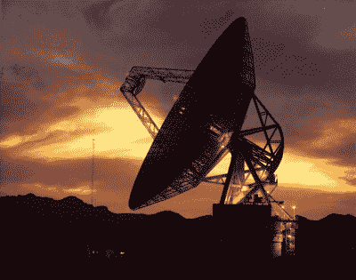

# 对阿雷西博的破坏给天文学留下了巨大的漏洞

> 原文：<https://hackaday.com/2020/08/24/damage-to-arecibo-leaves-gaping-hole-in-astronomy/>

8 月 10 日清晨，阿雷西博天文台的一根支撑电缆从支架上脱落，[撞穿了](http://www.naic.edu/ao/blog/broken-cable-damages-arecibo-observatory)下方的主反射器表面。从标志性的 305 米碟形天线下面拍摄的图像显示了令人难以置信的破坏程度，该天线因电影*接触*和*黄金眼*而闻名。估计重约 6000 公斤(13000 磅)的粗电缆段几乎没有困难就撕裂了反射器的薄网格结构。

更糟糕的是，电缆还击中了所谓的“格里高利圆顶”，这是一种悬挂在安装敏感仪器的碟形天线上方的结构。在撰写本文时，还不清楚这些仪器是否已经损坏，尽管美国宇航局至少已经表示，他们在圆顶内操作的设备似乎完好无损。至少，圆顶结构本身的损坏需要在天文台恢复正常运作之前得到解决。

 

阿雷西博天文台[由 JidoBG](https://commons.wikimedia.org/wiki/File:The_Arecibo_Observatory_20151101114231-0_8e7cc_c7a44aca_orig.jpg)【CC-BY-SA 4.0】

但是维修要花多长时间，谁来支付费用？众所周知，至少从 21 世纪初开始，为这台 60 岁的望远镜提供资金就变得困难了。如果不是因为中佛罗里达大学领导的一个财团，修复 2017 年飓风玛丽亚期间望远镜遭受的相对较小的损坏的成本可能足以永久关闭该设施。他们同意与国家科学基金会共同承担天文台的运营费用，并追加数百万美元的资金。

现在知道阿雷西博天文台恢复运行状态需要多少时间和金钱还为时过早，但根据当前的世界形势，这台望远镜似乎至少在今年剩余的时间里将无法使用。鉴于 2017 年损坏的修复工作仍未完成，或许还要更长时间。与此同时，全球的天文学家都没有这种完全独特的资源。

## 冷战遗迹

为什么阿雷西博的离去会成为一个如此大的问题，现在可能还不是很明显。毕竟只是个射电望远镜。它甚至不再是最大的了，因为这个头衔是 2016 年由中国的五百米口径球面望远镜(FAST)夺走的。研究人员当然可以将他们的实验转移到其他观测站？

在某些情况下，他们可能会。但是阿雷西博天文台有一个特点，这使它在世界上所有大型射电望远镜中独一无二。它可以做一些甚至更现代的 FAST 都做不到的事情:它有能力*传输*，而其他人只能充当接收器。这使得阿雷西博通过传输微波并观察它们如何从远处的物体反射回来，从而进行雷达天文学。

Workers installing the reflector’s mesh panels in 1963.

通常情况下，无线电望远镜是不会进行传输的。不会比光学望远镜更能把光投射到天空中。但是阿雷西博天文台实际上并不是作为一个射电望远镜来设计的，至少最初不是。它最初的目标是帮助探测从苏联发射的洲际弹道导弹。

在 20 世纪 50 年代末，高级研究计划局(现在被称为 DARPA)开始寻找方法来探测进入地球大气层的洲际弹道导弹。人们普遍认为，以再入速度穿越大气层的物体会在其尾流中留下电离痕迹，而且这将显示为独特的雷达信号。但是在这个问题上几乎没有可靠的数据，对于高层大气中的电离层更是知之甚少。

为了帮助填补这些空白，并有望产生一种可靠的方法来检测和跟踪潜在的 ICBM 弹头，康奈尔大学和 ARPA 之间的合同导致了 1963 年被称为阿雷西博电离层观测站的建设。通过向电离层发送强大的雷达传输信号并研究返回的回波，该装置将能够研究大气边缘的电磁相互作用。

## 伸手摘星

当碟形天线建成时，射电天文学领域仍处于起步阶段，但没过多久，阿雷西博的真正科学价值就显现出来了。电离层的研究当然有价值，但是天文台的敏感设备可以看到更远的地方。在上线十年内，来自碟形卫星天线的数据能够确认中子星的存在，并识别出第一颗双星脉冲星。

The first image ever taken of an asteroid.

该装置向深空传输信号的能力也具有诱人的可能性。1974 年，研究人员[向 M13 星团传播了后来被称为阿雷西博信息](https://www.seti.org/seti-institute/project/details/arecibo-message)的信息。这 210 字节的数字信息包括简单的人形图像和射电望远镜本身。

这代表了第一次，也是迄今为止唯一一次，与潜在的地外生命直接交流的一致尝试。消息的作者，包括弗兰克·德雷克和卡尔·萨根，并没有真的期待回复；但是人类能够首先发送它的事实被视为一个技术转折点。

1989 年，阿雷西博首次在太空中捕捉到一颗小行星的直接图像。通常小行星太远、太小，通过光学望远镜只能看到一束光，但是当用雷达观察时，可以很容易地观察到 *Castalia* 的形状和旋转。

1990 年由 dish 收集的数据后来被用来首次确认太阳系外行星的存在。我们现在知道有数以千计的这些所谓的系外行星，而且由于专门的行星搜寻飞船的出现，更多的行星仍在被发现，它们的起源应归功于阿雷西博。

## 不确定的未来

直到今天，阿雷西博天文台仍然是世界上最大、最强大的深空发射机。它能够生成的远处物体的雷达图像绝对是无与伦比的，即使是在它建成 60 年后。不仅仅是满足我们对宇宙的好奇心，这种能力使它成为美国宇航局行星防御计划的重要组成部分。我们已经[严重依赖陈旧的轨道资产](https://hackaday.com/2020/07/22/the-wise-in-neowise-how-a-hibernating-satellite-awoke-to-discover-the-comet/)来帮助识别和跟踪接近地球的潜在危险小行星，失去阿雷西博独一无二的雷达能力只会使情况变得更糟。

The 70m dish at Goldstone

在阿雷西博天文台能够重新上线之前，我们最接近的备份是加利福尼亚州的戈德斯通深空通信中心。它不是一个巨大的碟形天线，而是由五个独立的天线组成，其中最大的不到阿雷西博主反射器直径的 1/4。

虽然不那么灵敏，但多天线确实有优势，因为它们可以分别瞄准不同的目标。这是因为戈德斯通的主要任务是保持与远处飞船的通信，经常是一次几个。这些天线可以用作射电望远镜，但只有当它们不积极参与航天器通信时。随着前阿雷西博研究人员的涌入，有限的研究时间变得更加宝贵，他们将在设备上争夺时间。

事实是，在阿雷西博天文台进行的许多研究将不得不暂时搁置。射电望远镜独特的能力没有直接的替代品，对较小装置的可用研究时间不足以满足增加的需求。尽管如此，让天文台重新上线的明确科学需求并不会自动让实现这一目标的后勤工作变得更容易。至少就目前而言，人类窥视宇宙的能力将比我们已经习惯的能力更加有限。