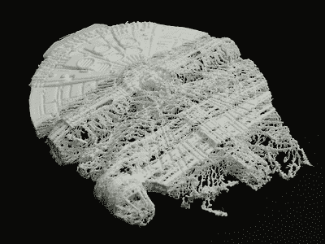

# 不可能和 3D 打印

> 原文：<https://hackaday.com/2020/08/29/impossibilities-and-3d-printing/>

本周，我们自己的[唐纳德·帕普]写了一篇发人深省的关于买卖 3D 打印机模型的文章。他的基本观点是:如果你在购买之前不知道你会得到什么，并且没有退款政策，你怎么知道你的钱花得是否值得？对于这些新兴市场来说，这是一个[的严重问题，因为当顾客不满意时，他们就不会再回来。](https://en.wikipedia.org/wiki/The_Market_for_Lemons)

这让我想起了我自己的经历，尽管那里有很多免费的 3D 模型。它们是一个超级混合包，即使你没有为模型付钱，你也在为打印时间、细丝和努力付钱。挑剔是有好处的，而且[唐纳德]的所有建议在“自由”市场上也适用。

Failenium Falcon. Image by [Johannes](https://www.flickr.com/photos/p1hde/24626495890/in/pool-3d-print-failures/)

只下载已经打印过*至少一次*的模型，有关于层高、灯丝类型和支持等方面的像样的文档，尽你所能，对制造零件的能力持批评态度。熔融沉积打印机只能在前面的层上打印，并且有明显的纹理，所以你需要注意突出部分和打印方向。对于树脂打印机，你需要小心未固化树脂的体积。您希望确保建模者至少考虑了这些因素。

但是当你的零件有强度要求、配合和公差时，情况就更糟了。设计师几乎没有办法知道你的第一层是否过度使用。不同的切片机处理边角的方式不同，使得内表面收缩程度不同。设计师如何解决你的特殊情况？

我个人的答案是开源。只要有可能，我更喜欢 OpenSCAD 中的模型。如果你下载了一个有 10 个 M8 螺栓孔的 STL，你可以在建模程序中把它们全部加宽，但是如果你有源代码，这就像改变一个变量一样简单。在我看来，使用源代码有助于 3D 打印的可定制性，这可能是它最强的优势。毕竟，除了你自己，没人知道你的桌子到底有多厚。制作可定制的耳机挂钩是关键。

因此，即使 3D 打印市场*可以*解决可靠性问题，通过客户审查或大量文件的要求，他们也永远无法解决“一刀切”的问题。开源很容易解决这个问题。卖给我源代码，不是 STL！

This article is part of the Hackaday.com newsletter, delivered every seven days for each of the last 200+ weeks. It also includes our favorite articles from the last seven days that you can see on [the web version of the newsletter](https://mailchi.mp/hackaday.com/hackaday-newsletter-649368). Want this type of article to hit your inbox every Friday morning? [You should sign up](http://eepurl.com/gTMxQf)!