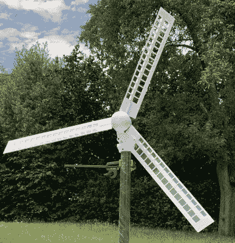
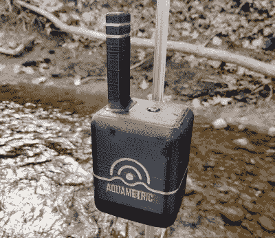
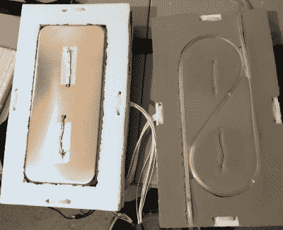
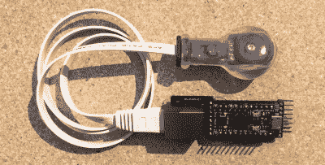
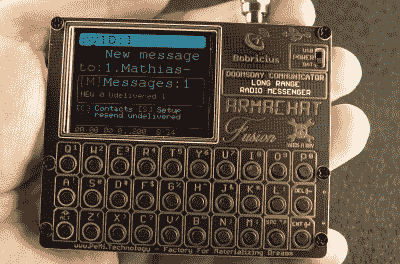

# 宣布了 2020 年黑客日奖的决赛选手

> 原文：<https://hackaday.com/2020/09/14/finalists-announced-for-the-2020-hackaday-prize/>

鉴于 2020 年发生的一切，[第七届年度 Hackaday 奖](https://prize.supplyframe.com/)致力于培养可以真正帮助改变世界的想法。首先，我们与几个非营利组织合作，帮助确定一些当今最困难的问题，从保护和救灾到对先进辅助技术的需求。今年的比赛有超过 20 万美元的奖金，包括帮助团队全职开展项目的小额赠款，旨在帮助实现重要的解决方案，否则这些方案可能永远不会问世。

但这并不容易。全球化的疫情使得以我们都习惯的方式进行项目合作变得更加困难，零件变得更加难以获得，许多制造商发现自己太忙于基层抗击新冠肺炎的努力，以至于几乎没有时间做其他事情。尽管存在这些不确定性，我们还是收到了来自全球各地的数百份令人难以置信的参赛作品。

选择谁将进入下一轮比赛从来都不容易。但是，在我们的非营利合作伙伴的帮助下，专家评委小组能够将参赛作品名单缩减到 34 个决赛选手，这些选手产生了 Hackaday 奖有史以来最令人印象深刻和最具影响力的一些想法。让我们来看看将在 11 月争夺最高奖项的几个项目。

## 现代住房解决方案

CalEarth 致力于“通过地球建筑的研究、开发和教育，为人类的住房需求提供解决方案”，因此他们要求设计师找到新的方法来解决与建设可持续住宅相关的问题。该类别中的竞争项目应该是旨在提高住宅整体效率的解决方案，因为它涉及到能源采集、集水、照明、供暖和制冷。

The mostly 3D printed WinDIY turbine.

Libre 太阳能项目希望通过开源硬件使可再生能源的使用更加经济可靠。他们的电池管理系统和充电控制器允许在离网和并网应用中高效地采集、存储和分配风能和太阳能。同样，WinDIY 是一个[大部分是 3D 打印的三叶片水平风力涡轮机](https://hackaday.io/project/172328-windiy-hawt-wind-turbine)，带有主动变桨调整和制动系统，以确保它在当前的风力条件下总是产生尽可能多的电力。

为了更好地结合自然和人工光源，[照明颜色控制与商品灯](https://hackaday.io/project/174098-lighting-color-control-with-commodity-lamps)项目建议除了更传统的占用传感器和调光器之外，还使用环境光传感器和分光光度计。在另一个项目中，来自太阳的光线将通过一系列铰接的镜子被用来为住宅[提供照明和温暖。通过跟踪太阳在天空中的移动并反射光线穿过建筑物，该系统应该可以减少白天对人工照明的需求。](https://hackaday.io/project/5142-reflecting-the-sun-into-your-home)

## 保护地球

地球是我们拥有的唯一家园，所以尽我们所能去保护它是人类的责任。这就是为什么来自 Conservation X Labs 的挑战集中在保护工作上，例如寻找对抗入侵物种的方法，以及开发有助于监测和保护海洋生物的技术。

Aquametric with a cellular antenna.

实现这些目标的一个方法是使必要的设备更便宜、更容易获得。[aqua metric 项目旨在生产一种低成本的传感器平台](https://hackaday.io/project/170881-aquametric-cellular-based-stream-monitors)，可用于监测河流和溪流。它的传感器可以检测水温、流速和电导率等变量，板载蜂窝调制解调器意味着它可以连续提供数据，而不必进行物理检索。

对于水下研究来说， [Aruna ROV 有望比目前商业市场上的产品更便宜、更模块化。这个项目包括驱动潜水器所需的软件和硬件，以及潜水器本身的基线设计。使用 3D 打印和现成的组件，建造这些水下研究和探索船的成本应该在小社区和公民科学家的能力范围内。](https://hackaday.io/project/172364-aruna-rov)

## 第一线的黑客

如果有一场生态灾难将一个社区与外界隔绝，简单地订购你需要的供应品并等待它们到达不是一个选择。这就是为什么 Field Ready 致力于将快速制造技术用于偏远地区的人道主义目的。他们向设计师提出挑战，要求他们拿出可以在现场使用的技术和工具，并特别关注可以固化紫外线粘合剂的设备。

Inside the OpenFluidWarmer

UVA 本质上是一种高功率的紫外线闪光灯，但它有许多特性，使其更安全，更容易用于制造。有一个小显示屏显示固化倒计时定时器，距离传感器用于指示光线与目标的最佳距离。还支持使用相同电池组的附加工具头。

从另一个角度来看这个问题,[openfluidcwarper 是一种开源的医疗设备](https://hackaday.io/project/173308-openfluidwarmer),设计成本低廉，易于在需要的地方制造。通过仔细控制其绝缘腔内的加热元件，OpenFluidWarmer 确保冷冻静脉注射液在注射前达到患者的体温，以降低体温过低的风险。

## 高科技援助

洛杉矶的联合脑瘫组织让黑客们创建开源辅助设备，供脑瘫和其他身体障碍患者使用，以帮助他们过上更加充实和独立的生活。

The BYTE mouth controller.

像这个[机器人手臂这样的想法旨在帮助那些难以养活自己的人](https://hackaday.io/project/172170-open-assistive-robotic-arm-for-meal)，可以极大地提高用户的自尊，并减轻家庭成员或其他护理人员的日常负担。[BYTE 是电脑的免提嘴部接口](https://hackaday.io/project/171778-the-byte)，即使是那些严重行动不便的人也可以使用，比目前市场上的产品反应更快，可扩展性更强。

辅助设备悬浮滑板项目寻求[使用商用自平衡踏板车作为电动轮式辅助设备的一种方式](https://hackaday.io/project/170932-hoverboards-for-assistive-devices)。儿童电动轮椅价格昂贵，很快就会过时，但有了基于悬浮滑板的通用驱动系统，并通过简单的操纵杆控制，定制动力移动设备就可以快速廉价地制造出来。

## 无限的创造力

并非所有 Hackaday 奖项都符合我们的非营利合作伙伴创建的预定义类别。这些参赛作品背后的创意头脑利用他们独特的才能，提出了解决他们自己选择的现实世界问题的设备。

The ARMACHAT LoRa communicator.

天空之锚被设计成一个飞行连接中继站，可用于在遭受自然灾害或没有电信基础设施的地区建立高速数据链接。为了在灾难场景中帮助促进人与人之间的通信， [ARMACHAT 和 ARMAWATCH 使用 LoRa 网状网络在彼此之间传输消息](https://hackaday.io/project/171790-armawatch-armachat-long-range-radio-messengers)。凭借多种物理外形和全硬件 QWERTY 键盘，这些设备提供了一种灵活的方式来保持远距离联系。

为了解决新冠肺炎疫情造成的呼吸机短缺问题， [DP 呼吸机希望通过将手动复苏器机动化来解决现有 DIY 设计](https://hackaday.io/project/171890-dp-ventilator)的一些缺点。通过使用这些相对便宜和丰富的一次性呼吸装置作为患者和机器之间的接口，这种设计从不直接处理被推入肺部的空气。

## 这还没有结束

在 11 月初选出获胜者之前，决赛选手还有一个月的时间来完成他们的创作。今年要选出最后的十名获奖者将会非常困难，竞争可能会归结到技术方面，如项目的整体文档和生产的适用性。要在最后一轮考虑，每个项目还需要有一个全面的视频解释概念，并详细说明在过去几个月取得的进展。

这最后一段是这个社区真正能够发光的地方。欢迎访问这些项目的 Hackaday.io 页面，分享您的反馈、技巧或想法。你可能有他们一直在努力解决的问题的解决方案，让他们更接近终点线。

The [HackadayPrize2020](https://prize.supplyframe.com) is Sponsored by: