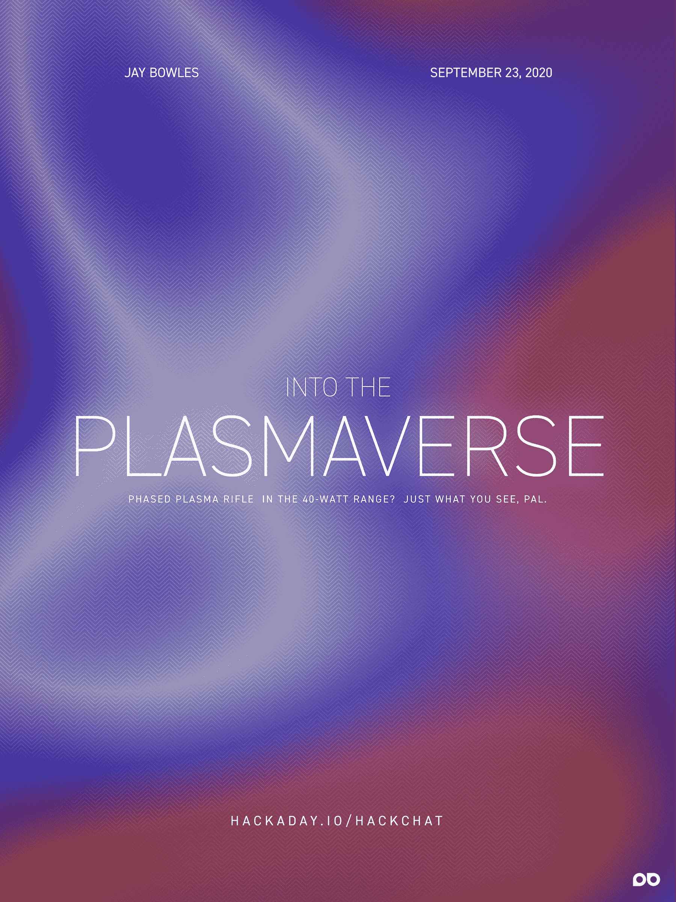

# 变成了讨厌等离子的黑客聊天

> 原文：<https://hackaday.com/2020/09/21/into-the-plasmaverse-hack-chat/>

加入我们太平洋时间 9 月 23 日星期三中午的[与](https://hackaday.io/event/174398-into-the-plasmaverse-hack-chat)[杰伊·鲍尔斯](https://hackaday.io/hacker/1013407-jay-bowles)的等离子厌恶黑客聊天！

大多数孩子在很小的时候就明白了物质可以以三种状态存在——固态、液态和气态——通常是在玩了几次雪之后。冰和雪花，湿袜子，以及呼吸中凝结成水滴的水汽雾，都不仅在物质状态方面，而且在它们之间的转变方面提供了快速而持久的课程。因此，当他们后来了解到另一种或许更有趣的状态:等离子体时，通常会感到有些惊讶。

对于年轻的科学家来说，等离子体不像物质的其他相态那样容易获得，因为它来自于通常不被允许参与的事物。高压放电，强电磁场，或者仅仅是大量的热量都可以从气体中带走电子，形成我们称之为等离子体的电离汤。但是一旦他们抓到了虫子，很少有什么能与良好的等离子放电的舞动、狂热能量相比。

杰伊·鲍尔斯很久以前就养成了使用等离子的习惯，并围绕等离子建立了他的 YouTube 频道。[特斯拉线圈](https://hackaday.com/2017/11/25/low-end-parts-make-tesla-coil-with-a-high-end-look/)，[范德格拉夫发电机](https://hackaday.com/2018/12/10/mini-van-de-graaff-is-a-shocking-desk-toy/)，各种类型的线圈和电容器——无论是什么，只要能产生火花，杰伊很可能已经制造并使用它来制造第四种物质状态。他将加入我们的 Hack Chat，谈论所有与等离子体、高压放电有关的有趣事情，以及任何引发他兴趣的事情。

 我们的黑客聊天是 [Hackaday.io 黑客聊天群发消息](https://hackaday.io/messages/room/2369)中的社区直播活动。本周，我们将在太平洋时间 9 月 23 日星期三中午 12:00 坐下来讨论。如果时区让你和我们一样困惑，我们有[一个方便的时区转换器](https://www.timeanddate.com/countdown/generic?iso=20200923T12&p0=224&msg=Into+the+Plasmaverse+Hack+Chat&font=cursive)。

点击右边的那个发言气泡，你会被直接带到 Hackaday.io 上的黑客聊天群，不用等到周三；随时加入，你可以看到社区在谈论什么。

