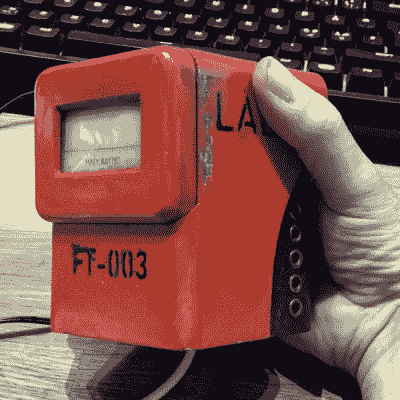

# 氡监测仪用 E-Ink 再造蒸汽表

> 原文：<https://hackaday.com/2020/09/18/radon-monitor-recreates-steam-gauge-with-e-ink/>

虽然对大多数人来说，完整的蒸汽朋克美学可能有点过时，但这些古董仪表确实有一定的魅力。不幸的是，在现代项目中实现它们可能有些棘手。即使你有一堆旧仪表，你仍然需要修改刻度线，并想出如何用数字电子设备驱动它们。虽然这些年来我们已经看到很多人这样做了，但毫无疑问，这比仅仅给一个 I2C 显示器接线要难得多。

但也许不一定是这样。通过他的 Rad-O-Matic，[Hans jrgen grim stad][使用一个小型电子墨水面板](https://www.timeexpander.com/posts/radon/)创建了一个非常令人信服的“模拟”仪表。当然，它骗不了任何近距离观察它的人，但一眼看去，你肯定会被原谅认为它是某种古董指示器。尤其是他放在它前面的有裂纹和污迹的菲涅耳透镜。

 在这个项目中【Hans】使用了 LilyGo T5，它结合了 ESP32 和 2.13 英寸的电子纸显示屏。这些可能是数字标牌应用的开发板，但[它们偶尔会出现在黑客项目](https://hackaday.com/2019/07/18/live-apollo-11-transcript-on-eink-display/)中，因为它们很容易使用。该板通过简单的 UART 连接从 RD200M 氡传感器获取数据，当前读数由在显示器上水平刻度上移动的“指针”指示。

就其本身而言，它看起来不会很复古。事实上，恰恰相反。但[汉斯]真的帮助推销了这个项目的外观，他设计并 3D 打印了一个厚重的外壳，然后风化它，使它看起来像是自冷战以来一直在踢来踢去。

如果你不想假装，我们已经看到了一些非常令人印象深刻的基于正宗老式仪表的项目。只要你不介意拆除可能比你更老的硬件，投入[额外的努力进行令人信服的修改](https://hackaday.com/2020/08/08/vintage-gauges-turned-classy-weather-display/)真的会有回报。

【感谢塔杰的提示。]