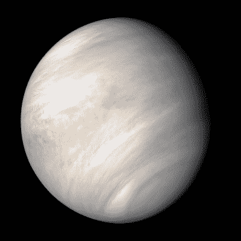
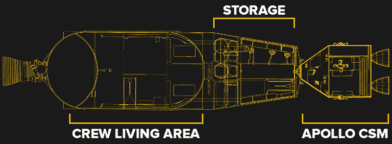
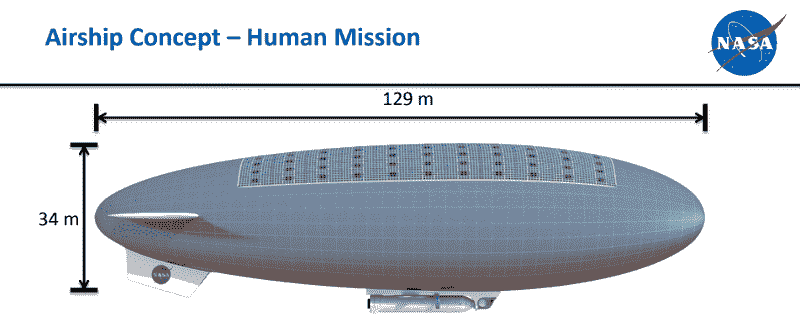
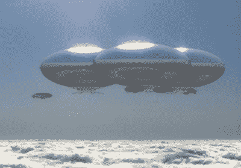

# 探索金星的云层；这不是幻想，但它需要专门的航天器

> 原文：<https://hackaday.com/2020/09/21/exploring-the-clouds-of-venus-its-not-fantasy-but-it-will-take-specialized-spacecraft/>

到现在为止，你可能已经听说科学家们在金星上发现了潜在的生物迹象。通过 2017 年和 2019 年的一系列射电望远镜观测，他们能够确认在地球厚厚的大气层中存在磷化氢气体。在地球上，这种气体在实验室外产生的唯一方式是通过微生物过程。它在金星大气中如此高的浓度下可以被探测到的事实意味着，我们要么不像我们认为的那样了解磷化氢，要么更诱人的是，在我们最近的行星邻居上发现了生命的火花。

Venus, as seen by Mariner 10 in 1974

对许多人来说，生命能在金星上生存的想法是难以想象的。虽然从大小、质量、组成和离太阳的距离来看，它是技术上最像地球的行星，但这个岩石世界的表面绝对是地狱般的；失控的温室效应导致温度超过 460 摄氏度(840 华氏度)。至少就我们目前所知，生命在金星表面找不到安全的避难所。即使是苏联的 Venera 登陆器，在 20 世纪 80 年代被送到地球上，也无法在高温和高压下生存超过几个小时。

虽然表面可能在很大程度上超出了我们的能力范围，但这颗行星异常稠密的大气层完全是另一回事。在大约 50 公里的高度，金星大气层内的条件要宽松得多。这个高度的大气压力几乎与地球表面的压力相同，平均温度足够低，可以形成液态水。虽然按照地球的标准，大气的化学成分不适合呼吸，硫酸云也不是特别受欢迎，但简单的生物体在这种富含二氧化碳的环境中茁壮成长的可能性肯定不是没有。如果金星上真的有生命，许多人推测它会藏在高高的云层中这个相对温和的微观世界里。

简而言之，所有的部分似乎都在到位。观察证实，金星大气层的上层有生物生命的迹象，我们从以前的研究中知道，这个区域可以说是太阳系中最像地球的环境之一。现在宣称我们已经发现了外星生命还为时过早，但不难理解为什么人们会如此兴奋。

但是这并不是科学家们第一次将目光投向地球的孪生兄弟。事实上，如果事情有所不同，美国国家航空航天局可能会在阿波罗计划完成对月球的调查后派遣一组人员前往金星。如果那项任务在 20 世纪 70 年代启动，它可能会从根本上重塑我们对地球的认识；甚至是我们对人类在宇宙中的位置的理解。

## 只是路过

阿波罗计划非常昂贵，许多人认为，一旦主要任务完成，简单地放弃所有的设备和收集的知识是一种浪费。因此，甚至在 1969 年登月之前，美国宇航局就已经开始研究这种硬件的潜在未来用途，作为他们所谓的阿波罗应用计划的一部分。这个项目最大的成功是天空实验室，但也有其他令人着迷的想法被提出，但不幸的是从未离开过绘图板。

其中最奇特的无疑是 1973 年计划中的飞越金星任务。使用一个为长时间太空飞行而专门改装的阿波罗指挥和服务舱(CSM)，以及一个由废弃的土星五号上面级制成的[“湿车间”乘员舱，三名宇航员将开始为期一年的旅程，前往我们最近的行星邻居。](https://hackaday.com/2019/08/06/why-spacecraft-of-the-future-will-be-extruded/)

在土星五号上面级将运载工具送入轨道后，阿波罗 CSM 将分离并旋转 180 度，与安装在登月舱位置的加压储存舱对接。上面级的 J-2 发动机将用于执行穿越金星的喷射燃烧，并且任何剩余的推进剂将被排放到太空中。在离开地球的旅程中，宇航员会通过安装在顶部的特殊舱口，将紧密包装的设备和用品从储存区转移到现在空的推进剂罐中。由于 J-2 发动机现在不能工作，当飞行器返回地球时，拟议的 Block IV CSM 的冗余双发动机将用于执行任何航向修正以及制动燃烧。

经过四个月的星际飞行后，在金星上不可能减速。相反，该飞行器将在大约 5000 公里(3000 英里)的高度绕地球运行一周，然后被吊回地球。这只会给机组人员几个小时的关键时间来进行观察和部署传感设备，但人们相信，他们与行星的近距离将使他们在这么短的时间内做更多有用的科学研究，而不是用那个时代的技术远程完成。

## 探索云朵

虽然这艘临时星际飞船上的人类乘客不会停留太久，但预计他们会放下几个机器人探测器，这些探测器将下降到行星的大气层中。这些探测器在第一次飞越后会继续工作几天，并直接与返回的载人宇宙飞船通信。这将使他们能够携带更小、更小功率的无线电发射器，而不是将他们的发现直接发送回地球，不仅增加了他们的有效载荷能力，还增加了他们在电池耗尽之前可以工作的时间。

Vega spacecraft with spherical entry module.

虽然我们只能推测这些探测器会采取什么形式，但可以肯定的是，至少有一些会与 1985 年苏联织女星任务中携带的气球类似。这些探测器充满了氦气，并进行了化学处理，以帮助抵抗金星云层的腐蚀性，它们被设计成达到平衡，并保持在 50 公里的温带范围内，以便在电池耗尽之前收集尽可能多的数据。织女星气球被证明是非常成功的，尽管它们只携带了基本的仪器。

如果美国宇航局继续执行定期的阿波罗-金星任务，随着技术的进步和科学家对这颗行星了解的增加，这些浮动探测器可能会变得更加先进。我们现在知道，低层大气非常厚，探测器和宇宙飞船可以很容易地在这个温带漂浮。机器人交通工具，甚至最终载人交通工具，可以被设计成“溅落”在大气层中，而不是穿过大气层。

## 金星飞艇

尽管金星表面不适宜居住，但还是有几个令人信服的理由让宇航员去金星探险。首先，它是太阳系中仅次于月球的第二近的目的地。由于运输时间短至四个月，往返任务完全在人类太空耐力的既定范围内。从轨道上，人类可以进行更详细和多样的观察和实验，而不仅仅是通过遥控飞行器。

但是人类天生就是探险者，最终宇航员会希望自己下降到地球的大气层中。在这种情况下，他们将体验到他们在地球上所习惯的 90%的重力；足够接近，肌肉和骨骼退化将不再是一个问题。同样值得注意的是，人类探险者需要随身携带的氮气和氧气的可呼吸混合物将在地球 96.5%的二氧化碳大气中发挥浮力气体的作用，从而使载人金星飞船成为可能。

早在 2015 年，美国国家航空航天局(NASA)就在探索发送载人充气飞行器，甚至在云中建立永久前哨基地的想法。这项研究被称为[高空金星操作概念(浩劫)](https://ntrs.nasa.gov/citations/20160006329)，它提出了一种航天器架构，可以安全地将人类机组人员插入金星大气层的温和层，允许他们在那里工作较长时间，然后用空中发射的火箭将他们送回轨道。从外表上看，这些飞船，有些长达 129 米，很像 20 世纪早期的大型刚性飞艇，如美国航空母舰*号【谢南多厄号】和*号【兴登堡号】。**

## 接下来的步骤

尽管金星上人类“云城”的前景令人兴奋，但它可能永远不会发生。如果最近的历史可以作为借鉴的话，那么获得为如此规模的项目提供资金所必需的长期政治支持几乎是不可能的。让美国宇航员乘坐国内宇宙飞船返回轨道已经够难的了，而该机构的 T2 重返月球的详细计划似乎要永远走上好几年。

An exciting, though improbable, vision of the future.

与建立前哨站相比，将宇航员送入金星轨道要容易得多，也便宜得多，但更有可能的是，在金星大气层中发现磷化氢气体的最直接后果是推动新一代机器人任务。技术进步显著，建造一个漂浮的大气探测器来寻找生物生命的迹象不再像 20 世纪 70 年代那样是不可逾越的挑战。

事实上，车轮已经在转动了。火箭实验室首席执行官彼得·贝克已经宣布，他的公司计划最早于 2023 年向金星发射一个小型探测器，该探测器将被设计成潜入该星球的大气层，寻找微生物生命的迹象。由于电子火箭的[相对贫乏的有效载荷能力，探测器将会很小，但这是一个开始。希望更大更精致的宇宙飞船不会太远。](https://hackaday.com/2018/01/29/smaller-and-smarter-the-electron-rocket-takes-flight/)

虽然我们永远不会看到宇航员在金星的岩石表面迈出一小步，但它仍然是一颗值得近距离观察的行星。确认外星生命的存在将是有史以来最伟大的科学发现之一，如果它最终出现在一个与我们地球如此相似的世界，那就更是如此。研究以金星为家的生命形式将是我们直接观察地球遥远过去的最接近的机会。或者，如果我们不小心，地球遥远的未来。