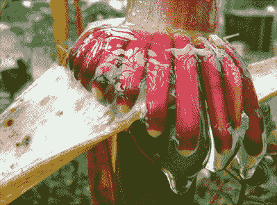

# 突变玉米可能是农业的未来

> 原文：<https://hackaday.com/2020/10/16/mutant-corn-could-be-the-future-of-agriculture/>

在美国，玉米糖浆是国王，真正的糖在王子地位附近徘徊。我们对玉米上瘾，反过来，玉米也对氮上瘾。很久以前，人们发现通过轮作，土壤将保持营养丰富，这在一定程度上有助于保留氮。然后我们发现了如何制造氮肥，通过氮肥的使用，我们在过去一百年左右的时间里基本上使农作物的平均产量翻了一番。

The aerial roots of the Sierra Mixe corn stalk help the plant produce its own nitrogen. Image via [Wikimedia Commons](https://commons.wikimedia.org/wiki/File:Journal.pbio.2006352.g002_cropped.png)

不是所有的植物都需要额外的氮。像豆类和大豆这样的豆类能够自己制造。但是玉米绝对需要氮。20 世纪 80 年代，时任玛氏公司农业总监的霍华德-亚娜·夏皮罗前往世界玉米之都墨西哥，寻找新的玉米品种。他在墨西哥南部的瓦哈卡混合区找到了一个。这种玉米不仅比美国玉米高几英尺，而且在糟糕的土壤中不知何故长到了令人眩晕的高度。

夏皮罗认为这种玉米的成功可能与从玉米秸秆中伸出的手指状根有关。几十年后，事实证明他是对的。加州大学戴维斯分校的研究人员已经证明，这些气根允许植物通过与清澈的糖浆状粘液中的细菌的共生关系从空气中吸收氮气。这个过程叫做固氮。

## 固氮有点坏了

因此，如果我们已经有氮肥，为什么还要寻找自己生产氮肥的植物呢？哈伯-博施肥料制造工艺是一种人工固氮形式，它确实减少了贫瘠土壤的影响。但是氨基肥料中多余的氮往往会流失到附近的河流和湖泊中，使其使用成为环境危害。制造化肥用氨的过程涉及化石燃料，消耗大量能源，并产生温室气体。总而言之，为了农业而对环境做的事情是很恐怖的。但是这么多人要养活，还能做什么呢？

The Haber-Bosch process illustrated. Image via [Wikimedia Commons](https://commons.wikimedia.org/wiki/File:Haber-Bosch-En.svg)

在过去的十年里，加州大学戴维斯分校的研究人员利用 DNA 测序确定，Sierra Mixe 品种植物上的粘液为玉米提供了微生物，这些微生物既给玉米提供了可食用的糖，又提供了一层氧气保护。他们认为植物通过这种方式获得 30-80%的氮。研究人员还证明，这些微生物实际上属于固氮家族，与在豆类中发现的微生物相似。最令人印象深刻的是，他们能够将 Sierra Mixe 玉米移植到加利福尼亚州的戴维斯和威斯康星州的麦迪逊，并使其成功生长，证明固氮技巧并不局限于玉米的家乡。现在他们正致力于识别产生气生根的基因。

## 漫长的进步之旅中的一步

然而，我们可能不会很快转向 Sierra Mixe 玉米。它需要八个月才能成熟，这对于习惯了三个月成熟期的美国人来说太慢了。如果我们能弄清楚如何让其他植物自己固氮，谁知道我们能走多远？看起来更有可能的是，更多的人会接受从玉米近亲嫁接而来的超能力，而不是试图使用 CRISPR 来实现自我固氮，因为 T2 的研究表明了对转基因食品的不信任。

知识产权问题可能是一个问题，但研究人员通过制定法律协议，确保 Sierra Mixe 社区从研究和可能的商业化中受益，从而与墨西哥政府建立了良好的关系。我们迫不及待地想看看他们能做什么。如果他们不能将自我固定的能力移植到其他植物上，那么也许有希望改进哈伯-博施工艺。