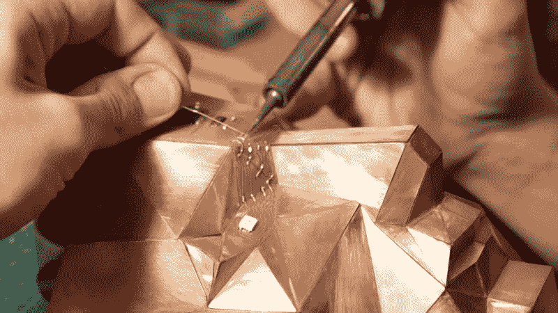
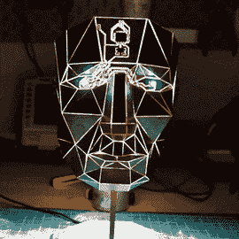

# 电路板折纸让你直面低聚电子产品

> 原文：<https://hackaday.com/2020/09/21/circuit-board-origami-puts-you-face-to-face-with-low-poly-electronics/>

纸工艺几乎和纸一样历史悠久。用低聚合度 3D 打印模仿纸工艺和折纸很有趣，斯蒂芬·霍斯(Stephen Hawes)想知道这是否可以用覆铜印刷电路板实现。这个问题提出两年后，我们有了答案，一个带亮眼的梦幻面具。看看下面的视频吧。

 

[Stephen]从 papercraft 程序 Pepakura Designer 的一个模型(更新:[kongorilla 的] [2012 年的 low poly mask 模型](https://www.thingiverse.com/thing:32189)是这次黑客攻击的起点)开始，然后铣出几十块板。只有少数支持电路，但这仍然是一个非常耗时的过程。额头上的 ATMega32u4 与折叠遍历电路一起用来照亮 WS2812B 的眼睛。电力沿着铜管向上流动，铜管可以作为一个方便的安装杆连接到 3D 打印的底座。

公平地说，这个项目花了两年时间，其中 18 个月是用手工打磨每块面板的边缘，这样它们就可以粘在一起了。将边缘焊接在一起并不像你想象的那么好，所以[斯蒂芬]用混合了小苏打的强力胶来给它塑身，让它干得更快。结果是一个低聚合度的闪亮铜色人脸，TQFP-44 芯片封装在额头中间的全视眼上，就像来自 *Tron* 的东西活了过来。

提醒一下— [我们有一场赛道雕塑大赛，比赛将持续到 2020 年 11 月 10 日星期二下午 12:00(太平洋标准时间](https://hackaday.io/contest/174093-2020-circuit-sculpture-challenge))。我们很想看看你能做些什么，无论是黄铜棒，铜包，还是两者的结合。看看我们迄今为止收到的提交内容，然后向我们展示您的成果。

 [https://www.youtube.com/embed/uk_gvd5PMLI?version=3&rel=1&showsearch=0&showinfo=1&iv_load_policy=1&fs=1&hl=en-US&autohide=2&wmode=transparent](https://www.youtube.com/embed/uk_gvd5PMLI?version=3&rel=1&showsearch=0&showinfo=1&iv_load_policy=1&fs=1&hl=en-US&autohide=2&wmode=transparent)

感谢[Sophi]和[BaldPower]的[提示](https://twitter.com/stephentherobot/status/1307281112444686337?s=20)！