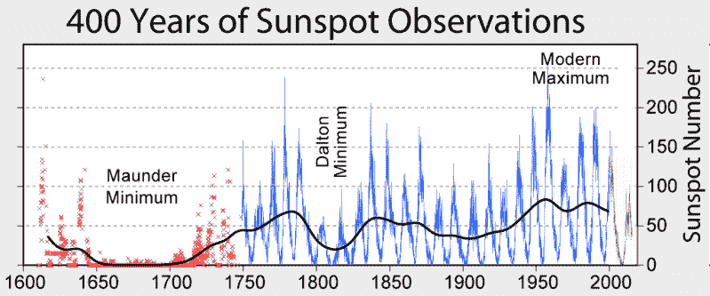
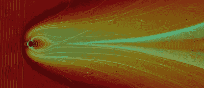
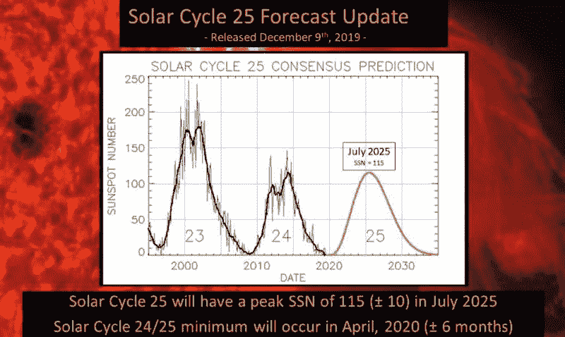

# 欢迎来到太阳周期 25；我们的太阳进入了新的 11 年周期

> 原文：<https://hackaday.com/2020/10/06/welcome-to-solar-cycle-25-our-sun-enters-a-new-11-year-period/>

我们大多数人认为时间是一支箭，是通向未来的单程旅行。虽然这是真的，但大自然有办法将圆形图案插入到线性模型中——白天跟着黑夜，季节在一年中前进，一代又一代人出生、生活和死亡，然后创造下一代人在未来经历相同的周期。

我们的恒星也遵循这种循环模型，并经历可观察到的周期性变化，这是太阳科学家非常感兴趣的。因此，他们最近大张旗鼓地宣布，太阳已经过渡到第 25 个太阳周期。但是这到底是什么意思呢？太阳变脸对一般人的日常生活影响大吗？历史表明这是可能的，所以了解我们在未来几十年的情况是有好处的。欢迎来到第 25 太阳周期的初级读本。

## 现在是十一点

自从科学家有能力(安全地)观察太阳以来，他们已经注意到我们的恒星并不像最初看起来那样是一个完美的发光球体。伽利略是第一个观察到太阳有小的暗缺陷的人之一。观测者开始跟踪这些太阳黑子，不仅注意到它们数量的变化，还注意到它们随时间在太阳表面移动的事实。

大约两个半世纪后，人们才注意到太阳黑子模式的周期性。德国科学家塞缪尔·海因里希·施瓦贝在对太阳黑子的平均数量进行了 17 年的观察后，于 1843 年发现了太阳活动周期。瑞士科学家鲁道夫·沃尔夫利用施瓦贝等人的观察数据回溯到 1755 年。出于太阳科学的目的，这被指定为太阳周期 1 开始的年份。

Cycles of sunspots for the last 400 years. The earliest data is estimated from geological and tree-ring records. By Robert A. Rohde, [CC BY-SA 3.0](http://creativecommons.org/licenses/by-sa/3.0/)

这些先驱太阳科学家发现的周期有着非常规律的 11 年周期。变化的范围很窄，从第二太阳周期的九年(1766 年至 1775 年)到第四太阳周期的近十四年(1784 年至 1798 年)。每个太阳周期都是从太阳活动极小期开始计算的，本质上是当太阳黑子数达到局部最低点时。太阳黑子的数量在周期的前半部分增加，在太阳活动最大点达到顶峰，然后再次下降到下一个太阳活动最小点。

太阳黑子的原始数量并不是太阳显示的唯一有趣的周期。太阳黑子在太阳表面的分布也随着太阳周期周期性地变化。在每个太阳周期的开始，为数不多的太阳黑子倾向于聚集在太阳赤道。随着周期的进行和太阳变得更加活跃，太阳黑子往往会在远离赤道的地方出现，通常聚集在北纬 30 度和南纬 30 度的中纬度地区。随着太阳活动高峰期的过去，太阳黑子再次迁移回赤道，开始新的周期。

## 翻转磁极

太阳黑子数量和分布的周期性变化可能是一个有趣的观察结果，但这在地球上意味着什么呢？为了帮助理解这一点，有必要回忆一下，尽管太阳黑子看起来很暗，但它的温度只比周围的太阳物质低一点点。黑子仍然是极其活跃的区域，随着黑子数量的增加，太阳的输出(以光度计算)也在增加。

太阳黑子代表了磁力线从太阳内部深处集中出现的地方。因此，太阳黑子数量和位置的变化揭示了太阳磁场的变化。事实证明，太阳周期的背后是太阳磁场的周期性变化。(这里需要注意的是，11 年的周期在技术上是“太阳黑子周期”，22 年的磁极翻转周期是真正的“太阳周期”，但通常两者都使用“太阳周期”。)

太阳的磁极不断运动，北极和南极每 11 年翻转一次。在太阳活动极小期，磁极大致与太阳的轨道轴对齐，磁力线倾向于穿透赤道附近的光球层。随着两极向赤道旋转，磁场活动加快，磁力线向高纬度移动，增加了那里太阳黑子的数量。在太阳周期的后半部分，随着两极完成逆转，这一过程仍在继续。

 [https://www.youtube.com/embed/P2hN5M4g5bY?version=3&rel=1&showsearch=0&showinfo=1&iv_load_policy=1&fs=1&hl=en-US&autohide=2&wmode=transparent](https://www.youtube.com/embed/P2hN5M4g5bY?version=3&rel=1&showsearch=0&showinfo=1&iv_load_policy=1&fs=1&hl=en-US&autohide=2&wmode=transparent)

因此，由于太阳磁场的迁移，随着每个太阳周期的进行，太阳输出增加。尽管这些变化微不足道，但它们对地球上的生命有着明显的影响。但是，我们的太阳亮度的增加远不是这里感受到的唯一影响。太阳磁场的变化也会对我们的星球产生巨大影响。

## 接下来会发生什么？

众所周知，太阳黑子的增加与更强、更频繁的日冕物质抛射(CMEs)有关。当太阳中的磁畴变得如此扭曲和扭曲，以至于它们向外爆发，从太阳的日冕中获得数十亿吨高度兴奋的等离子体时，这些事件就会发生，有时会在极端情况下充满能量。如果日冕物质抛射发生在太阳表面的正确位置，猛烈喷射出的磁通量和等离子体可以撞击地球，导致从极光出现的增加到基础设施的灾难性破坏。

 虽然破坏性的日冕物质抛射更有可能发生在太阳活动高峰期——1859 年的[卡林顿事件](https://hackaday.com/2019/01/22/the-1859-carrington-event/)发生在第 10 个太阳周期的高峰期附近，而 [1989 年的魁北克水文灾难](https://hackaday.com/2017/04/10/lights-out-in-quebec-the-1989-geomagnetic-storm/#more-250826)发生在第 22 个太阳周期的高峰期之前大约 7 个月——但它们只发生在那个时候远不是规律。太阳活动极小期发生了大量具有破坏性或潜在危险的日冕物质抛射。但是日冕物质抛射的数量随着太阳黑子的数量急剧增加，因此在太阳活动高峰期，太阳每天都会发生几次大的爆发。简单地增加射击次数会增加毁灭性打击的几率。

虽然在太阳活动高峰期撞击地球的日冕物质抛射风险增加是一个问题，但记住几件事很重要。首先，太阳活动最大期还有大约五年的时间；美国宇航局表示[第 25 太阳周期正式开始于 2019 年 12 月](https://www.weather.gov/news/201509-solar-cycle)，这意味着我们仍然处于太阳活动最少的状态。第二，并不是所有的太阳周期都是一样的。在十一年太阳周期之上是[其他周期性周期](https://www.scientificamerican.com/article/the-sunspot-cycle-is-more-intricate-than-previously-thought/)，我们才刚刚开始了解。一个是格列斯堡周期，一个大约 87 年的周期，在这个周期中，11 年周期的太阳极大期趋于增加和减少。我们目前正处于格列斯堡周期的下降阶段，这意味着刚刚结束的第 24 个太阳周期的太阳最大值比前一个周期低得多。[目前的预测](https://www.swpc.noaa.gov/news/solar-cycle-25-forecast-update?fbclid=IwAR0II6o75ehEkIfRW-QP4F4w1ljXx89KsQrKdhEGeJvnIm6GviIFiEjdH34)是第 25 个太阳周期的强度将与上一个太阳活动高峰期的强度大致相同，并将在 2025 年 7 月左右达到太阳活动高峰期。

Source: [Space Weather Prediction Center-NOAA](https://www.swpc.noaa.gov/news/solar-cycle-25-forecast-update)

在接下来的 11 年里，沉睡的太阳可能是一个“好消息，坏消息”的事情。从积极的一面来看，经历灾难性的撞击地球的日冕物质抛射的风险大大降低了，但远非为零。这意味着我们脆弱的基础设施面临的风险更小，包括我们缝合在一起的数百万英里电力和通信线路的地面基础设施，以及天基基础设施，因为卫星可能会受到太空天气的极大影响。另一方面，业余无线电操作员和其他依靠电离层跳跃进行远程无线电通信的人，如海事操作员、航空公司和军队，总是在太阳不太活跃时变得暴躁，因为太阳黑子减少意味着地球大气的电离减少。

最终，太阳会做它该做的，不管它会如何影响地球上的生命。我们所能做的就是了解太阳系中心恒星的一切可能，建立良好的模型来预测它随时间的行为，并建立能够承受我们恒星情绪波动的系统。