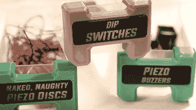

# 令人惊叹的 Technicolor 零件组织者

> 原文：<https://hackaday.com/2020/10/03/the-amazing-technicolor-parts-organizer/>

毫不夸张地说，任何读到这些文字的人都曾努力避免不断增长的电子零零碎碎的收集陷入绝对的混乱。将它们全部扔进塑料箱至少是通往长期组织之路的一个开端，但如果你想避免浪费时间和金钱去购买你忘记已经拥有的零件，它们仍然需要被分类和编目。

为了他的最新项目，[【扎克·弗里德曼】决定最终处理他在过去几年里一直随身携带的个人零件收藏。战斗的前半部分只是弄清楚他实际上有什么，他可能需要什么，并把它们都整理出来，这样他就不必在一大堆东西中翻找他需要的东西了。但是光有*把*组织起来还不够，你还需要*把*组织起来。](https://www.youtube.com/watch?v=Y8mCTiGv41k)

 这就是为什么他然后把注意力转向所有这些新排序的组件实际上如何向前存储。他已经有了三个港口货运箱组织者，但正如人们期望的那样，他们只是勉强适合手头的任务。所以[Zack]设计了一个 3D 打印面板，可以卡在原来的塑料箱上。新的正面使他们更容易抓住，并设有一个开口，接受激光蚀刻塑料标签。

为了给他们一点视觉天赋，他决定用彩虹渐变丝打印面板。为了防止它们是随机的颜色，他使用了相对模糊的顺序切片选项，这样他的 Prusa i3 就可以在移动到床上的下一个面板之前完整地打印每个面板。这比并行打印花费的时间要长得多(尤其是因为他可以使用多台打印机)，但由于颜色在墙上的每个箱之间平滑过渡，这种方式更具美感。这也有一个实际的好处，因为你可以一眼看出是否有任何垃圾桶发现自己在错误的位置。

如果你真的想走极端，我们已经看到黑客[用连接到可搜索库存系统](https://hackaday.com/2020/01/26/light-the-way-to-every-component/)的 RGB LEDs 点亮单个垃圾箱。但是对于大多数业余爱好者来说，简单的[学习什么时候清理会更实际。](https://hackaday.com/2016/05/31/path-to-craftsmanship-the-art-of-throwing-it-away/)

 [https://www.youtube.com/embed/Y8mCTiGv41k?version=3&rel=1&showsearch=0&showinfo=1&iv_load_policy=1&fs=1&hl=en-US&autohide=2&wmode=transparent](https://www.youtube.com/embed/Y8mCTiGv41k?version=3&rel=1&showsearch=0&showinfo=1&iv_load_policy=1&fs=1&hl=en-US&autohide=2&wmode=transparent)

